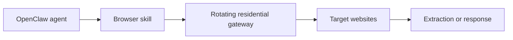

## Rotation Solves a Different Problem Than Browser Automation
OpenClaw agents can browse, extract data, and automate tasks through browser-based skills. But even when the browser layer is configured correctly, one major weakness remains: repeated traffic from the same IP becomes easy to detect.
That is where rotating residential proxies matter. They do not replace Playwright, and they do not replace careful workflow design. What they do is distribute traffic across many residential IPs so one address does not absorb all the request pressure.
This guide explains how rotating residential proxies work in OpenClaw, when rotation is the right choice, when sticky sessions are better, and how to validate the setup in real workflows. It connects naturally with [OpenClaw proxy setup](https://bytesflows.com/blog/openclaw-proxy-setup), [why OpenClaw agents need residential proxies](https://bytesflows.com/blog/openclaw-residential-proxy), and [OpenClaw Playwright proxy configuration](https://bytesflows.com/blog/openclaw-playwright-proxy).
## Why Rotation Matters for OpenClaw Agents
OpenClaw workflows often involve repeated browsing across many pages, domains, or search results. Without rotation, all of that activity can appear to come from one origin IP or a very small pool.
That creates several problems:
- request density per IP rises too fast
- rate limits appear earlier
- IP reputation degrades more quickly
- repeated browsing patterns become easier to flag
- large task queues become unstable under load
This is especially relevant for OpenClaw because the system often combines browsing, extraction, and reasoning in one workflow. That makes each task more capable, but it also increases the volume and visibility of the traffic if the transport layer is weak.
## What Rotating Residential Proxies Actually Do
A rotating residential proxy gateway routes traffic through real household or mobile IPs and changes the exit IP over time.
In practical terms, this means:
- one request may leave through IP A
- the next request may leave through IP B
- later traffic may leave through IP C
That distribution helps reduce the pattern of one identity making hundreds of repeated requests. On many targets, that is the main reason rotation improves survival.
It is important to understand that the rotation behavior is typically controlled by the provider, not by OpenClaw itself. OpenClaw sends traffic to the configured gateway, and the provider determines whether the exit behavior is rotating or sticky.
## Why Residential Rotation Is Usually Better Than Datacenter Rotation
Not all rotation is equal.
Datacenter IP rotation can help, but many strict targets still recognize datacenter ranges as automated infrastructure. Residential rotation helps more because the traffic comes from IPs that look closer to normal users.
This is why rotating residential proxies are often the better fit for:
- search engine result pages
- e-commerce browsing
- competitive monitoring
- multi-site research tasks
- AI agent workflows on stricter targets
If you want the broader background, [best proxies for web scraping](https://bytesflows.com/blog/best-proxies-for-web-scraping), [residential proxies](https://bytesflows.com/blog/residential-proxies), and [why residential proxies are best for scraping](https://bytesflows.com/blog/why-residential-proxies-best-for-scraping-2026) provide a useful foundation.
## Rotating vs Sticky Sessions
This is the part that many teams misunderstand.
### Rotating residential proxies
Best for:
- large-scale public crawling
- search result collection
- broad discovery tasks
- repeated stateless browsing
- workflows where each request is independent
### Sticky sessions
Best for:
- logged-in browsing
- cart or checkout simulations
- multi-step workflows
- tasks that depend on cookies and continuity
For most OpenClaw scraping workflows, rotating mode is the better default because it spreads risk across the pool. But for session-sensitive tasks, over-rotation can make the workflow less stable rather than more stable.
## How Rotation Fits into the OpenClaw Stack
A practical architecture looks like this:

OpenClaw handles orchestration. The browser skill handles execution. The residential gateway handles IP distribution. That separation matters because it clarifies where failures come from when the workflow starts breaking.
## How to Use Rotation with OpenClaw
A typical setup follows a simple pattern:
1. choose a provider that supports rotating residential gateways
1. get the gateway URL and credentials
1. configure the browser launch in the OpenClaw skill
1. validate the visible IP behavior
1. test on the real target under controlled traffic
In most cases, OpenClaw itself does not need special “rotation logic.” You configure one gateway in the browser layer, and the provider handles how the IP changes.
That is why related setup guides such as [OpenClaw proxy setup](https://bytesflows.com/blog/openclaw-proxy-setup) and [OpenClaw Playwright proxy configuration](https://bytesflows.com/blog/openclaw-playwright-proxy) are operationally important.
## When Rotation Helps the Most
Rotation becomes especially valuable in these OpenClaw use cases:
### Multi-site research
When an agent visits many unrelated sources in one workflow, rotation keeps request pressure from collecting on one identity.
### SERP and search extraction
Search engines are highly sensitive to repetitive access from a single IP. Rotating residential traffic reduces that visibility and improves geo realism.
### Large public scraping jobs
If the task is broad and stateless, rotation is usually better than trying to preserve continuity on one address.
### Competitor monitoring and recurring browsing
Repeated observation of the same targets creates predictable patterns. Rotation helps reduce that predictability.
## Common Mistakes with Rotating Proxies
### Assuming rotation alone solves blocking
Rotation helps with IP pressure, but it does not fix unrealistic browser fingerprints, poor pacing, or weak workflow design.
### Over-rotating session-dependent tasks
If the site expects continuity, rotating too aggressively can break the workflow.
### Not validating on the real target
A rotating gateway may look fine on an IP-check page while still failing under target-specific defenses.
### Scaling too quickly
Rotation gives more room, but it does not mean unlimited concurrency is safe.
### Ignoring geography
If the task depends on local results, the exit location still matters even with rotation enabled.
## How to Validate That Rotation Is Working
Testing should be done in stages.
1. launch a browser task through OpenClaw
1. verify that traffic does not use the host machine IP
1. observe whether exit IPs change across suitable requests
1. confirm country or region if geo-targeting matters
1. run the actual target workflow and monitor block rate
Helpful tools here include [Proxy Checker](https://bytesflows.com/blog/proxy-checker), [Proxy Rotator Playground](https://bytesflows.com/blog/proxy-rotator), and [Scraping Test](https://bytesflows.com/blog/scraping-test-tool-detect-blocks).
## Best Practices for OpenClaw + Rotation
### Use rotation for stateless tasks by default
This is where it creates the most value.
### Slow down before adding more IP pressure
If challenge rate rises, tune pacing before blaming the proxy pool.
### Keep browser realism strong
Residential IPs help, but weak browser behavior can still get flagged.
### Monitor outcomes, not assumptions
Success rate, latency, and block frequency matter more than whether rotation is “enabled” on paper.
### Build internal link paths by workflow type
If you are documenting OpenClaw infrastructure, connect rotation content to setup, residential proxy, and Playwright configuration pieces so the reader can move naturally through the stack.
## When Sticky Is Better Than Rotating
Rotating proxies are not always the answer.
If the OpenClaw task requires continuity—such as authentication, multi-step navigation, or consistent cart state—sticky sessions often perform better. That is why the real question is not “Should I always rotate?” but “Does this workflow need continuity or distribution?”
That framing is far more useful than treating rotation as a universal fix.
## Conclusion
Rotating residential proxies are one of the most useful reliability layers for OpenClaw agents that browse or scrape at scale. They help distribute traffic, reduce IP pressure, and improve survivability on stricter targets.
But they work best when matched to the right kind of workflow. Use rotating mode for broad, stateless, repeated browsing. Use sticky sessions when continuity matters. And remember that rotation is only one layer in the system—browser quality, request pacing, and target behavior still determine whether the workflow remains stable.
If you want the strongest next reading path from here, continue with [OpenClaw proxy setup](https://bytesflows.com/blog/openclaw-proxy-setup), [OpenClaw Playwright proxy configuration](https://bytesflows.com/blog/openclaw-playwright-proxy), [why OpenClaw agents need residential proxies](https://bytesflows.com/blog/openclaw-residential-proxy), and [proxy rotation strategies](https://bytesflows.com/blog/proxy-rotation-strategies).
## Further reading
- [OpenClaw proxy setup](https://bytesflows.com/blog/openclaw-proxy-setup)
- [OpenClaw Playwright proxy configuration](https://bytesflows.com/blog/openclaw-playwright-proxy)
- [Why OpenClaw agents need residential proxies](https://bytesflows.com/blog/openclaw-residential-proxy)
- [Proxy rotation strategies](https://bytesflows.com/blog/proxy-rotation-strategies)
- [How many proxies do you need](https://bytesflows.com/blog/how-many-proxies-need-scraping)
- [Best proxies for web scraping](https://bytesflows.com/blog/best-proxies-for-web-scraping)
- [Residential proxies](https://bytesflows.com/blog/residential-proxies)
