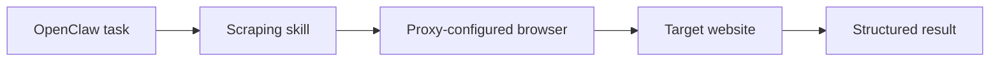

## Scraping Skills Are Where OpenClaw Becomes Operational
OpenClaw becomes useful for scraping not because the gateway itself scrapes, but because skills give the agent controlled ways to browse, extract, and act on the web. That means if you want reliable OpenClaw scraping, the quality of the skill design matters just as much as the model or the prompt.
For many users, the most important part of that design is proxy awareness. A scraping skill that launches a browser without the right proxy setup may work in light testing but fail quickly once the workload becomes repeated, remote, or production-like.
This guide explains how OpenClaw scraping skills work, where proxy integration belongs, how to design browser-aware skills cleanly, and what best practices help those skills stay reliable over time. It pairs naturally with [OpenClaw for web scraping and data extraction](https://bytesflows.com/en/blog/openclaw-web-scraping), [OpenClaw Playwright proxy configuration](https://bytesflows.com/en/blog/openclaw-playwright-proxy), and [OpenClaw proxy setup](https://bytesflows.com/en/blog/openclaw-proxy-setup).
## What OpenClaw Skills Actually Do
Skills are the execution modules that give OpenClaw access to external actions.
In scraping workflows, that often means a skill is responsible for one or more of the following:
- launching a browser
- opening pages
- waiting for content
- extracting data from the DOM
- returning structured output
- handing results to another part of the workflow
This is important because the skill is where abstract intent becomes concrete browser behavior. If the skill is weak, the agent can reason correctly and still fail operationally.
## Why Scraping Skills Need Proxy Awareness
A browser-based skill does not just fetch content. It creates traffic patterns that websites can evaluate.
If the skill always launches from one exposed server IP, you will often see:
- rate limits
- 403 responses
- CAPTCHA flows
- region mismatch
- unstable session behavior
That is why proxy integration is not just an add-on. For many scraping skills, especially those used repeatedly or on stricter targets, it is part of the skill’s core runtime design.
## Where the Proxy Belongs in the Skill
The most important implementation detail is simple: the proxy belongs where the browser is launched.
That usually means:
- the `chromium.launch(...)` call
- a Playwright wrapper used by the skill
- a shared browser helper function
This is the point where network behavior is determined. If the browser instance is created without the proxy, the rest of the skill cannot retroactively change that browsing identity in a clean way.
## A Practical Skill Pattern
A strong scraping skill often looks like this in layers:

This design keeps the responsibilities clear:
- OpenClaw coordinates the workflow
- the skill handles execution
- the browser handles interaction
- the proxy layer controls transport identity
That separation makes debugging and reuse much easier.
## Example: Proxy-Aware Playwright Skill
A simple pattern in Node.js looks like this:
```javascript
const { chromium } = require("playwright");

async function runWithBrowser() {
  const browser = await chromium.launch({
    headless: true,
    proxy: process.env.PROXY_SERVER
      ? {
          server: process.env.PROXY_SERVER,
          username: process.env.PROXY_USER,
          password: process.env.PROXY_PASS,
        }
      : undefined,
  });

  const page = await browser.newPage();
  await page.goto("https://example.com");
  const title = await page.title();
  await browser.close();
  return { title };
}
```
This approach is useful because it keeps proxy logic close to browser launch while still letting the skill run in environments where a proxy is optional.
## Why Environment Variables Matter
A proxy-aware skill should almost always read credentials from environment variables rather than hardcoding them.
Typical variables include:
- `PROXY_SERVER`
- `PROXY_USER`
- `PROXY_PASS`
This is better because it:
- keeps secrets out of source files
- supports different environments cleanly
- makes it easier to reuse the skill across deployments
- reduces accidental leakage in repos or logs
It also matches how most OpenClaw deployments are actually operated.
## Designing Good Scraping Skills
A strong scraping skill usually has four qualities.
### 1. Narrow scope
The skill should do one browser job clearly rather than try to implement the entire pipeline in one block.
### 2. Explicit fetch logic
Page navigation, waits, extraction, and proxy configuration should be understandable and testable.
### 3. Proxy-aware execution
The skill should support residential or rotating transport when the use case requires it.
### 4. Safe failure handling
The skill should report useful errors rather than silently returning empty or misleading output.
This is especially important because agent workflows often chain several steps together. A weak skill creates noise for every downstream step.
## Throttling and Traffic Discipline
Even the best proxy-aware skill can fail if it behaves too aggressively.
Good scraping skills should consider:
- delays between requests
- concurrency per domain
- retry rules
- session continuity where needed
- output validation before handing results forward
This matters because a skill is not just code that “works once.” It is part of a traffic pattern that may be repeated many times.
## When to Use Residential Proxies in Skills
Not every skill needs residential transport, but many scraping skills benefit from it when they:
- browse protected sites
- repeat tasks frequently
- need geo-specific results
- use browser automation heavily
- operate through a VPS or cloud environment
In those cases, related pieces such as [why OpenClaw agents need residential proxies](https://bytesflows.com/en/blog/openclaw-residential-proxy), [rotating residential proxies for OpenClaw agents](https://bytesflows.com/en/blog/openclaw-rotating-proxy), and [running OpenClaw on a VPS with residential proxies](https://bytesflows.com/en/blog/openclaw-vps-proxy) become part of the same design path.
## Common Mistakes in Skill Design
### Hiding browser launch logic too deeply
That makes it harder to understand whether proxy configuration is actually being applied.
### Treating proxy integration as an afterthought
If the skill is meant for repeated scraping, proxy behavior should be part of the design from the beginning.
### Making skills too broad
A skill that tries to browse, extract, summarize, and post-process everything at once becomes difficult to maintain.
### Ignoring validation
If the skill extracts data, its outputs should be checked before they are trusted by the rest of the workflow.
### Forgetting target-specific behavior
Different sites tolerate different pacing, session patterns, and browser behavior.
## How to Validate a Scraping Skill
A good validation flow includes:
1. testing the skill without scale
1. verifying the visible IP and region if a proxy is enabled
1. confirming the target content actually loads
1. checking extraction quality on real pages
1. monitoring failures before increasing throughput
Helpful tools include [Proxy Checker](https://bytesflows.com/en/blog/proxy-checker), [Scraping Test](https://bytesflows.com/en/blog/scraping-test-tool-detect-blocks), and [Proxy Rotator Playground](https://bytesflows.com/en/blog/proxy-rotator).
## Best Practices for OpenClaw Scraping Skills
### Keep the skill small and explicit
Clarity beats cleverness in scraping modules.
### Put the proxy at browser launch
That is where the browsing identity is actually decided.
### Use environment variables for secrets
This keeps the skill portable and safer to deploy.
### Throttle before you scale
Reliability usually breaks before throughput becomes useful.
### Link skills into a larger workflow cleanly
A scraping skill should return structured output that other tools or steps can actually use.
## Conclusion
OpenClaw scraping skills are where browser automation becomes practical, reusable, and production-capable. They are also where proxy support becomes operationally critical for many real-world workflows.
The strongest skills are not the biggest ones. They are the ones that keep execution logic clear, configure the browser correctly, handle proxy-aware transport, and return outputs that the rest of the system can trust. When those pieces are aligned, OpenClaw becomes much more than a chat interface—it becomes a workable orchestration layer for real web data workflows.
If you want the strongest next reading path from here, continue with [OpenClaw for web scraping and data extraction](https://bytesflows.com/en/blog/openclaw-web-scraping), [OpenClaw proxy setup](https://bytesflows.com/en/blog/openclaw-proxy-setup), [OpenClaw Playwright proxy configuration](https://bytesflows.com/en/blog/openclaw-playwright-proxy), and [why OpenClaw agents need residential proxies](https://bytesflows.com/en/blog/openclaw-residential-proxy).
## Further reading
- [OpenClaw for web scraping and data extraction](https://bytesflows.com/en/blog/openclaw-web-scraping)
- [OpenClaw proxy setup](https://bytesflows.com/en/blog/openclaw-proxy-setup)
- [OpenClaw Playwright proxy configuration](https://bytesflows.com/en/blog/openclaw-playwright-proxy)
- [Why OpenClaw agents need residential proxies](https://bytesflows.com/en/blog/openclaw-residential-proxy)
- [Rotating residential proxies for OpenClaw agents](https://bytesflows.com/en/blog/openclaw-rotating-proxy)
- [Residential proxies](https://bytesflows.com/en/blog/residential-proxies)
- [Best proxies for web scraping](https://bytesflows.com/en/blog/best-proxies-for-web-scraping)
