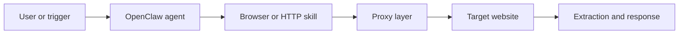

## OpenClaw Changes How Scraping Workflows Are Triggered
Most scraping systems are built as scripts, schedulers, and queues. OpenClaw changes that model by letting AI agents receive requests conversationally, trigger tools, and coordinate browser-based tasks from a self-hosted control layer.
That makes it useful for web scraping and data extraction—not because it magically replaces scraping infrastructure, but because it gives you a better orchestration layer for agent-style workflows. An OpenClaw setup can receive a task in chat, decide which tools to use, launch a browser, extract data, summarize output, and return the result in the same loop.
This guide explains where OpenClaw fits in a scraping stack, when it is better than a fixed scraper, how browser and proxy layers plug into the workflow, and what to watch when you scale. For adjacent context, it pairs naturally with [OpenClaw proxy setup](https://bytesflows.com/blog/openclaw-proxy-setup), [AI web scraping with agents](https://bytesflows.com/blog/ai-web-scraping-agents), and [AI web scraping explained](https://bytesflows.com/blog/ai-web-scraping-explained).
## What OpenClaw Actually Does in a Scraping Stack
OpenClaw is best understood as the control plane, not the fetch engine.
In a typical scraping architecture:
- OpenClaw receives the task
- an agent decides what workflow to run
- a browser or HTTP layer fetches the content
- extraction logic turns the page into usable output
- the result is returned, stored, or passed into another workflow
That means OpenClaw is not competing with Playwright, Requests, or a crawler framework. It sits above them and coordinates how they are used.

This model is what makes OpenClaw especially attractive for workflows that are interactive, multi-step, or hard to encode as one rigid script.
## Why Use OpenClaw for Web Scraping?
The value of OpenClaw is not just that it can scrape. It is that it can combine scraping with reasoning and workflow control.
That becomes useful when the task includes things like:
- deciding what page to visit next
- switching between browsing and extraction steps
- summarizing the result after collection
- responding to ad hoc user requests instead of only running scheduled jobs
- combining scraping with other tools or downstream automation
This makes OpenClaw a better fit for agent-style research, targeted extraction, or mixed browsing workflows than for extremely simple repetitive scraping jobs. If the task is just “fetch the same structured page ten million times,” a deterministic scraper is still often the better fit.
## When OpenClaw Is Better Than a Traditional Scraper
OpenClaw tends to perform well when the workflow includes decision-making.
Examples include:
- extracting information from multiple sites with inconsistent layouts
- running chat-triggered research tasks
- browsing through paginated or conditional site flows
- combining collection, summarization, and drafting in one pipeline
- handling workflows where the next step depends on what the current page contains
This is also why OpenClaw is often grouped with AI agent workflows rather than classic scrapers. It is closer to an execution framework for intelligent browsing than to a single-purpose crawler.
## Where Browser Automation Fits
OpenClaw itself does not replace the browser layer. In most real setups, a skill launches a browser through Playwright or a similar tool.
That browser layer matters whenever the target:
- renders key content with JavaScript
- requires interaction before data appears
- uses browser-based challenge pages
- behaves differently in a real browser than in raw HTTP requests
This is why articles like [playwright web scraping tutorial](https://bytesflows.com/blog/playwright-web-scraping-tutorial), [browser automation for web scraping](https://bytesflows.com/blog/browser-automation-web-scraping), and [headless browser scraping guide](https://bytesflows.com/blog/headless-browser-scraping-guide) remain directly relevant to OpenClaw-based workflows.
## Why Proxies Matter for OpenClaw Workflows
Once OpenClaw starts driving real browsing tasks at scale, it hits the same blocking problems as any other automation stack.
Common failure patterns include:
- HTTP 403 responses
- temporary or regional bans
- challenge pages
- unstable session behavior
- geo mismatch during extraction
That is why serious OpenClaw scraping usually depends on a proxy layer. In many cases, [residential proxies](https://bytesflows.com/blog/residential-proxies) are the practical choice because they reduce obvious datacenter exposure and support more realistic session behavior on stricter targets.
The key point is simple: OpenClaw improves orchestration, but the transport layer still has to survive the target website. That is where [best proxies for web scraping](https://bytesflows.com/blog/best-proxies-for-web-scraping), [proxy rotation strategies](https://bytesflows.com/blog/proxy-rotation-strategies), and [OpenClaw proxy setup](https://bytesflows.com/blog/openclaw-proxy-setup) become part of the same system.
## A Typical OpenClaw Scraping Workflow
A realistic workflow often looks like this:
1. A user or automation trigger sends a request.
1. OpenClaw routes the request to an agent with the right browsing skill.
1. The skill launches a browser or HTTP fetch flow.
1. Traffic is sent through a proxy if the target requires it.
1. The page is parsed or interpreted.
1. The result is returned to chat, stored, or forwarded.
This model is especially strong for high-value, lower-volume workflows where the task requires both collection and interpretation.
## Adding Residential Proxies for Reliability
When the target is stricter or the workload starts growing, adding a residential proxy layer improves reliability.
A practical setup usually includes:
- an authenticated proxy gateway
- proxy configuration inside the browser skill
- session handling rules for rotating or sticky behavior
- request pacing and concurrency control
- validation of exit IP, geography, and challenge rate
This is why proxy integration should be treated as part of the skill design, not as a final patch after blocks begin.
## Legal and Operational Considerations
OpenClaw makes scraping more convenient, but it does not change the legal or operational responsibilities.
You still need to think about:
- terms of service
- robots.txt and access policy
- personal data handling
- request pacing and system load
- region-specific compliance risks
For some users, this is exactly why OpenClaw is powerful: the same system that browses can also reason about guardrails, classification, and workflow rules. But the compliance layer still needs to be designed intentionally. Related reading such as [is web scraping legal](https://bytesflows.com/blog/is-web-scraping-legal) and [web scraping legal considerations](https://bytesflows.com/blog/web-scraping-legal-considerations) helps frame that side of the workflow.
## Common Failure Modes in OpenClaw Scraping
| Symptom | Likely cause | Practical fix |
| --- | --- | --- |
| Blocked or CAPTCHA | Weak IP layer or aggressive pacing | Add residential proxies and reduce concurrency |
| Empty extraction | Content rendered after page load | Use browser automation and wait correctly |
| Session breaks | Wrong rotation mode | Use sticky sessions for multi-step flows |
| Slow workflow | Heavy browser tasks or poor skill design | Simplify steps and improve task segmentation |
These issues are usually operational rather than conceptual. Most OpenClaw scraping failures come from weak skill design, weak proxies, or forcing interactive workflows into a fetch pattern that does not match the target.
## Best Practices for OpenClaw Data Extraction
### Treat OpenClaw as the workflow layer
Let it coordinate the process, but keep fetch, proxy, and extraction components explicit.
### Keep skills narrow and reliable
A skill that does one thing well is usually easier to debug than one giant automation chain.
### Match session mode to the task
Rotating is good for broad public collection. Sticky is better for logged-in or multi-step browsing.
### Validate outputs before reusing them
If the agent is extracting, summarizing, or drafting from scraped content, add checks before storing or forwarding the result.
### Scale with measurements, not assumptions
Track success rate, latency, challenge rate, and extraction quality before increasing throughput.
## When OpenClaw Is Not the Best Choice
OpenClaw is not the best fit for every scraping problem.
If you are running a very high-volume, fixed-schema, purely scheduled crawl, a traditional scraper or crawler framework may be simpler and cheaper to operate.
OpenClaw becomes more valuable when the task includes one or more of the following:
- user-triggered requests
- adaptive browsing decisions
- multi-step workflows
- summarization or post-processing
- integration with broader agent pipelines
This is the key tradeoff: OpenClaw increases flexibility, but that flexibility should be used where it creates value.
## Conclusion
OpenClaw is a strong fit for web scraping and data extraction when the workflow is more than just retrieval. It works best as an orchestration layer for agent-style browsing, extraction, and response loops rather than as a replacement for the browser or proxy stack itself.
The most reliable setups combine OpenClaw for coordination, browser automation for rendering and interaction, residential proxies for transport reliability, and clear extraction logic for structured output. When those layers work together, OpenClaw becomes a practical way to run more adaptive scraping workflows without turning everything into a rigid script.
If you are building a fuller internal reading path from here, the best next steps are [OpenClaw proxy setup](https://bytesflows.com/blog/openclaw-proxy-setup), [OpenClaw Playwright proxy configuration](https://bytesflows.com/blog/openclaw-playwright-proxy), [why OpenClaw agents need residential proxies](https://bytesflows.com/blog/openclaw-residential-proxy), and [AI web scraping with agents](https://bytesflows.com/blog/ai-web-scraping-agents).
## Further reading
- [OpenClaw proxy setup](https://bytesflows.com/blog/openclaw-proxy-setup)
- [OpenClaw Playwright proxy configuration](https://bytesflows.com/blog/openclaw-playwright-proxy)
- [Why OpenClaw agents need residential proxies](https://bytesflows.com/blog/openclaw-residential-proxy)
- [AI web scraping with agents](https://bytesflows.com/blog/ai-web-scraping-agents)
- [AI web scraping explained](https://bytesflows.com/blog/ai-web-scraping-explained)
- [Best proxies for web scraping](https://bytesflows.com/blog/best-proxies-for-web-scraping)
- [OpenClaw proxy setup](https://bytesflows.com/blog/openclaw-proxy-setup)
