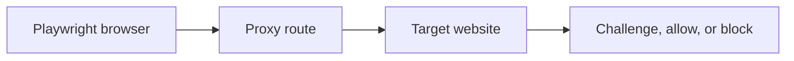

## Playwright Proxy Setup Is Not Just a Configuration Step — It Is Part of Browser Identity Design
A lot of Playwright guides treat proxy setup like one small launch option: add a server, add credentials, and the problem is solved. In real scraping workflows, proxy setup affects far more than connectivity. It shapes the visible identity of the browser session, determines whether requests concentrate on one route or spread across many, and influences whether a target sees the browser as credible or suspicious.
That is why Playwright proxy setup matters as part of the whole browser workflow.
This guide explains how Playwright proxy configuration works, when to use rotating versus sticky sessions, how proxy routing relates to browser identity, and what practical checks reduce false confidence before scaling. It pairs naturally with [playwright proxy configuration guide](https://bytesflows.com/en/blog/playwright-proxy-configuration-guide), [bypass Cloudflare with Playwright](https://bytesflows.com/en/blog/bypass-cloudflare-playwright), and [how to avoid detection in Playwright scraping](https://bytesflows.com/en/blog/avoid-detection-playwright-scraping).
## Why Playwright Still Needs Proxies
Playwright gives you a real browser, but the website still sees where that browser is coming from.
Without proxies, repeated Playwright sessions may reveal:
- one cloud-hosted IP handling too much traffic
- datacenter origin on stricter consumer-facing sites
- too many browser sessions sharing one visible identity
This is why Playwright alone often improves browser realism, but not network identity.
## Where Proxy Setup Fits in Playwright
In practice, Playwright proxy setup determines how the browser session enters the site.
That affects:
- IP trust
- route geography
- whether the session should stay stable or rotate
- how retries can change identity
- how parallel browser tasks distribute pressure
So the proxy is not separate from the browser. It is part of the browser session story.
## Rotating vs Sticky Sessions in Playwright
The right routing mode depends on task type.
### Rotating mode
Best when requests or tasks are mostly independent, such as:
- broad page collection
- product or listing extraction
- repeated one-off page visits
### Sticky mode
Best when the session needs continuity, such as:
- login flows
- multi-step forms
- account-based workflows
- long browsing tasks where identity changes would break the flow
The key question is whether the Playwright task needs continuity more than it needs identity distribution.
## Residential vs Datacenter Still Matters
The browser may be real, but stricter sites still judge the route.
Residential proxies often work better for Playwright on protected targets because they:
- reduce obvious datacenter-origin suspicion
- support more credible browser sessions
- improve pass rates on consumer-facing sites
- pair well with browser-based challenge handling
This is why Playwright plus residential routing is often the strongest default for protected workflows.
## Verification Should Happen Before Scale
A common mistake is assuming the proxy works because Playwright launched successfully.
You should verify:
- the exit IP
- the route geography if region matters
- whether the real target behaves differently through the proxy
- whether repeated sessions are actually rotating as expected
A session that connects is not necessarily a session that supports the real scraping goal.
## Browser Context Still Needs to Match the Route
Good proxy setup does not eliminate the need for coherent browser settings.
A stronger Playwright session often still needs:
- locale that fits the route when relevant
- realistic viewport and browser context
- stable session behavior through the task
- sensible pacing and concurrency
A good route plus incoherent browser context can still look suspicious.
## Retries Depend on Good Proxy Strategy
When Playwright hits blocks, the retry logic depends heavily on proxy design.
For example:
- rotating sessions make it easier to retry with fresh identity
- sticky sessions make more sense for continuity-heavy flows but need careful reset logic
- weak route reuse can amplify failure instead of fixing it
This is why proxy setup and retry design should be planned together.
## A Practical Playwright Proxy Model
A useful mental model looks like this:

The important point is that the browser reaches the target through a chosen identity path. That identity path is part of the outcome.
## Common Mistakes
### Treating proxy setup as only a syntax problem
The real issue is identity strategy.
### Using rotating mode on tasks that need continuity
That can break the workflow.
### Using sticky mode for broad stateless crawling by default
That can overconcentrate pressure on one route.
### Assuming browser realism compensates fully for weak IP trust
Protected targets still judge the network layer.
### Skipping verification before launching volume
That often hides misconfiguration until it becomes expensive.
## Best Practices for Playwright Proxy Setup
### Choose routing mode based on task continuity
Do not let sticky or rotating behavior be accidental.
### Prefer residential routes on stricter sites
The browser layer benefits from stronger identity.
### Verify route behavior on the real target
Not just on an IP-check page.
### Keep browser settings coherent with the route
Locale, geography, and session type should align.
### Design retries around fresh identity where needed
Do not let failed routes keep repeating blindly.
Helpful support tools include [Proxy Checker](https://bytesflows.com/en/blog/proxy-checker), [Scraping Test](https://bytesflows.com/en/blog/scraping-test-tool-detect-blocks), and [Proxy Rotator Playground](https://bytesflows.com/en/blog/proxy-rotator).
## Conclusion
Playwright proxy setup matters because it defines the identity path your browser session uses to reach the site. That affects trust, geography, session continuity, retry behavior, and how much pressure each visible route absorbs.
The most reliable Playwright setups are not only correctly formatted. They are matched to the task: rotating when broad distribution helps, sticky when continuity matters, residential when trust matters, and always verified against the actual target. Once proxy setup is treated as part of browser identity design, Playwright becomes much more stable under real scraping workloads.
If you want the strongest next reading path from here, continue with [playwright proxy configuration guide](https://bytesflows.com/en/blog/playwright-proxy-configuration-guide), [bypass Cloudflare with Playwright](https://bytesflows.com/en/blog/bypass-cloudflare-playwright), [how to avoid detection in Playwright scraping](https://bytesflows.com/en/blog/avoid-detection-playwright-scraping), and [best proxies for web scraping](https://bytesflows.com/en/blog/best-proxies-for-web-scraping).
## Further reading
- [Playwright proxy configuration guide](https://bytesflows.com/en/blog/playwright-proxy-configuration-guide)
- [Bypass Cloudflare with Playwright](https://bytesflows.com/en/blog/bypass-cloudflare-playwright)
- [How to avoid detection in Playwright scraping](https://bytesflows.com/en/blog/avoid-detection-playwright-scraping)
- [Best proxies for web scraping](https://bytesflows.com/en/blog/best-proxies-for-web-scraping)
- [Residential proxies](https://bytesflows.com/en/blog/residential-proxies)
- [How proxy rotation works](https://bytesflows.com/en/blog/how-proxy-rotation-works)
- [Playwright web scraping tutorial](https://bytesflows.com/en/blog/playwright-web-scraping-tutorial)
