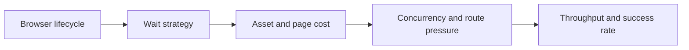

## Playwright Performance Is About Balancing Speed, Resource Cost, and Success Rate
Playwright is powerful because it gives you a real browser. That same strength also makes it heavier than simple HTTP scraping. Browsers consume memory, startup time, CPU, and network bandwidth. If performance is ignored, a scraper may become slow, expensive, or unstable long before it becomes useful at scale.
That is why Playwright performance tuning is not about making the browser “fast” in the abstract. It is about removing wasted work without damaging reliability.
This guide explains the most important Playwright scraping performance decisions: browser reuse, context design, wait strategy, asset control, concurrency, and how to optimize throughput without simply scaling block risk faster. It pairs naturally with [playwright web scraping at scale](https://bytesflows.com/en/blog/playwright-web-scraping-scale), [playwright web scraping tutorial](https://bytesflows.com/en/blog/playwright-web-scraping-tutorial), and [browser automation for web scraping](https://bytesflows.com/en/blog/browser-automation-web-scraping).
## Why Playwright Feels Expensive
A Playwright workflow is heavier than a request-based workflow because it usually involves:
- launching or reusing browser processes
- rendering pages
- running JavaScript
- managing session state
- waiting for dynamic page conditions
This is why many performance problems in Playwright are really browser-lifecycle and waiting-strategy problems.
## Reuse Matters More Than Most Teams Expect
One of the biggest performance mistakes is paying browser startup cost too often.
The main design question is usually:
- when should one browser be reused?
- when should a new context be created?
- when does the task actually require a fresh browser identity?
Reusing a browser process while isolating work through contexts often improves performance far more than micro-optimizing extraction code.
## Contexts Are Often the Right Unit of Isolation
Browser contexts are usually lighter than launching full new browsers.
That makes them useful when you need:
- session separation
- cookie isolation
- repeated tasks inside one browser process
- lower startup overhead than one-browser-per-task patterns
But context reuse should still match the identity needs of the target. Performance gains are not worth breaking session logic or proxy strategy.
## Wait Strategy Is a Major Performance Lever
A lot of Playwright slowness comes from waiting too broadly.
Common problems include:
- relying on `networkidle` when it is unnecessary
- waiting for the whole page when only one element matters
- overusing fixed delays
- not distinguishing between page readiness and extraction readiness
Smarter waits usually come from targeting the actual condition needed for extraction rather than waiting for the page to become maximally quiet.
## Asset Loading Should Match the Goal
If the scraper only needs structured text or DOM content, loading every image, font, or decorative asset may waste time and bandwidth.
Reducing unnecessary assets can improve:
- navigation speed
- bandwidth cost
- memory pressure
- page stabilization time
But asset blocking should still be used carefully. Some pages depend on resources that indirectly affect what the browser receives or how challenges behave.
## Concurrency Is Performance and Risk at the Same Time
Many teams treat more parallel browsers as a pure performance win. It is not.
More concurrency can mean:
- more CPU and memory pressure
- more proxy demand
- more per-domain traffic concentration
- more block risk if scaling is too aggressive
This is why good Playwright performance is not only about local resource usage. It is also about keeping browser traffic believable to the target.
## Proxy Design Affects Performance Too
Proxy choices shape more than access. They also affect latency and workflow stability.
For example:
- weak routes can slow page loads or increase retries
- unnecessary route churn can add overhead
- overly aggressive browser turnover can reduce reuse benefits
This is why performance tuning should be aligned with the proxy and session model, not done separately.
## A Practical Performance Model
A useful mental model looks like this:

This shows why faster scraping is not only about one optimization knob.
## Common Mistakes
### Launching too many fresh browsers without need
That pays startup cost repeatedly.
### Using broad waits for narrow extraction goals
This adds delay without value.
### Blocking assets blindly on every target
Some targets become less stable or less believable.
### Scaling concurrency before measuring pass rate impact
Faster failure is not better performance.
### Tuning only CPU efficiency while ignoring proxy and anti-bot pressure
The full workflow must stay healthy.
## Best Practices for Playwright Performance
### Reuse browser processes where identity design allows it
This is often the largest performance win.
### Use contexts for lighter isolation when appropriate
They are often cheaper than full browser churn.
### Wait for what you need, not for everything to settle
Extraction readiness is usually more specific than full page quiet.
### Remove unnecessary page cost carefully
Block only the assets that are truly irrelevant.
### Tune concurrency together with success rate, not separately
Performance must stay believable to the target.
Helpful support tools include [HTTP Header Checker](https://bytesflows.com/en/blog/http-header-checker), [Scraping Test](https://bytesflows.com/en/blog/scraping-test-tool-detect-blocks), and [Proxy Checker](https://bytesflows.com/en/blog/proxy-checker).
## Conclusion
Playwright scraping performance is really about trading browser realism against unnecessary overhead in a disciplined way. The biggest gains usually come from better browser reuse, lighter session isolation, smarter waits, and concurrency that respects both system resources and target sensitivity.
The practical lesson is that the fastest scraper is not the one with the most browsers running. It is the one that does the least wasted browser work while still preserving session correctness and access quality. Once performance is treated as a systems problem, Playwright becomes much more efficient without becoming brittle.
If you want the strongest next reading path from here, continue with [playwright web scraping at scale](https://bytesflows.com/en/blog/playwright-web-scraping-scale), [playwright web scraping tutorial](https://bytesflows.com/en/blog/playwright-web-scraping-tutorial), [browser automation for web scraping](https://bytesflows.com/en/blog/browser-automation-web-scraping), and [playwright proxy setup guide](https://bytesflows.com/en/blog/playwright-proxy-setup).
## Further reading
- [Playwright web scraping at scale](https://bytesflows.com/en/blog/playwright-web-scraping-scale)
- [Playwright web scraping tutorial](https://bytesflows.com/en/blog/playwright-web-scraping-tutorial)
- [Browser automation for web scraping](https://bytesflows.com/en/blog/browser-automation-web-scraping)
- [Playwright proxy setup guide](https://bytesflows.com/en/blog/playwright-proxy-setup)
- [Best proxies for web scraping](https://bytesflows.com/en/blog/best-proxies-for-web-scraping)
- [Headless browser frameworks](https://bytesflows.com/en/blog/headless-browser-frameworks)
- [Common web scraping challenges](https://bytesflows.com/en/blog/common-web-scraping-challenges)
