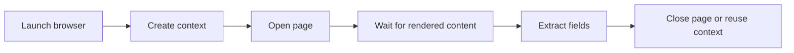

## Playwright Is Useful Because Modern Scraping Often Needs a Real Browser, Not Just a Request Library
A beginner scraper can get surprisingly far with simple HTTP requests. But once a site relies on JavaScript rendering, infinite scroll, interaction, or browser-aware defenses, a request library alone often stops being enough. That is where Playwright becomes valuable.
Playwright gives you browser automation that feels close to how real modern sites actually behave.
This tutorial explains how to think about Playwright for scraping, from core concepts like browser contexts and pages to real-world patterns such as infinite scroll, proxy routing, and the first habits that make browser automation more production-ready. It pairs naturally with [browser automation for web scraping](https://bytesflows.com/blog/browser-automation-web-scraping), [playwright web scraping at scale](https://bytesflows.com/blog/playwright-web-scraping-scale), and [playwright proxy configuration guide](https://bytesflows.com/blog/playwright-proxy-configuration-guide).
## Why Playwright Is Different from Simple HTTP Scraping
A request client downloads a response. A browser automation tool runs the page.
That means Playwright can:
- execute JavaScript
- wait for dynamic content
- interact with buttons, forms, and filters
- preserve browser session state
- expose the rendered DOM after the page actually loads
This makes it especially useful for modern SPAs, dynamic marketplaces, and browser-sensitive scraping targets.
## The Core Mental Model: Browser, Context, Page
One of the most important Playwright concepts is understanding the difference between:
- the browser
- the browser context
- the page
### Browser
The main browser process.
### Context
An isolated session container, similar to an incognito profile.
### Page
A tab or page inside that context.
This matters because contexts let you run multiple isolated scraping flows without launching a full new browser every time.
## Why Contexts Matter So Much
Contexts are one of the most practical scaling and organization features in Playwright.
They let you:
- isolate cookies and storage
- run separate sessions in one browser
- reduce total browser-launch overhead
- test multiple identities or tasks more cleanly
This is why many Playwright scraping systems reuse browsers but create separate contexts for parallel tasks.
## The First Practical Use Case: Dynamic Content
Playwright becomes especially useful when the page:
- renders product cards after load
- updates content after interaction
- uses infinite scroll
- depends on client-side routing
- returns incomplete HTML to simple HTTP clients
Instead of scraping the original response body, you scrape the browser’s rendered state.
## Waiting Correctly Is a Core Skill
A lot of Playwright reliability comes from waiting for the right moment.
In practice, that often means:
- waiting for a selector that proves the content is present
- waiting for rendering to settle enough to extract safely
- avoiding arbitrary sleeps as the main logic
This is where Playwright often feels cleaner than older browser automation stacks: the waiting model is better aligned with modern pages.
## Infinite Scroll and Dynamic Discovery
A common real-world pattern is scraping discovery pages that reveal more results as the user scrolls.
Playwright helps here because it can:
- scroll programmatically
- wait between scroll actions
- inspect whether more content appeared
- stop when the page stops revealing useful new items
This is one of the clearest examples of why browser automation is sometimes necessary rather than optional.
## Why Proxy Use Matters in Playwright
A browser is still judged by its visible network identity.
That means Playwright scraping often needs proxies when:
- the target is anti-bot sensitive
- the scraper runs from cloud infrastructure
- region-specific data matters
- repeated browsing creates too much pressure on one IP
Residential proxies are often the better fit because Playwright is commonly used exactly where identity quality matters most.
Related background from [best proxies for web scraping](https://bytesflows.com/blog/best-proxies-for-web-scraping), [how residential proxies improve scraping success](https://bytesflows.com/blog/residential-proxies-improve-scraping), and [playwright proxy configuration guide](https://bytesflows.com/blog/playwright-proxy-configuration-guide) fits directly here.
## Browser Realism Matters Too
If the target is sensitive, browser automation should also think about:
- realistic viewport
- coherent locale and geography
- session continuity
- navigation pacing
This is not about pretending to be magic. It is about avoiding obviously inconsistent automation signals.
## A Practical Playwright Workflow
A useful browser-scraping flow often looks like this:

This model helps make Playwright feel less mysterious. It is just browser state managed deliberately.
## Common Mistakes
### Launching a new browser for every small task
This raises cost and slows throughput unnecessarily.
### Using fixed sleeps instead of waiting for page state
That makes the workflow more brittle.
### Treating proxy setup as optional on strict targets
Browser realism alone is often not enough.
### Forgetting to close pages or contexts
This can create memory and stability issues over time.
### Assuming one successful run means the workflow is production-ready
Real reliability only appears under repetition.
## Best Practices for Playwright Scraping
### Use contexts for isolation
They are lighter and cleaner than launching many full browsers.
### Wait for actual content signals
Let the page tell you when it is ready.
### Use proxies when identity matters
Especially on protected or geo-sensitive targets.
### Keep browser settings coherent with the routing strategy
Viewport, locale, and region should make sense together.
### Build toward production gradually
Start simple, then add scaling, retries, and better session handling as needed.
Helpful related reading includes [playwright web scraping at scale](https://bytesflows.com/blog/playwright-web-scraping-scale), [browser automation for web scraping](https://bytesflows.com/blog/browser-automation-web-scraping), and [playwright proxy configuration guide](https://bytesflows.com/blog/playwright-proxy-configuration-guide).
## Conclusion
Playwright web scraping is useful because many modern sites no longer expose their real content cleanly to simple HTTP clients. A real browser can render, wait, interact, and preserve session state in ways that match how the target actually works.
The key to using Playwright well is understanding the browser-context-page model, waiting for real page signals, and treating identity and proxy routing as part of the browser workflow rather than as separate concerns. Once those pieces click, Playwright becomes a practical and powerful scraping tool rather than just a heavy fallback.
If you want the strongest next reading path from here, continue with [browser automation for web scraping](https://bytesflows.com/blog/browser-automation-web-scraping), [playwright web scraping at scale](https://bytesflows.com/blog/playwright-web-scraping-scale), [playwright proxy configuration guide](https://bytesflows.com/blog/playwright-proxy-configuration-guide), and [best proxies for web scraping](https://bytesflows.com/blog/best-proxies-for-web-scraping).
## Further reading
- [Browser automation for web scraping](https://bytesflows.com/blog/browser-automation-web-scraping)
- [Playwright web scraping at scale](https://bytesflows.com/blog/playwright-web-scraping-scale)
- [Playwright proxy configuration guide](https://bytesflows.com/blog/playwright-proxy-configuration-guide)
- [Best proxies for web scraping](https://bytesflows.com/blog/best-proxies-for-web-scraping)
- [Residential proxies](https://bytesflows.com/blog/residential-proxies)
- [Playwright vs Selenium](https://bytesflows.com/blog/playwright-vs-selenium-scraping)
- [Playwright vs Crawlee for web scraping](https://bytesflows.com/blog/playwright-vs-crawlee-comparison)
