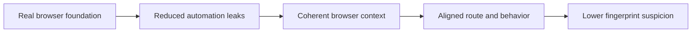

## Preventing Scraper Fingerprinting Is Mostly About Avoiding Inconsistency Across the Session
A lot of people hear “fingerprinting” and immediately think of one technical artifact such as canvas or `navigator.webdriver`. Those things matter, but the broader issue is coherence. Websites do not always need one perfect fingerprint to detect a scraper. They often only need enough mismatch between route, browser context, runtime properties, and behavior to decide the session does not look trustworthy.
That is why preventing scraper fingerprinting is less about one patch and more about making the browser session tell one believable story.
This guide explains what scraper fingerprinting prevention actually means, why coherence matters more than blind randomization, how browser automation helps and still leaks, and what practical changes lower fingerprint-based suspicion in modern scraping. It pairs naturally with [browser fingerprinting explained](https://bytesflows.com/blog/browser-fingerprinting-explained), [browser stealth techniques](https://bytesflows.com/blog/browser-stealth-techniques-scraping), and [how to avoid detection in Playwright scraping](https://bytesflows.com/blog/avoid-detection-playwright-scraping).
## What Sites Mean by a “Fingerprint” in Practice
A browser fingerprint is usually not one value. It is a combination of browser-visible signals that together help the site assess whether the environment looks ordinary, unusual, or obviously automated.
That may include:
- graphics and rendering behavior
- browser runtime properties
- viewport and screen values
- locale and language settings
- timezone and region alignment
- hardware-related values exposed through the browser
The site often cares less about uniqueness by itself and more about whether the whole profile makes sense.
## Why Fingerprinting Causes Scrapers Trouble
Fingerprinting becomes a problem when the browser session reveals contradictions or obvious automation cues.
Examples include:
- automation leaks in runtime properties
- a route and locale that do not align
- viewport choices that do not fit the claimed environment
- browser behavior that looks too machine-like
- a request-only client pretending to be a full browser
This is why simply rotating IPs often does not solve fingerprint-based detection.
## A Real Browser Is Usually the Starting Point
When the target inspects browser runtime, a real browser is often the practical baseline.
That is because frameworks like Playwright or Puppeteer can:
- execute browser-side code
- expose real rendering behavior
- preserve session state
- reduce some of the obvious gaps that request-only clients cannot close
This does not make them invisible. It simply gives you a more credible starting point.
## Automation Leaks Still Need Attention
Even with a real browser, some setups still expose clear automation hints.
That can include:
- `navigator.webdriver`
- other runtime inconsistencies
- browser context defaults that look less natural on stricter targets
This is where stealth patches and careful context design may help, especially when the browser layer itself is the weak point.
## Why Consistency Usually Beats Randomization
One of the biggest fingerprinting mistakes is changing too many things too often.
A better strategy is usually:
- keep one stable viewport through the session
- align locale and timezone with the route
- maintain a coherent browser identity
- avoid contradictory environment signals
A believable fingerprint is often stable, not noisy.
## Route and Browser Must Support the Same Story
Fingerprint prevention is not only about browser-side values. The route also matters.
A session looks stronger when:
- the region of the IP matches the browser context when relevant
- residential traffic supports the browser realism on stricter sites
- the route and browser together resemble a plausible user session
This is why residential proxies often matter in fingerprint-sensitive scraping.
## Behavior Can Reinforce Fingerprinting Risk
A technically cleaner browser can still attract suspicion if the behavior is too concentrated or too regular.
That includes:
- exact fixed delays
- impossible browsing speed
- too many sessions following identical timing patterns
- repeated retry loops on the same target
In practice, fingerprinting risk and behavioral risk often reinforce each other.
## A Practical Prevention Model
A useful mental model looks like this:

This shows why prevention is about the whole session profile, not one hidden patch.
## Common Mistakes
### Treating canvas or one signal as the whole fingerprint problem
The site usually sees a broader environment.
### Rotating settings constantly in the hope of looking human
Too much change can create contradiction.
### Ignoring route quality while focusing only on browser tweaks
The browser and IP need to support each other.
### Using request-only tools on browser-sensitive targets
They cannot present a full browser environment.
### Assuming one clean run proves fingerprinting is solved
Suspicion often appears under repetition.
## Best Practices for Preventing Scraper Fingerprinting
### Start with a real browser when the site clearly inspects runtime
That gives you the right baseline.
### Reduce obvious automation leaks where needed
Do not let easy browser-side signals go unpatched.
### Keep session identity coherent
Viewport, locale, timezone, and route should fit together.
### Use stronger route quality on strict targets
Fingerprint prevention works better when the network layer is also credible.
### Measure repeated outcomes, not one lucky result
Fingerprint health should be evaluated over many sessions.
Helpful support tools include [HTTP Header Checker](https://bytesflows.com/blog/http-header-checker), [Scraping Test](https://bytesflows.com/blog/scraping-test-tool-detect-blocks), and [Proxy Checker](https://bytesflows.com/blog/proxy-checker).
## Conclusion
Preventing scraper fingerprinting is mostly about removing contradictions across the browser session rather than spoofing everything in sight. A real browser, fewer automation leaks, a coherent browser context, and route quality that matches the story all work together to lower suspicion.
The most important shift is to stop thinking of fingerprint prevention as one technical patch. It is a systems problem. The cleaner and more internally consistent the session becomes, the less likely it is that fingerprinting turns into one more reason the target decides your browser does not belong.
If you want the strongest next reading path from here, continue with [browser fingerprinting explained](https://bytesflows.com/blog/browser-fingerprinting-explained), [browser stealth techniques](https://bytesflows.com/blog/browser-stealth-techniques-scraping), [how to avoid detection in Playwright scraping](https://bytesflows.com/blog/avoid-detection-playwright-scraping), and [how websites detect web scrapers](https://bytesflows.com/blog/how-websites-detect-scrapers).
## Further reading
- [Browser fingerprinting explained](https://bytesflows.com/blog/browser-fingerprinting-explained)
- [Browser stealth techniques](https://bytesflows.com/blog/browser-stealth-techniques-scraping)
- [How to avoid detection in Playwright scraping](https://bytesflows.com/blog/avoid-detection-playwright-scraping)
- [How websites detect web scrapers](https://bytesflows.com/blog/how-websites-detect-scrapers)
- [Best proxies for web scraping](https://bytesflows.com/blog/best-proxies-for-web-scraping)
- [Residential proxies](https://bytesflows.com/blog/residential-proxies)
- [How to scrape websites without getting blocked](https://bytesflows.com/blog/scrape-websites-without-getting-blocked)
