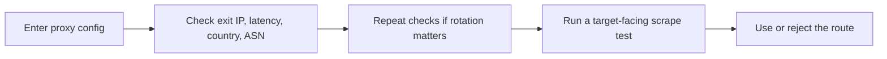

## Proxy Checker Helps You Verify Whether a Proxy Is Actually Usable, Not Just Reachable
A proxy that connects successfully can still be the wrong route for the job. The exit country may be wrong. The ASN may reveal cloud traffic when you expected residential identity. Latency may be high enough to break browser workflows. The route may even look healthy in a simple connectivity test while still being a weak fit for the target.
That is why a proxy checker matters. It gives you a fast way to inspect what a target is likely to see before you burn crawl budget, retries, or browser time on a weak route.
This page explains what to validate with a proxy checker, how to interpret the results, and how to use that information in a real scraping workflow. It pairs naturally with [Proxy Rotator Playground](https://bytesflows.com/en/blog/proxy-rotator), [proxy rotation strategies](https://bytesflows.com/en/blog/proxy-rotation-strategies), and [proxy management for large scrapers](https://bytesflows.com/en/blog/proxy-management-large-scrapers).
## What a Proxy Checker Should Confirm
A useful proxy checker should help you answer four questions:
- Is the proxy actually being applied?
- Does the route look like the country or network type I expected?
- Is latency low enough for the workload?
- Does the route look strong enough before I test it on the target?
That makes proxy checking one of the cheapest and most valuable preflight steps in scraping.
## The Main Signals to Validate
| Signal | What it tells you | Why it matters |
| --- | --- | --- |
| **Exit IP** | The address the outside world sees | Confirms the proxy is actually in effect |
| **Latency** | How expensive the route is in time | High latency often breaks browser timing and raises retry cost |
| **Country** | The visible geo location | Important for localized content, pricing, and access behavior |
| **ASN** | The network the IP belongs to | Useful for telling whether a route looks residential, ISP-based, or datacenter-like |
## Why ASN Matters More Than Many Teams Expect
Many teams validate only IP and country. That misses one of the fastest clues about route quality.
ASN matters because:
- some targets distrust datacenter or cloud networks quickly
- country alone does not tell you whether the route looks residential
- a proxy can be technically healthy while still exposing the wrong identity profile
If the ASN does not match the route type you expected, the workflow may fail later for reasons that look unrelated at first.
## A Practical Proxy Validation Workflow
A strong workflow usually looks like this:

This order keeps debugging cheap. You validate the route first, then test it under the real target.
## How to Use This Checker
1. Add the proxy endpoint in the correct format.
1. Choose the right protocol.
1. Run the check.
1. Inspect the visible IP, country, latency, and ASN.
1. If rotation matters, repeat the test several times.
One check can confirm basic health. Repeated checks are better when session behavior or rotation quality matters.
## How to Interpret the Results
### Exit IP matches expectation
This confirms the proxy is actually being applied.
### Country is correct
This matters for geo-sensitive content, location testing, and region-based blocking patterns.
### Latency stays reasonable
This is especially important for browser-based workflows, challenge-heavy targets, or multi-step tasks.
### ASN looks right for the route type
This helps confirm whether the proxy identity matches the trust profile your scraper needs.
## Common Problems a Proxy Checker Reveals Early
This kind of validation is especially good at exposing:
- wrong credentials or malformed config
- geo mismatch
- datacenter-like identity on a supposedly residential route
- slow routes that will hurt browser workflows
- inconsistent behavior across repeated checks
- sticky routing when you expected rotation
These are small problems when caught early and expensive problems when discovered during production crawling.
## When to Re-Check a Proxy
Re-checking is especially worthwhile when:
- you changed provider settings or gateway parameters
- geo targeting is critical to the workflow
- you are moving from HTTP scraping into browser automation
- success rate started dropping and the cause is unclear
- you are validating a new pool before scaling
A proxy checker is not only for first setup. It is also useful when reliability changes over time.
## Best Practices
### Validate new proxy configs before they enter production
It is cheaper to reject bad routes early.
### Compare country and ASN together, not separately
A route can have the right country and still have the wrong trust profile.
### Use repeated checks when rotation matters
One successful request does not prove session behavior.
### Pair proxy checking with a target-facing scrape test
Validation is necessary, but target behavior is still the final test.
### Keep notes by provider, region, or gateway
That makes future routing decisions faster and less guess-based.
Helpful companion pages include [Proxy Rotator Playground](https://bytesflows.com/en/blog/proxy-rotator), [Scraping Test](https://bytesflows.com/en/blog/scraping-test), [HTTP Header Checker](https://bytesflows.com/en/blog/http-header-checker), and [best proxies for web scraping](https://bytesflows.com/en/blog/best-proxies-for-web-scraping).
## FAQ
### If the proxy connects, is it automatically good enough?
No. Connectivity only proves that the route exists. It does not prove that the geo, ASN, latency, or identity profile match the workload.
### Why is the ASN surprising if the route still works?
Because technical reachability and trust profile are different questions. A route can work while still looking suspicious to the target.
### Should I test every single proxy in a large pool?
Usually not. Sampling, gateway-level validation, and ongoing monitoring are more practical for larger systems.
### If the proxy looks healthy here, will the target definitely accept it?
No. This checker validates the route layer. The target may still have stricter anti-bot logic.
## Conclusion
A proxy checker is useful because it helps you validate whether a proxy is actually usable for scraping before you commit traffic to it. Exit IP, latency, country, and ASN together tell a much richer story than a simple success response.
The practical lesson is simple: do not confuse *connected* with *correct*. When you validate the route first and then test it on the target, proxy debugging becomes faster, cheaper, and much easier to control.
## Further reading
- [Proxy Rotator Playground](https://bytesflows.com/en/blog/proxy-rotator)
- [Proxy rotation strategies](https://bytesflows.com/en/blog/proxy-rotation-strategies)
- [Proxy rotation best practices](https://bytesflows.com/en/blog/proxy-rotation-best-practices-2026)
- [Proxy management for large scrapers](https://bytesflows.com/en/blog/proxy-management-large-scrapers)
- [Best proxies for web scraping](https://bytesflows.com/en/blog/best-proxies-for-web-scraping)
- [Datacenter vs residential proxies](https://bytesflows.com/en/blog/datacenter-vs-residential-proxies)
- [Residential proxies](https://bytesflows.com/en/proxies)
