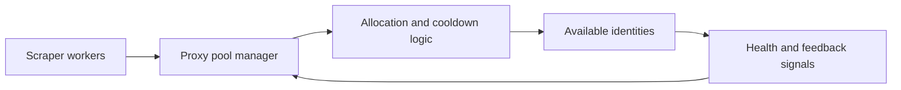

## Proxy Pool Design Is Really the Problem of Managing Identity as a Shared Resource
A proxy pool is easy to describe as a list of IPs. In practice, that description misses the part that actually matters. A real proxy pool decides how identities are assigned, reused, cooled down, quarantined, and withdrawn when routes become weak. That is why pool design has a direct effect on pass rate, stability, and cost.
A weak pool can waste strong proxies. A strong pool can make the whole scraping system feel more predictable even when targets are hostile.
This guide explains what proxy pool systems actually do, when a managed pool is enough, when custom pool logic becomes useful, and how health scoring, segmentation, cooldowns, and allocation policy shape routing quality over time. It pairs naturally with [proxy management for large scrapers](https://bytesflows.com/blog/proxy-management-large-scrapers), [how many proxies do you need](https://bytesflows.com/blog/how-many-proxies-need-scraping), and [building proxy infrastructure for crawlers](https://bytesflows.com/blog/building-proxy-infrastructure-crawlers).
## What a Proxy Pool Really Manages
A proxy pool sits between scraping workloads and available identities.
In practice, that means it helps decide:
- which route gets assigned next
- how load is distributed across identities
- when a route should cool down
- when sticky or rotating behavior should apply
- when a weak route should be quarantined or removed
That is why a proxy pool is not just transport. It is an identity allocation system.
## Why Pool Design Matters More at Scale
Small workflows can survive with simple route assignment. Larger systems usually cannot.
As scale increases, the pool has to protect against:
- route overuse
- repeated reuse of recently challenged identities
- hidden cost waste from poor assignment
- one target damaging the health of a shared pool
- uneven load concentration across a small part of the route inventory
This is why pool design becomes more important the moment scraping stops being a single script.
## Managed Pool Behavior vs Self-Built Pool Logic
Many teams can start with a managed rotating gateway where the provider handles most pool behavior internally.
That is often enough when:
- the workload is straightforward
- provider routing matches the use case
- deep allocation control is unnecessary
Custom or self-built pool logic becomes more useful when:
- you combine multiple providers
- different domains need different identity behavior
- you want explicit health scoring and cooldown rules
- you need target-specific segmentation or session mapping
The right choice depends on how much control the scraper truly needs, not on whether building it sounds sophisticated.
## Pool Size Is Only One Part of Pool Quality
Teams often ask how large the pool should be. That matters, but count alone does not define pool health.
Useful factors include:
- concurrency level
- request rate by target
- target strictness
- retry volume
- sticky session duration
- how well the pool prevents route concentration
A smaller well-managed pool can outperform a larger one that assigns identities carelessly.
## Allocation Strategy Shapes Pool Outcomes
Proxy pool systems often differ most in how they assign routes.
Common patterns include:
- random selection
- round-robin assignment
- least-recently-used distribution
- sticky session mapping
- domain-specific or region-specific sub-pools
The goal is not to choose the most elegant-sounding method. It is to choose the one that keeps identity pressure believable for the real workload.
## Cooldown and Health Logic Prevent Slow Failure
A route does not need to be fully dead to become costly.
Useful pool health signals often include:
- repeated 403 or 429 responses
- rising latency
- challenge concentration
- repeated retry failure
- region-specific degradation
Cooldown logic matters because weak routes can quietly damage performance long before they are obviously broken.
## Segmentation Protects the Rest of the Pool
Not every workload should share one undifferentiated pool.
Segmentation may be useful by:
- target domain or target class
- geography
- stickiness requirements
- browser versus request-based workload
- sensitivity level of the target
This helps prevent one type of work from poisoning the entire identity inventory.
## Proxy Pool Design Affects Browser Automation Too
In browser-heavy systems, pool behavior changes:
- how browser sessions are grouped
- whether retries really get fresh identity
- whether sticky continuity is preserved correctly
- how aggressively identities are reused across sessions
That is why pool design is tightly linked to Playwright, Puppeteer, and crawler architecture rather than sitting apart from them.
## A Practical Proxy Pool Model
A useful mental model looks like this:

This shows why proxy pools behave more like routing control loops than simple inventories.
## Common Mistakes
### Treating the pool like a bag of interchangeable IPs
The value comes from allocation and health control.
### Growing pool size without fixing load concentration
More routes do not solve bad assignment logic.
### Using one undifferentiated pool for every region and target
Different workloads often need different identity rules.
### Waiting for routes to fully die before reacting
Soft decline can still be expensive.
### Building custom pool logic too early when a managed gateway already fits
Control has its own complexity cost.
## Best Practices
### Treat identity allocation as the main design problem
Inventory matters, but assignment matters more.
### Size the pool around workload shape, not vanity IP counts
Concurrency and target behavior matter more than a headline number.
### Add cooldown and health logic before scale magnifies weak routes
Preventive control beats reactive cleanup.
### Segment pools when regions, targets, or session needs diverge materially
One pool should not always serve every job.
### Stay with managed behavior until a real routing limitation appears
Do not build complexity for prestige.
Helpful companion pages include [Proxy Checker](https://bytesflows.com/blog/proxy-checker), [Proxy Rotator Playground](https://bytesflows.com/blog/proxy-rotator), [Scraping Test](https://bytesflows.com/blog/scraping-test), and [best proxies for web scraping](https://bytesflows.com/blog/best-proxies-for-web-scraping).
## Conclusion
Designing proxy pool systems is really the work of managing identity as a shared resource across scraping workloads. The pool decides how routes are assigned, when they are cooled down, and how failures are contained before they spread across the wider system.
The strongest pool designs do not rely only on having many proxies. They rely on sensible allocation, route health awareness, workload segmentation, and cooldown behavior that preserves route usefulness over time. Once those controls are in place, the pool stops being just a list of IPs and becomes one of the most important reliability systems in scraping infrastructure.
## Further reading
- [Proxy management for large scrapers](https://bytesflows.com/blog/proxy-management-large-scrapers)
- [How many proxies do you need](https://bytesflows.com/blog/how-many-proxies-need-scraping)
- [Building proxy infrastructure for crawlers](https://bytesflows.com/blog/building-proxy-infrastructure-crawlers)
- [How proxy rotation works](https://bytesflows.com/blog/how-proxy-rotation-works)
- [Best proxies for web scraping](https://bytesflows.com/blog/best-proxies-for-web-scraping)
- [Proxy Checker](https://bytesflows.com/blog/proxy-checker)
- [Residential proxies](https://bytesflows.com/proxies)
