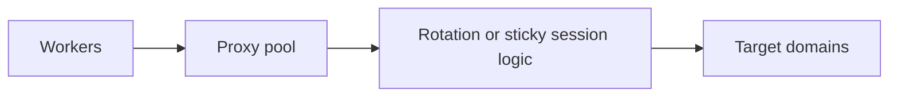

## Proxy Pools Exist Because One Good Proxy Is Still Not Enough at Scale
A single proxy can be enough for a quick test. It is not enough for serious scraping. Once requests repeat at volume, one IP—or even a very small number of IPs—starts carrying too much visible load. That is when websites begin to rate-limit, challenge, or classify the traffic more aggressively.
Proxy pools solve that problem by turning one identity into many potential identities.
This guide explains what a proxy pool really is, how pool design affects scraping reliability, the difference between gateway-based and list-based pools, and how concurrency, rotation, and workload segmentation shape pool performance in production. It pairs naturally with [web scraping proxy architecture](https://bytesflows.com/en/blog/web-scraping-proxy-architecture), [how proxy rotation works](https://bytesflows.com/en/blog/how-proxy-rotation-works), and [how many proxies do you need](https://bytesflows.com/en/blog/how-many-proxies-need-scraping).
## What a Proxy Pool Actually Means
A proxy pool is a set of identities available to the scraper so traffic can be distributed rather than concentrated.
That pool may be:
- exposed through a rotating gateway
- represented as a managed list of proxy endpoints
- segmented by geography, session behavior, or worker routing
The key point is that the scraper should not depend on one visible IP as the workload grows.
## Why Proxy Pools Matter
Without a proxy pool, repeated requests create concentrated pressure.
That often leads to:
- faster IP bans
- higher challenge rates
- worse stability at scale
- weak retry behavior because there is no meaningful alternative identity
A proxy pool improves survivability because the workload is spread across more possible routes.
## Gateway vs List: The Two Main Models
### Gateway model
With a gateway, the scraper points to one endpoint and the provider handles the underlying IP rotation.
This is often the simplest operational model because:
- the scraper does not manage individual IPs directly
- the provider rotates identities internally
- configuration stays relatively simple
### List model
With a list model, the scraper or middleware chooses from explicit proxy endpoints.
This gives more control over:
- routing decisions
- per-proxy health logic
- segmentation by worker or domain
But it also creates more operational burden.
For many teams, the gateway model is the easiest useful default. The list model becomes more attractive when control needs increase.
## Pool Size and Concurrency Are Connected
A proxy pool is only useful if it can support the workload.
That means pool design must consider:
- how many workers run in parallel
- how many requests hit the same domain
- whether sessions are sticky or rotating
- how strict the target is
- how retries affect total identity pressure
A tiny pool behind a large concurrent scraper often behaves like a single-IP system with extra complexity.
## Why Per-Domain Concurrency Still Matters
A common misconception is that a large proxy pool automatically solves scale.
It does not.
Even with many IPs, sending too much simultaneous traffic to one domain can still look coordinated or suspicious. That is why pool size and per-domain concurrency must be designed together.
A stronger pool gives more room to distribute load, but it does not remove the need for pacing discipline.
## Sticky Sessions Change Pool Economics
Sticky sessions are useful, but they also change how the pool is consumed.
Why?
Because each longer-lived session may pin an identity for a period of time rather than releasing it quickly back into the broader rotation pattern.
That means workflows with many sticky browser sessions often need different pool sizing assumptions than simple stateless page collection.
## A Practical Pool Architecture
A useful model looks like this:

This shows that the pool is not just a bag of IPs. It is part of the routing system that determines how identities are assigned and reused.
## When a Gateway Is Usually Enough
A gateway-based pool is often enough when:
- the team wants low operational complexity
- the provider’s rotation quality is adequate
- the workload is not highly customized by domain
- explicit per-proxy control is not necessary
This is why rotating residential gateways are so common in production scraping.
## When a List-Based Pool Makes More Sense
A list or custom-managed pool becomes more useful when:
- you want multi-provider redundancy
- you need custom routing rules
- certain workers or targets need isolation
- you want deeper health-based selection logic
- the system needs more granular control than one gateway offers
This is a more advanced model and usually comes with more operational responsibility.
## Common Mistakes
### Assuming more IPs automatically solve all block issues
Pool quality and traffic behavior still matter.
### Using too much concurrency for the real pool size
This creates concentration under the surface.
### Ignoring domain-level load patterns
A large pool does not remove coordinated-looking traffic.
### Treating gateway simplicity as infinite flexibility
Gateway-based pools are simpler, but not infinitely customizable.
### Forgetting that sticky sessions consume identity differently
Longer session continuity changes capacity planning.
## Best Practices for Proxy Pools
### Size the pool to the actual workload, not just the scraper count
Think about sessions, retries, and domain pressure together.
### Start with a gateway unless control needs justify more complexity
Operational simplicity is valuable.
### Monitor success rate, block rate, and latency together
A large pool is only useful if it improves the real outcome.
### Segment workloads when targets behave very differently
Not every domain should share the same traffic assumptions.
### Revisit pool design as the scraper scales
A pool that works at small scale can become inadequate quickly.
Helpful support tools include [Proxy Checker](https://bytesflows.com/en/blog/proxy-checker), [Proxy Rotator Playground](https://bytesflows.com/en/blog/proxy-rotator), and [Scraping Test](https://bytesflows.com/en/blog/scraping-test-tool-detect-blocks).
## Conclusion
Proxy pools for web scraping exist to prevent repeated traffic from collapsing onto too few visible identities. They matter because scaling a scraper is as much about traffic distribution as it is about workers and parsers.
Gateway-based pools offer simplicity and are often enough for many systems. List-based pools offer more control but demand more operational work. The right design depends on target strictness, session behavior, concurrency, and how much routing control the scraper actually needs. In practice, a good proxy pool is not just bigger—it is matched to the real shape of the workload.
If you want the strongest next reading path from here, continue with [web scraping proxy architecture](https://bytesflows.com/en/blog/web-scraping-proxy-architecture), [how proxy rotation works](https://bytesflows.com/en/blog/how-proxy-rotation-works), [how many proxies do you need](https://bytesflows.com/en/blog/how-many-proxies-need-scraping), and [best proxies for web scraping](https://bytesflows.com/en/blog/best-proxies-for-web-scraping).
## Further reading
- [Web scraping proxy architecture](https://bytesflows.com/en/blog/web-scraping-proxy-architecture)
- [How proxy rotation works](https://bytesflows.com/en/blog/how-proxy-rotation-works)
- [How many proxies do you need](https://bytesflows.com/en/blog/how-many-proxies-need-scraping)
- [Best proxies for web scraping](https://bytesflows.com/en/blog/best-proxies-for-web-scraping)
- [Residential proxies](https://bytesflows.com/en/blog/residential-proxies)
- [Proxy rotation strategies](https://bytesflows.com/en/blog/proxy-rotation-strategies)
- [Playwright web scraping at scale](https://bytesflows.com/en/blog/playwright-web-scraping-scale)
