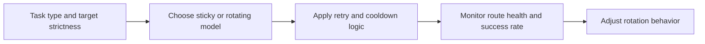

## High Scraping Success Rates Usually Come from Better Rotation Discipline, Not Just More Proxies
Many teams assume proxy rotation is automatically helpful as long as IPs keep changing. In practice, rotation only improves results when the identity pattern fits the workflow. Rotating too aggressively can break continuity. Rotating too slowly can concentrate pressure until the route burns out. Best practices exist because proxy rotation is one of the main control systems that determines whether a scraper stays stable under repetition.
That is why high success rates usually come from better rotation discipline rather than from proxy volume alone.
This guide explains the most important proxy rotation best practices: choosing the right session model, handling route failure intelligently, coordinating retries and cooldowns, and making sure traffic looks distributed without becoming incoherent. It pairs naturally with [proxy rotation strategies](https://bytesflows.com/blog/proxy-rotation-strategies), [how proxy rotation works](https://bytesflows.com/blog/how-proxy-rotation-works), and [designing proxy pool systems](https://bytesflows.com/blog/proxy-pool-design).
## Rotation Best Practice Starts with the Task, Not the Proxy Provider
The first question is not “how do I rotate?” It is “what kind of task is this?”
Different tasks need different identity behavior.
For example:
- stateless page collection often benefits from broader rotation
- login or multi-step flows often need sticky continuity
- repeated browser sessions may need a different model than one-off HTTP requests
This is why good rotation starts with task shape.
## Use Per-Request Rotation for Stateless Work
Per-request rotation is usually best when each request stands on its own.
That includes tasks such as:
- broad catalog collection
- price checks
- simple listing or SERP scraping
- one-page fetches with no session continuity requirement
The goal is to spread pressure broadly so no single route absorbs too much attention.
## Use Sticky Sessions When the Workflow Needs Continuity
Sticky routing is best practice when changing the route would break the session.
That often includes:
- login sequences
- checkouts or carts
- multi-step forms
- long browser sessions with persistent cookies or state
In those cases, stability matters more than variety.
## Do Not Treat Rotation as a Substitute for Route Quality
Rotation helps distribute identity. It does not turn weak routes into strong ones.
If the route class is poor:
- aggressive rotation can still fail quickly
- repeated fresh identities may still look low-trust
- the target may still challenge or block at scale
This is why best practice includes evaluating proxy type and route trust alongside rotation logic.
## Retries Should Change Identity Intelligently
A common anti-pattern is retrying immediately with no change in route behavior.
Better practice usually means deciding:
- whether the failure was route-related
- whether the next attempt should rotate or remain sticky
- whether a cooldown is needed before trying again
- whether the failure indicates broader pool degradation
Retries should reduce repeated pressure, not repeat it blindly.
## Cooldowns Help Protect Pool Health
A route does not need to be permanently dead to be temporarily harmful.
Best practice often includes cooling down routes that show:
- repeated 403 or 429 responses
- challenge concentration
- sudden latency spikes
- poor outcomes on one target class
Cooldown logic helps preserve the pool instead of consuming it recklessly.
## Rotation Needs Concurrency Awareness
A strong rotation policy can still fail if worker behavior overwhelms it.
For example:
- too many concurrent tasks can overuse the same pool
- many sticky sessions can silently consume route diversity
- domain pressure can stay suspicious even with varied identities
This is why best practice treats rotation and concurrency as one system.
## Align Browser Identity with Proxy Identity
When browser automation is involved, rotation quality also depends on coherence.
That means:
- route region should fit browser locale when relevant
- sticky browser sessions should not change identity mid-flow
- browser context and route logic should tell one believable story
This is especially important on stricter anti-bot targets.
## A Practical Best-Practice Model
A useful mental model looks like this:

This shows why rotation best practice is an ongoing control process, not one setting.
## Common Mistakes
### Rotating constantly when session continuity is required
This breaks working flows.
### Using sticky sessions everywhere because they feel safer
This often overconcentrates traffic.
### Retrying blocks without thinking about identity change
That compounds route damage.
### Ignoring route cooldowns until the pool degrades badly
Best practice is preventive.
### Measuring only rotation frequency instead of actual success rate
Outcome matters more than movement.
## Best Practices for High Success Rates
### Match the rotation model to the task’s continuity needs
This is the foundation.
### Combine rotation with route-quality awareness
Not all fresh IPs are equally useful.
### Design retries, cooldowns, and concurrency together
Identity pressure is a system problem.
### Keep browser and route identity coherent on browser-based tasks
Continuity is part of realism.
### Monitor actual success rate by target and route pattern
That is the real feedback loop.
Helpful support tools include [Proxy Checker](https://bytesflows.com/blog/proxy-checker), [Proxy Rotator Playground](https://bytesflows.com/blog/proxy-rotator), and [Scraping Test](https://bytesflows.com/blog/scraping-test-tool-detect-blocks).
## Conclusion
Proxy rotation best practices are really about using identity with discipline. High success rates come from rotating when distribution is needed, staying sticky when continuity is required, and making sure retries, cooldowns, and concurrency all reinforce the same traffic strategy.
The practical lesson is that rotation should be treated as an adaptive control system, not a checkbox. When the routing model fits the task and route health is managed deliberately, rotation stops being a defensive reaction and becomes one of the main reasons a scraper stays stable over time.
If you want the strongest next reading path from here, continue with [proxy rotation strategies](https://bytesflows.com/blog/proxy-rotation-strategies), [how proxy rotation works](https://bytesflows.com/blog/how-proxy-rotation-works), [designing proxy pool systems](https://bytesflows.com/blog/proxy-pool-design), and [proxy management for large scrapers](https://bytesflows.com/blog/proxy-management-large-scrapers).
## Further reading
- [Proxy rotation strategies](https://bytesflows.com/blog/proxy-rotation-strategies)
- [How proxy rotation works](https://bytesflows.com/blog/how-proxy-rotation-works)
- [Designing proxy pool systems](https://bytesflows.com/blog/proxy-pool-design)
- [Proxy management for large scrapers](https://bytesflows.com/blog/proxy-management-large-scrapers)
- [Best proxies for web scraping](https://bytesflows.com/blog/best-proxies-for-web-scraping)
- [Avoid IP bans in web scraping](https://bytesflows.com/blog/avoid-ip-bans-web-scraping)
- [How to scrape websites without getting blocked](https://bytesflows.com/blog/scrape-websites-without-getting-blocked)
