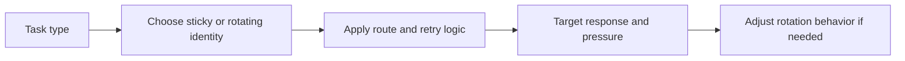

## Proxy Rotation Strategy Is One of the Most Important Decisions in Scraping Architecture
Many scraping failures are blamed on bad code, weak selectors, or difficult targets. Often the deeper problem is simpler: the scraper is using the wrong identity pattern. It rotates when continuity is needed, or it stays sticky when distribution is needed. Proxy rotation strategy determines how much pressure each visible identity absorbs and whether the target experiences your traffic as broad, believable access or repeated suspicious concentration.
That is why a scraper often lives or dies by how it rotates IPs, not just by what it requests.
This guide explains the most important proxy rotation strategies, when per-request or sticky models make sense, how route type changes the outcome, and why retry and concurrency logic need to be designed together with rotation instead of after it. It pairs naturally with [how proxy rotation works](https://bytesflows.com/blog/how-proxy-rotation-works), [proxy management for large scrapers](https://bytesflows.com/blog/proxy-management-large-scrapers), and [designing proxy pool systems](https://bytesflows.com/blog/proxy-pool-design).
## What Rotation Strategy Actually Controls
Proxy rotation is not just about changing IPs frequently. It controls how identity is distributed over time.
That affects:
- how much load one route receives
- whether sessions remain coherent
- how easily retries can recover from a bad route
- how the target scores repeated behavior
- how much value the proxy pool actually provides
This is why rotation strategy is part of scraper architecture, not just a provider feature.
## Per-Request Rotation
Per-request rotation means each independent request or task gets fresh identity.
This model is usually strongest when:
- requests are stateless
- each page can be fetched independently
- broad distribution matters more than continuity
- you want to minimize repeated pressure per route
It is especially useful for catalog pages, broad collection, simple listings, and similar stateless workloads.
## Sticky Sessions
Sticky sessions keep one route stable for a period of time or for the duration of a workflow.
This model is strongest when:
- the target depends on session continuity
- login state matters
- a multi-step process would break if the route changes
- the browser needs one coherent identity through the whole flow
This is why sticky routing is not an optimization. It is often a functional requirement.
## Rotation Only Works If the Route Type Fits the Task
A common failure pattern is using the right proxy source with the wrong session logic.
For example:
- rotating every step in a checkout or login flow breaks continuity
- keeping one sticky identity across a broad stateless crawl concentrates pressure too much
The real design question is always: does this task need continuity or distribution more?
## Residential vs Datacenter Changes the Meaning of Rotation
Rotation logic does not override weak route trust.
On stricter targets:
- datacenter rotation may still look suspicious
- residential rotation usually gives each new route more credibility
- the value of good rotation rises when the route class is strong enough to matter
This is why rotation strategy and proxy type should be evaluated together.
## Retries Need to Respect Rotation Logic
A retry strategy that ignores rotation logic often repeats failure.
Good design usually asks:
- should the next attempt stay on the same identity?
- is continuity necessary or harmful here?
- is this a route-quality failure or a page-specific failure?
- should the retry wait, rotate, or cool down the route?
This is why retries and rotation should be designed as one system.
## Concurrency Can Defeat Good Rotation
Even a good rotation model can fail if too many workers behave badly.
For example:
- high parallelism can still overuse a pool
- domain concentration can make broad rotation look suspicious
- many sticky sessions at once can create hidden route exhaustion
Rotation reduces concentration, but it does not eliminate the need for traffic discipline.
## A Practical Rotation Model
A useful mental model looks like this:

This shows why rotation strategy is a control loop, not just a connection setting.
## Common Mistakes
### Rotating aggressively on tasks that need one stable identity
This breaks the workflow.
### Using sticky sessions by default for broad stateless crawling
This overconcentrates pressure.
### Treating proxy rotation as enough without considering route trust quality
Weak routes stay weak when rotated.
### Retrying on the same failing identity without thinking about continuity needs
That often compounds failure.
### Ignoring concurrency while focusing only on rotation settings
Too much pressure still looks bad.
## Best Practices for Proxy Rotation Strategy
### Choose rotation style from the task’s continuity needs
The workflow should drive the routing model.
### Prefer broad rotation for stateless collection and sticky sessions for continuity-heavy flows
This is the core split.
### Evaluate rotation together with route quality and target strictness
The route class changes the result.
### Design retries and cooldown rules around identity logic
Do not treat them separately.
### Measure real success rate under repeated runs, not only theoretical rotation variety
Outcome quality matters more than rotation frequency.
Helpful support tools include [Proxy Checker](https://bytesflows.com/blog/proxy-checker), [Proxy Rotator Playground](https://bytesflows.com/blog/proxy-rotator), and [Scraping Test](https://bytesflows.com/blog/scraping-test-tool-detect-blocks).
## Conclusion
Proxy rotation strategy matters because it determines how your scraper presents identity over time. The right strategy supports either continuity or distribution, depending on what the task actually needs. The wrong strategy makes even a good proxy source and a good scraper behave badly.
The practical lesson is to stop treating rotation as a default checkbox. It is one of the main control systems in scraping. Once rotation, retries, route quality, and concurrency are designed together, the scraper becomes much more stable and much less likely to fail simply because it showed up in the wrong way.
If you want the strongest next reading path from here, continue with [how proxy rotation works](https://bytesflows.com/blog/how-proxy-rotation-works), [proxy management for large scrapers](https://bytesflows.com/blog/proxy-management-large-scrapers), [designing proxy pool systems](https://bytesflows.com/blog/proxy-pool-design), and [best proxies for web scraping](https://bytesflows.com/blog/best-proxies-for-web-scraping).
## Further reading
- [How proxy rotation works](https://bytesflows.com/blog/how-proxy-rotation-works)
- [Proxy management for large scrapers](https://bytesflows.com/blog/proxy-management-large-scrapers)
- [Designing proxy pool systems](https://bytesflows.com/blog/proxy-pool-design)
- [Best proxies for web scraping](https://bytesflows.com/blog/best-proxies-for-web-scraping)
- [Residential proxies](https://bytesflows.com/blog/residential-proxies)
- [Avoid IP bans in web scraping](https://bytesflows.com/blog/avoid-ip-bans-web-scraping)
- [How to scrape websites without getting blocked](https://bytesflows.com/blog/scrape-websites-without-getting-blocked)
