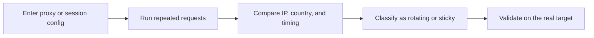

## Proxy Rotator Playground Helps You See Whether Proxy Rotation Matches the Workflow, Not Just the Marketing Label
A provider may say a gateway rotates. That does not automatically mean the rotation is useful for your scraper. What matters in practice is how the route behaves over repeated requests. Does the IP change when expected? Does the country remain stable? Does a session stay coherent when continuity matters? Does the pool really spread identity, or does it repeat weak routes too often?
That is why a proxy rotator playground matters. It lets you observe the real identity pattern before you scale it into production.
This page explains what rotation behavior to test, how to interpret repeated results, and how to decide whether a route should be used as rotating or sticky infrastructure. It pairs naturally with [Proxy Checker](https://bytesflows.com/blog/proxy-checker), [how proxy rotation works](https://bytesflows.com/blog/how-proxy-rotation-works), and [proxy rotation strategies](https://bytesflows.com/blog/proxy-rotation-strategies).
## What This Tool Helps You Test
Use this playground to inspect:
- whether the proxy rotates at all
- how often the visible IP changes
- whether sticky behavior remains stable long enough
- whether geo stays aligned while identity changes
- whether route diversity looks broad enough for the workload
The point is not just to see movement. It is to see whether the movement is the right kind for the task.
## Why Rotation Testing Matters Before Production
A lot of scraping failures start as identity-model misunderstandings.
For example:
- a supposedly rotating gateway behaves sticky
- a session that should stay stable rotates too early
- country targeting drifts while IPs rotate
- a pool looks large on paper but repeats the same weak identities
These problems are much easier to diagnose in a playground than during a live crawl.
## Rotating vs Sticky Behavior
| Mode | Best for | Main risk |
| --- | --- | --- |
| **Per-request rotation** | Stateless scraping, broad distribution, repeated one-off fetches | Can break workflows that need continuity |
| **Sticky session** | Login flows, browser sessions, multi-step interactions | Can concentrate pressure if overused |
This playground helps make that difference visible instead of theoretical.
## A Practical Rotation Test Workflow
A useful workflow usually looks like this:

This keeps proxy testing grounded in observable behavior instead of documentation alone.
## What to Look For in Repeated Results
### IP diversity
If you expect broad rotation, the visible route should vary across repeated requests.
### Session continuity
If you expect sticky behavior, the identity should remain stable for the intended session window.
### Country consistency
If geo matters, rotation should not quietly drift into the wrong region.
### Failure concentration
If repeated tests keep surfacing the same weak route or error pattern, the gateway may not be healthy enough for scale.
## How to Use This Playground
1. Add the proxy endpoint or session configuration.
1. Send repeated requests through the tool.
1. Compare visible IPs across attempts.
1. Check whether country remains consistent.
1. Decide whether the observed pattern matches the workload you plan to run.
This works especially well before you attach the route to a larger crawler or browser system.
## Why Rotation Quality Matters More Than Rotation Claims
Two providers can both say they offer rotating proxies and still produce very different real-world behavior.
The questions that actually matter are:
- how broad is the identity spread?
- how predictable is session continuity?
- how much geo drift appears under repetition?
- how often do weak routes repeat?
The right provider is not the one with the strongest label. It is the one whose observed behavior fits the workflow.
## Common Problems This Tool Reveals Early
This tool is particularly useful for spotting:
- unexpected sticky behavior
- too little IP diversity
- route repetition that is higher than expected
- geo inconsistency during rotation
- unstable session continuity
- mismatch between the provider model and the scraper’s needs
These are the same issues that later become failed logins, wasted retries, or avoidable bans.
## When to Use a Proxy Rotator Playground
This tool is especially useful when:
- you are testing a new provider or gateway
- you need to compare rotating versus sticky behavior
- geo targeting matters and must remain stable
- you are planning session-heavy browser automation
- success rate has dropped and you suspect route behavior
Rotation testing is one of the best ways to prevent hidden routing assumptions from damaging a production crawl.
## Best Practices
### Test rotation before a large crawl, not during one
It is easier to diagnose identity behavior when the target is not also adding noise.
### Compare the result against the task, not only the proxy label
The right rotation model depends on continuity needs.
### Validate country and route diversity together
A changing IP is not enough if the identity still drifts in the wrong way.
### Pair rotation testing with a single-route validation step and a target-facing scrape test
Each tool answers a different layer of the problem.
### Keep notes by provider, session mode, and region
That makes future routing choices more deliberate.
Helpful companion pages include [Proxy Checker](https://bytesflows.com/blog/proxy-checker), [Scraping Test](https://bytesflows.com/blog/scraping-test), [HTTP Header Checker](https://bytesflows.com/blog/http-header-checker), and [best proxies for web scraping](https://bytesflows.com/blog/best-proxies-for-web-scraping).
## FAQ
### Why do I keep seeing the same IP?
The gateway may be sticky, the session setting may be fixed, or the provider may not rotate as often as expected.
### Does more IP variation always mean better rotation?
No. Some workflows need continuity more than diversity.
### Why does country change while rotating?
The provider may not be enforcing geo correctly, or the route may be mixing regions in the pool.
### Should I prefer rotating or sticky by default?
Neither. The correct choice depends on whether the workflow needs distribution or continuity.
## Conclusion
A proxy rotator playground is useful because it shows how a route actually behaves across repeated requests instead of asking you to trust a product label. That makes it much easier to decide whether a proxy setup is truly rotating, properly sticky, geo-consistent, and suited to the task.
The practical lesson is simple: good rotation is not random motion. It is identity behavior that matches the workflow. Once you can observe that clearly, proxy planning becomes much more deliberate and much less guess-based.
## Further reading
- [Proxy Checker](https://bytesflows.com/blog/proxy-checker)
- [How proxy rotation works](https://bytesflows.com/blog/how-proxy-rotation-works)
- [Proxy rotation strategies](https://bytesflows.com/blog/proxy-rotation-strategies)
- [Proxy rotation best practices](https://bytesflows.com/blog/proxy-rotation-best-practices-2026)
- [Designing proxy pool systems](https://bytesflows.com/blog/proxy-pool-design)
- [Proxy management for large scrapers](https://bytesflows.com/blog/proxy-management-large-scrapers)
- [Residential proxies](https://bytesflows.com/proxies)
