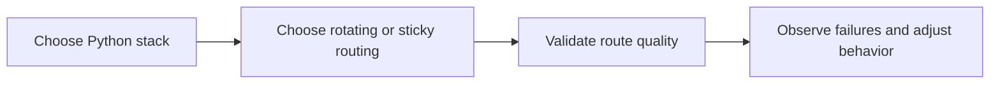

## Python Proxy Scraping Guide (2026)
Python proxy scraping gets complicated only when proxies are treated like a plug-in instead of part of the scraper’s design. In practice, the right proxy model depends on the Python tool you are using, the target’s protection level, and whether the workflow needs broad rotation or stable continuity. Requests, Scrapy, and Playwright all use proxies differently once the scraper moves beyond trivial scripts.
This guide explains how proxy use fits into the main Python scraping stacks, how to choose rotating versus sticky behavior, and how to avoid the failure patterns that show up when proxy logic and execution model do not match.
## Why Proxies Matter in Python Scraping
Proxies become important when you need to:
- reduce repeated pressure from one IP
- access geo-sensitive content
- improve pass rate on stricter targets
- keep browser sessions credible
- prevent one weak route from collapsing the whole workflow
This is why proxies are not only for scale. They are also for stability and control.
## Requests + Proxies
Requests is often the simplest proxy-enabled Python stack.
It works best when:
- the target is static enough for HTTP scraping
- browser execution is unnecessary
- you want a lightweight fetch layer
In this model, proxies mainly help with traffic distribution, region access, and rate pressure. They do not make Requests behave like a real browser.
## Scrapy + Proxies
Scrapy uses proxies inside a larger crawl system.
That means the proxy layer interacts with:
- scheduling
- concurrency
- middleware
- retries
- domain-level crawl pressure
A good Scrapy proxy setup is therefore part of crawl architecture, not just a single request option.
## Playwright + Proxies
Playwright uses proxies in the most browser-sensitive way.
That matters because the route now supports:
- a real browser session
- cookies and continuity
- dynamic page rendering
- stricter anti-bot evaluation
On protected targets, route quality often becomes even more important once browser cost and session complexity increase.
## Rotating vs Sticky in Python Workflows
Across Python stacks, the biggest proxy decision is whether the task needs:
- rotating identity for broad stateless work
or
- sticky identity for continuity-heavy workflows
### Rotating proxies
Best for:
- one-page fetches
- broad listings
- simple repeated tasks
- stateless collection where route variety helps
### Sticky proxies
Best for:
- login flows
- browser sessions with cookies
- multi-step interactions
- tasks that would break if the route changes mid-flow
This is the core routing split for Python proxy scraping.
## Route Quality Still Matters
Even a correctly configured proxy can be the wrong route.
Useful factors to validate include:
- country accuracy
- ASN type
- latency and stability
- provider rotation behavior
- how the route behaves under concurrency
A weak route stays weak whether you use it from Requests, Scrapy, or Playwright.
## Common Failure Patterns
### Requests failures
These often appear as repeated 403s, incomplete content, or connection instability.
### Scrapy failures
These often show up as retry storms, uneven crawl pressure, or falling pass rate under concurrency.
### Playwright failures
These often appear as challenge pages, slow browser sessions, broken continuity, or expensive retry loops.
Understanding proxy problems in the context of the Python stack using them makes debugging much faster.
## A Practical Mental Model
A useful model looks like this:

This shows why proxy use should follow the execution model rather than being bolted on afterward.
## Best Practices
### Choose the Python tool first, then design proxy behavior around it
Execution model comes before routing detail.
### Match rotating or sticky identity to the task’s continuity needs
This is the most important proxy decision.
### Validate IP, geo, ASN, and latency before scale
A working route can still be the wrong route.
### Keep retry logic proxy-aware
Do not let weak identity patterns repeat blindly.
### Scale only when pass rate stays stable under real workload
Proxy quality should be proven under repetition.
Helpful companion tools include [Proxy Checker](https://bytesflows.com/en/blog/proxy-checker), [Proxy Rotator Playground](https://bytesflows.com/en/blog/proxy-rotator), and [Scraping Test](https://bytesflows.com/en/blog/scraping-test).
## Conclusion
Python proxy scraping becomes much easier to manage once proxies are treated as part of workflow design rather than as optional network decoration. The right routing model depends on whether you are using a simple HTTP client, a structured crawler, or a real browser, and whether the workflow needs distribution or continuity.
The practical lesson is simple: good proxies do not replace good architecture. They support it. When route choice, Python stack, retries, and session behavior all reinforce each other, Python scraping becomes much more stable and much easier to scale on real targets.
## Further reading
- [Using requests for web scraping](https://bytesflows.com/en/blog/using-requests-web-scraping)
- [Scrapy framework guide](https://bytesflows.com/en/blog/scrapy-framework-guide)
- [Using proxies with Playwright](https://bytesflows.com/en/blog/using-proxies-playwright)
- [Best proxies for web scraping](https://bytesflows.com/en/blog/best-proxies-for-web-scraping)
- [Residential proxies](https://bytesflows.com/en/proxies)
- [Proxy rotation strategies](https://bytesflows.com/en/blog/proxy-rotation-strategies)
- [Python web scraping guide](https://bytesflows.com/en/blog/python-web-scraping-guide)
