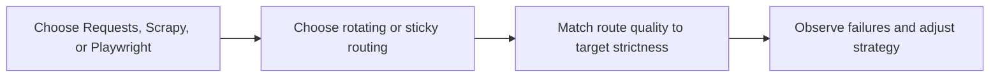

## Python Proxy Scraping Works Best When Proxy Strategy Matches the Python Stack You’re Using
Adding a proxy to a Python scraper is easy. Using proxies well is not. The right proxy setup depends on the tool you are using, the kind of target you are scraping, and whether the workflow needs simple distribution, browser realism, or sticky continuity across multiple steps. Requests, Scrapy, and Playwright all use proxies differently in practice, even when the configuration syntax looks simple.
That is why Python proxy scraping is really about matching routing behavior to the execution model.
This guide explains how proxy use differs across the main Python scraping stacks, when proxies become necessary, how sticky vs rotating identity affects each workflow, and what common failure patterns to watch for as your scraper scales. It pairs naturally with [using Requests for web scraping](https://bytesflows.com/blog/using-requests-web-scraping), [scrapy framework guide](https://bytesflows.com/blog/scrapy-framework-guide), and [playwright proxy setup guide](https://bytesflows.com/blog/playwright-proxy-setup).
## Why Proxies Matter in Python Scraping
A Python scraper is still judged as traffic by the target.
Proxies become important when you need to:
- spread load across identities
- reduce repeated pressure from one IP
- access region-specific content
- keep browser sessions believable on protected targets
- prevent one route failure from collapsing the whole workflow
This is why proxy use is not only about scale. It is also about stability.
## Requests and Proxies
Requests is often the simplest starting point for proxy-based Python scraping.
It works best when:
- the page is static enough for HTTP scraping
- browser execution is unnecessary
- the workflow is straightforward
In this model, proxies usually help with distribution, geo-targeting, and rate pressure. But they do not change the fact that Requests is still a request-only client.
## Scrapy and Proxies
Scrapy uses proxies in a more crawl-oriented environment.
That means proxy behavior interacts with:
- request scheduling
- concurrency
- middleware
- retry patterns
- domain-level crawl pressure
A Scrapy proxy strategy should therefore be designed as part of the crawl system, not only as a request parameter.
## Playwright and Proxies
Playwright uses proxies in the most browser-sensitive way of the three.
That matters because the route is now supporting:
- a real browser session
- cookies and state continuity
- dynamic rendering
- anti-bot-sensitive traffic
In this model, route quality often matters more because the browser session is more expensive and usually aimed at stricter targets.
## The Main Proxy Decision: Rotating or Sticky?
Across all three Python stacks, the biggest routing question is whether the task needs:
- broad rotation for stateless work
or
- sticky identity for continuity-heavy workflows
### Rotating identity
Best for:
- independent requests
- broad collection
- simple listings and stateless page fetches
### Sticky identity
Best for:
- login or checkout flows
- browser sessions that must stay coherent
- multi-step interaction-dependent tasks
This is the core routing decision no matter which Python tool you use.
## Route Quality Changes the Outcome
Proxy behavior only works well when the route itself is appropriate.
That means you still need to consider:
- residential vs datacenter fit
- geo accuracy
- ASN trust profile
- latency and stability
- how the provider behaves under repeated requests
A weak route stays weak whether you use it from Requests, Scrapy, or Playwright.
## Failure Patterns Differ by Stack
Proxy failures show up differently depending on the Python tool.
### In Requests
You may see connection failures, repeated 403s, or content that looks incomplete.
### In Scrapy
The problem may appear as rising block rate, retry storms, or uneven crawl pressure.
### In Playwright
You may see slower page loads, challenges, unstable sessions, or more expensive failed attempts.
This is why debugging proxy problems should always be done in the context of the stack using them.
## A Practical Python-Proxy Model
A useful mental model looks like this:

This shows why proxy use should follow the execution model instead of being bolted on afterward.
## Common Mistakes
### Treating proxy setup as identical across all Python stacks
The same route behaves differently in different workflows.
### Using Requests on browser-sensitive targets and expecting proxies to solve it
The client model is still limited.
### Adding proxies to Scrapy without reconsidering concurrency and retry policy
The crawl system still shapes pressure.
### Using weak routes for browser-heavy Playwright work
Browser traffic usually needs stronger identity.
### Ignoring sticky vs rotating logic until session failures appear
Routing style often determines whether the workflow works at all.
## Best Practices for Python Proxy Scraping
### Choose the Python stack first, then design the proxy model around it
Execution model comes before routing details.
### Match rotating or sticky behavior to the task’s continuity needs
This is the most important routing split.
### Use stronger route quality as target strictness increases
Protected sites punish weak identity faster.
### Observe failures in terms of the actual stack using the proxy
Requests, Scrapy, and Playwright fail differently.
### Treat proxy behavior as part of scraper architecture, not only network configuration
That is what makes scaling easier later.
Helpful support tools include [Proxy Checker](https://bytesflows.com/blog/proxy-checker), [Proxy Rotator Playground](https://bytesflows.com/blog/proxy-rotator), and [Scraping Test](https://bytesflows.com/blog/scraping-test).
## Conclusion
Python proxy scraping becomes much easier to reason about once you stop treating proxies as a universal plug-in. The right proxy setup depends on whether you are running simple HTTP requests, a structured crawler, or a real browser session. Each of those models creates different identity, continuity, and failure needs.
The practical lesson is that good proxy use follows the execution model. When routing style, route quality, and tool choice support each other, Python scrapers become more stable, more believable to the target, and much easier to scale without avoidable blocking.
If you want the strongest next reading path from here, continue with [using Requests for web scraping](https://bytesflows.com/blog/using-requests-web-scraping), [scrapy framework guide](https://bytesflows.com/blog/scrapy-framework-guide), [playwright proxy setup guide](https://bytesflows.com/blog/playwright-proxy-setup), and [proxy rotation strategies](https://bytesflows.com/blog/proxy-rotation-strategies).
## Further reading
- [Using Requests for web scraping](https://bytesflows.com/blog/using-requests-web-scraping)
- [Scrapy framework guide](https://bytesflows.com/blog/scrapy-framework-guide)
- [Playwright proxy setup guide](https://bytesflows.com/blog/playwright-proxy-setup)
- [Proxy rotation strategies](https://bytesflows.com/blog/proxy-rotation-strategies)
- [Best proxies for web scraping](https://bytesflows.com/blog/best-proxies-for-web-scraping)
- [Designing proxy pool systems](https://bytesflows.com/blog/proxy-pool-design)
- [The comprehensive Python web scraping guide for 2026](https://bytesflows.com/blog/python-web-scraping-guide)
