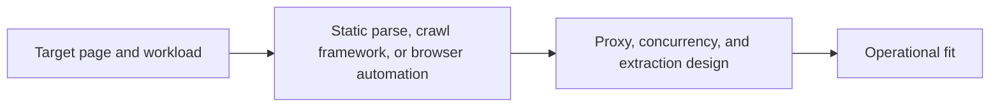

## Choosing a Python Scraping Framework Is Really About Choosing the Right Execution Model
A lot of framework comparisons become confusing because they compare tools as if they solve the same problem. They do not. BeautifulSoup, Scrapy, and Playwright each fit a different kind of scraping workload. Choosing the wrong one usually leads to either unnecessary complexity or the wrong client for the target. Choosing the right one makes the workflow feel much more natural.
That is why comparing Python scraping frameworks is really about matching framework shape to page shape and workload shape.
This guide compares BeautifulSoup, Scrapy, and Playwright in practical terms: what each tool is good at, where it becomes the wrong choice, and how to decide based on page type, scale, browser dependence, and operational needs. It pairs naturally with [beautifulsoup vs Scrapy vs Playwright for web scraping](https://bytesflows.com/en/blog/beautifulsoup-vs-scrapy-vs-playwright), [scraping dynamic websites with Python](https://bytesflows.com/en/blog/scraping-dynamic-websites-python), and [scrapy framework guide](https://bytesflows.com/en/blog/scrapy-framework-guide).
## These Tools Solve Different Problems
The first thing to understand is that the three tools play different roles.
### BeautifulSoup
A parsing library used after you already have the HTML.
### Scrapy
A crawling framework for repeated structured extraction across many pages.
### Playwright
A browser automation tool for dynamic or browser-dependent targets.
This means the real comparison is not only “which is best?” It is “which problem do I actually have?”
## BeautifulSoup Is Best for Simplicity and Static Parsing
BeautifulSoup is strongest when:
- the page is already available in the response HTML
- the extraction task is relatively small or straightforward
- you want minimal framework overhead
- browser execution is unnecessary
It is a good fit for simpler static-page workflows and for learning how extraction works.
## Scrapy Is Best for Crawl-Shaped Workloads
Scrapy becomes more valuable when the workload involves:
- many URLs
- repeated link-following
- structured item extraction
- pipelines, retries, and crawl scheduling
- a need for organized concurrency on static targets
It is less about one page and more about systematic crawling.
## Playwright Is Best When the Target Requires a Browser
Playwright is the stronger fit when:
- JavaScript rendering matters
- the target behaves differently in a real browser
- interaction is needed before data appears
- anti-bot systems make request-only clients unreliable
Its cost is higher, but so is its ability to reproduce modern dynamic page state.
## The Biggest Decision Factors
A practical framework choice usually depends on four things.
### 1. Is the page static or dynamic?
Static pages lean toward BeautifulSoup or Scrapy. Dynamic pages often require Playwright.
### 2. Is the workload one page or many pages?
Single or small batches lean toward lighter tools. Large repeated crawls often favor Scrapy.
### 3. Does the workflow need browser realism?
If yes, Playwright becomes much more relevant.
### 4. How much structure does the project need?
As the crawl grows, framework overhead can become a benefit rather than a burden.
## There Is No Universal “Best” Framework
A common mistake is trying to standardize on one tool for every target.
In practice:
- BeautifulSoup is often enough for simple static work
- Scrapy is strong for structured large static crawls
- Playwright is necessary on dynamic or browser-sensitive targets
The most effective teams often treat these as complementary options, not ideological rivals.
## Framework Choice Also Affects Proxy and Resource Strategy
The framework shapes how the rest of the scraping system behaves.
For example:
- BeautifulSoup workflows often depend on the HTTP client around them
- Scrapy shapes concurrency and crawl policy strongly
- Playwright affects browser cost, session design, and proxy identity differently
This is why framework choice is an architecture decision, not just a coding preference.
## A Practical Comparison Model
A useful mental model looks like this:

This shows why the right framework depends on the surrounding workflow too.
## Common Mistakes
### Using Playwright on every target by default
That adds browser cost where it may not be needed.
### Using BeautifulSoup on dynamic pages and blaming selectors
The issue is often the execution model.
### Using Scrapy for tiny tasks that do not need framework structure
The overhead may not help.
### Comparing frameworks only by popularity
Workload fit matters more.
### Forgetting that the framework changes proxy and concurrency design too
The architecture follows the tool shape.
## Best Practices for Choosing Between BeautifulSoup, Scrapy, and Playwright
### Use BeautifulSoup for simple static parsing with minimal overhead
It remains a very good tool in the right place.
### Use Scrapy when the job is really a repeated crawl system
That is its natural strength.
### Use Playwright when the page truly depends on browser execution
Do not fight a dynamic target with static tools.
### Choose from target behavior first and team preference second
The page should drive the framework choice.
### Let the framework shape the rest of the architecture deliberately
Concurrency, proxies, and validation will follow from that choice.
Helpful support tools include [HTTP Header Checker](https://bytesflows.com/en/blog/http-header-checker), [Proxy Checker](https://bytesflows.com/en/blog/proxy-checker), and [Scraping Test](https://bytesflows.com/en/blog/scraping-test-tool-detect-blocks).
## Conclusion
Python scraping framework comparison becomes much clearer once you stop treating BeautifulSoup, Scrapy, and Playwright as interchangeable. They fit different page types, different workload sizes, and different operational realities.
The practical lesson is to choose the framework that matches the target’s actual behavior and the project’s actual scale. When the framework fits the problem, the rest of the scraper—from proxies to validation to concurrency—becomes easier to design and much more likely to stay reliable over time.
If you want the strongest next reading path from here, continue with [beautifulsoup vs Scrapy vs Playwright for web scraping](https://bytesflows.com/en/blog/beautifulsoup-vs-scrapy-vs-playwright), [scraping dynamic websites with Python](https://bytesflows.com/en/blog/scraping-dynamic-websites-python), [scrapy framework guide](https://bytesflows.com/en/blog/scrapy-framework-guide), and [extracting structured data with Python](https://bytesflows.com/en/blog/extracting-structured-data-python).
## Further reading
- [BeautifulSoup vs Scrapy vs Playwright for web scraping](https://bytesflows.com/en/blog/beautifulsoup-vs-scrapy-vs-playwright)
- [Scraping dynamic websites with Python](https://bytesflows.com/en/blog/scraping-dynamic-websites-python)
- [Scrapy framework guide](https://bytesflows.com/en/blog/scrapy-framework-guide)
- [Extracting structured data with Python](https://bytesflows.com/en/blog/extracting-structured-data-python)
- [Using Requests for web scraping](https://bytesflows.com/en/blog/using-requests-web-scraping)
- [Playwright web scraping tutorial](https://bytesflows.com/en/blog/playwright-web-scraping-tutorial)
- [Python web scraping best practices](https://bytesflows.com/en/blog/python-web-scraping-best-practices)
