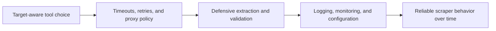

## Python Scraping Best Practices Matter Most When a Working Script Has to Keep Working
A scraper that succeeds once is not necessarily a good scraper. Production scraping fails in quieter ways: fields go missing, retries pile up, targets start blocking, logs become useless, and small assumptions break under volume. Best practices matter because they turn a script from something that runs occasionally into something that keeps producing usable data over time.
That is why Python web scraping best practices are really about operational reliability, not just code style.
This guide explains the most important practices for making Python scrapers stable in real use: target-aware tool choice, timeouts, retries, proxy design, validation, observability, and configuration discipline. It pairs naturally with [building a Python scraping API](https://bytesflows.com/blog/building-python-scraping-api), [extracting structured data with Python](https://bytesflows.com/blog/extracting-structured-data-python), and [python scraping proxy guide](https://bytesflows.com/blog/python-scraping-proxy-guide).
## Start by Choosing the Right Scraping Model
A lot of scraper pain begins before the first line of extraction logic.
The first question should be:
- is the page static enough for HTTP scraping?
- does it need browser execution?
- is the target lightly or heavily protected?
Best practice starts with using the cheapest reliable model rather than forcing every target into the same toolchain.
## Timeouts Protect Scrapers from Silent Resource Loss
Scrapers often fail slowly, not dramatically.
Without explicit timeouts:
- workers can hang
- retries can back up behind stuck tasks
- queues can fill with incomplete work
- throughput can collapse without obvious errors
This is why timeouts are not optional safety features. They are part of normal control.
## Retries Need Judgment, Not Repetition
Retrying a failed request is useful only when the retry logic understands what kind of failure occurred.
Good retry design usually distinguishes between:
- transient network failure
- target slowness
- parse or extraction issues
- route-related blocks
- rate-limit responses that need fresh identity or backoff
Blind retries often turn one failure into wasted traffic and cost.
## Proxy Strategy Should Be Treated as Core Architecture
A Python scraper is still judged by its traffic identity.
That means best practice includes thinking clearly about:
- whether a proxy is needed at all
- when residential routing matters
- how rotation or stickiness should work
- how proxy failure affects retry logic
- how route pressure grows with concurrency
Proxy handling should not be an afterthought added only after blocks begin.
## Missing Data Is a Normal Case, Not an Exception
Real web pages vary. Even pages from the same target can have incomplete or inconsistent structures.
A scraper should expect:
- missing fields
- optional sections
- shifted layouts
- incomplete values
- format changes over time
This is why defensive extraction logic is a best practice, not pessimism.
## Validation Is Part of Scraping, Not Cleanup
A scraper has not really succeeded just because it found some text.
Validation helps confirm:
- required fields exist
- values make sense
- types are normalized correctly
- records are usable downstream
Without validation, a scraper can keep running while data quality quietly collapses.
## Configuration Discipline Makes Change Manageable
Targets change. Timeouts change. Selectors change. Proxy settings change.
If those values are scattered through code, maintenance becomes harder than it should be.
A stronger scraper usually centralizes:
- timeouts
- base URLs or target definitions
- selector settings when appropriate
- proxy configuration
- concurrency or rate settings
This does not only improve style. It improves survivability.
## Logging and Monitoring Turn Failures into Diagnosable Problems
A production scraper should be understandable after it runs, not only while you are watching it.
Useful observability often includes:
- target URL or task ID
- status and duration
- retry count
- failure category
- extraction health metrics
- block rate or proxy health signals
This is what makes maintenance possible at volume.
## A Practical Best-Practice Model
A useful mental model looks like this:

This shows why scraper reliability is the result of several layers working together.
## Common Mistakes
### Treating a one-time successful run as proof of scraper quality
Stability matters more than a demo result.
### Retrying all failures the same way
Different failures need different responses.
### Adding proxies only after the target starts blocking heavily
Identity design should start earlier.
### Assuming fields will always exist when they do today
Page variation is normal.
### Logging too little to understand production failures
A silent scraper is hard to maintain.
## Best Practices for Python Web Scraping
### Choose the simplest tool that reliably fits the target
Do not overbuild or underbuild the scraper model.
### Enforce timeouts and failure-aware retries everywhere
Stuck tasks are hidden outages.
### Treat proxy design as part of the scraper architecture
Traffic identity shapes outcomes.
### Validate output as part of the extraction pipeline
Good scraping means good data, not just successful requests.
### Centralize configuration and invest in observability early
The scraper will change more than you think.
Helpful support tools include [HTTP Header Checker](https://bytesflows.com/blog/http-header-checker), [Proxy Checker](https://bytesflows.com/blog/proxy-checker), and [Scraping Test](https://bytesflows.com/blog/scraping-test-tool-detect-blocks).
## Conclusion
Python web scraping best practices are really the habits that keep a scraper useful after the first success: choosing the right tool for the target, controlling time and failure, treating proxy logic seriously, validating fields, and making the system observable enough to maintain.
The practical lesson is that the best scraper is not the shortest script. It is the one that continues to deliver usable data as targets change and scale grows. Once these practices are treated as part of the scraper itself, Python becomes an even stronger environment for dependable web data collection.
If you want the strongest next reading path from here, continue with [building a Python scraping API](https://bytesflows.com/blog/building-python-scraping-api), [extracting structured data with Python](https://bytesflows.com/blog/extracting-structured-data-python), [python scraping proxy guide](https://bytesflows.com/blog/python-scraping-proxy-guide), and [the ultimate guide to web scraping in 2026](https://bytesflows.com/blog/ultimate-guide-web-scraping-2026).
## Further reading
- [Building a Python scraping API](https://bytesflows.com/blog/building-python-scraping-api)
- [Extracting structured data with Python](https://bytesflows.com/blog/extracting-structured-data-python)
- [Python scraping proxy guide](https://bytesflows.com/blog/python-scraping-proxy-guide)
- [The ultimate guide to web scraping in 2026](https://bytesflows.com/blog/ultimate-guide-web-scraping-2026)
- [Using Requests for web scraping](https://bytesflows.com/blog/using-requests-web-scraping)
- [Scraping dynamic websites with Playwright](https://bytesflows.com/blog/scraping-dynamic-websites-playwright)
- [How to scrape websites without getting blocked](https://bytesflows.com/blog/scrape-websites-without-getting-blocked)
