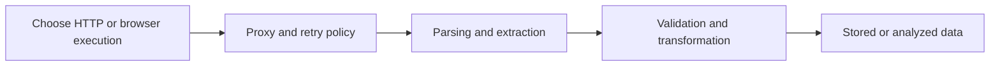

## Python Remains Strong for Web Scraping Because It Connects Collection, Parsing, and Data Work in One Stack
Python continues to be one of the strongest environments for web scraping because it does more than fetch pages. It lets teams move from requests and browser automation into parsing, validation, analysis, storage, and even AI-assisted post-processing without leaving the language. That makes it especially attractive when scraping is part of a broader data workflow rather than an isolated automation task.
That is why a comprehensive Python scraping guide should not only list libraries. It should explain how the pieces fit together.
This guide walks through the modern Python scraping stack in 2026: HTTP clients, parsers, browser tools, concurrency, anti-bot realities, and the practical logic for choosing the right combination for a given target. It pairs naturally with [python web scraping best practices](https://bytesflows.com/en/blog/python-web-scraping-best-practices), [extracting structured data with Python](https://bytesflows.com/en/blog/extracting-structured-data-python), and [scraping dynamic websites with Python](https://bytesflows.com/en/blog/scraping-dynamic-websites-python).
## The Real Python Scraping Stack Has Several Layers
A practical Python scraping workflow usually has multiple layers rather than one universal tool.
Those layers often include:
- request or browser execution
- parsing or rendered extraction
- validation and transformation
- retry, timeout, and proxy policy
- storage or downstream data use
This is why “best Python library” questions are often incomplete. Most real scrapers need a stack, not one package.
## HTTP Clients Still Matter
For static or lightly protected targets, HTTP clients remain the cheapest reliable access model.
They are useful when:
- the content is present in the response HTML
- browser execution is unnecessary
- you want lower overhead and high throughput
This is where tools such as Requests, HTTPX, or async HTTP workflows are often valuable.
## Parsers Still Decide Data Quality
Once the page is available, data still needs to be extracted into structured fields.
That is where parser choice matters.
In practice, Python scrapers often choose between:
- simpler parser workflows that are easier to develop
- faster parser workflows that matter more at volume
- browser locator-based extraction when rendering is required
The real question is not only speed. It is whether the extraction logic remains durable as the target changes.
## Browser Automation Is Now a Core Part of the Stack
Modern websites frequently require browser-capable tooling.
This is why Python scraping now often includes browser automation for:
- JavaScript-rendered pages
- browser-dependent interaction flows
- sites that reject request-only clients
- tasks where rendered state matters more than raw response HTML
In many 2026 workflows, browser automation is no longer a niche fallback. It is a normal layer in the stack.
## Concurrency Changes the Economics of Scraping
Python scraping performance is often about network wait and task coordination rather than raw CPU power.
Concurrency matters because it determines:
- how much throughput one process can sustain
- how many requests or sessions run simultaneously
- how proxy pressure accumulates
- whether async workflows outperform simpler synchronous ones for the target
Good concurrency is about controlled throughput, not just more tasks.
## Anti-Bot Reality Shapes Tool Choice
A modern Python scraper is also shaped by what the target checks.
That can include:
- request signature and headers
- TLS and connection behavior
- browser runtime signals
- IP reputation and route quality
- behavior under repetition
This is why the Python stack often has to combine the right execution layer with the right route and retry design.
## Proxies Are Part of the Stack, Not an Add-On
As soon as scraping becomes repeated, scaled, or target-sensitive, proxy logic becomes a normal part of the architecture.
That includes decisions about:
- whether proxies are needed at all
- residential vs datacenter use
- sticky vs rotating identity
- how retries and routing interact
- how proxy health affects the overall system
Python is strong here because it supports both simple and sophisticated routing models well.
## AI and Post-Processing Expand What Scraping Means
One reason Python remains attractive is that the scraping layer connects naturally to:
- data cleaning
- schema validation
- analysis pipelines
- machine learning workflows
- LLM-assisted extraction or classification
This makes Python especially valuable when the goal is not just collection but turning web content into usable downstream intelligence.
## A Practical Python-Scraping Model
A useful mental model looks like this:

This shows why comprehensive Python scraping is really a system of connected layers.
## Common Mistakes
### Looking for one library to solve every scraping problem
Different page types need different tools.
### Overusing browser automation on targets that do not need it
That adds unnecessary cost.
### Treating parsing as trivial once the page is fetched
Extraction quality still determines usefulness.
### Ignoring anti-bot and proxy design until scale introduces failures
Identity planning matters early.
### Focusing only on collection and not on validation or downstream usability
Scraping is valuable only when the data remains useful.
## Best Practices for a Modern Python Scraping Stack
### Choose the execution layer from the page behavior
Static, dynamic, and protected targets need different models.
### Treat parser choice as part of data quality design
Not just developer convenience.
### Use concurrency with restraint and visibility
More tasks should not mean more chaos.
### Integrate proxy and retry logic into the architecture early
Identity affects every layer.
### Design scraping as part of a larger data pipeline
Collection is only the beginning.
Helpful support tools include [HTTP Header Checker](https://bytesflows.com/en/blog/http-header-checker), [Proxy Checker](https://bytesflows.com/en/blog/proxy-checker), and [Scraping Test](https://bytesflows.com/en/blog/scraping-test-tool-detect-blocks).
## Conclusion
Python remains one of the most complete environments for web scraping because it connects access, parsing, browser automation, validation, and downstream data work in one practical ecosystem. The real power is not any single library. It is how well the stack adapts to different target types and workflow needs.
The practical lesson is to stop thinking about Python scraping as one tool choice. It is an architecture choice across several layers. Once you treat execution, proxy behavior, parsing, and data quality as one connected system, Python becomes not only a good scraping language but one of the most versatile foundations for serious web data work.
If you want the strongest next reading path from here, continue with [python web scraping best practices](https://bytesflows.com/en/blog/python-web-scraping-best-practices), [extracting structured data with Python](https://bytesflows.com/en/blog/extracting-structured-data-python), [scraping dynamic websites with Python](https://bytesflows.com/en/blog/scraping-dynamic-websites-python), and [building a Python scraping API](https://bytesflows.com/en/blog/building-python-scraping-api).
## Further reading
- [Python web scraping best practices](https://bytesflows.com/en/blog/python-web-scraping-best-practices)
- [Extracting structured data with Python](https://bytesflows.com/en/blog/extracting-structured-data-python)
- [Scraping dynamic websites with Python](https://bytesflows.com/en/blog/scraping-dynamic-websites-python)
- [Building a Python scraping API](https://bytesflows.com/en/blog/building-python-scraping-api)
- [Using Requests for web scraping](https://bytesflows.com/en/blog/using-requests-web-scraping)
- [Playwright web scraping tutorial](https://bytesflows.com/en/blog/playwright-web-scraping-tutorial)
- [The ultimate guide to web scraping in 2026](https://bytesflows.com/en/blog/ultimate-guide-web-scraping-2026)
