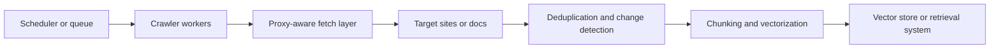

## Proxies and Controlled Crawling Matter in RAG Because Knowledge Bases Decay Without Stable Refresh Pipelines
RAG systems depend on knowledge that can be refreshed reliably. Help centers change, product docs evolve, blog content expands, and community sources drift over time. If the collection layer cannot keep up, retrieval quality degrades even when embeddings, prompts, and ranking logic remain unchanged. For many teams, the bottleneck is not vectorization itself. It is the crawling pipeline that keeps the knowledge base current.
That is why proxies and controlled crawling matter so much in RAG knowledge base construction. They turn refresh from an ad hoc scrape into a maintainable ingestion workflow.
This guide explains how proxies fit into scheduled RAG crawling, why deduplication and change detection matter, and how the full path from collection to vectorized storage should be organized. It pairs naturally with [dynamic proxy in AI data pipelines](https://bytesflows.com/blog/ai-dynamic-proxy-technical-implementation), [proxy management for large scrapers](https://bytesflows.com/blog/proxy-management-large-scrapers), and [extracting structured data with Python](https://bytesflows.com/blog/extracting-structured-data-python).
## Why RAG Collection Has Different Requirements from One-Time Scraping
RAG knowledge bases usually need:
- recurring refresh instead of one-time extraction
- multi-source ingestion across many URLs or domains
- stable handling of large document sets
- efficient detection of new or changed content
- downstream compatibility with chunking and vector storage
This makes the crawler part of the knowledge-base infrastructure, not just a pre-processing step.
## Why Proxies Belong in the RAG Collection Layer
At scale, repeated refresh jobs easily trigger rate limits, blocks, or degraded responses when too much traffic comes from one route.
Proxies help because they allow the crawler to:
- distribute request pressure across identities
- support geo-sensitive source collection when needed
- preserve session continuity on stateful sources
- separate routing control from parsing and storage logic
In other words, proxies protect the freshness pipeline from becoming operationally brittle.
## The Pipeline Needs More Than Proxy Rotation
A reliable RAG refresh system usually depends on several connected layers:
- scheduling or queueing
- proxy-aware crawling
- deduplication and change detection
- text extraction and segmentation
- vectorization and database storage
Proxy use is important, but it only creates leverage when it is part of this broader ingestion design.
## A Practical RAG Collection Architecture
A useful mental model looks like this:

This shows why RAG crawling should be treated as an end-to-end system rather than as isolated scripts.
## Scheduling and Prioritization Matter
RAG refresh pipelines are strongest when they avoid crawling everything equally.
Useful scheduling inputs often include:
- source priority
- estimated change frequency
- sitemap or feed signals
- backlog or queue pressure
- failure history by domain
This makes it easier to keep high-value knowledge fresh without overloading the whole system.
## Deduplication and Change Detection Protect Cost and Quality
Without deduplication, the crawler wastes resources reprocessing the same material repeatedly.
Change-aware ingestion helps by:
- skipping unchanged pages
- reducing embedding cost
- avoiding redundant vector writes
- making refresh cycles more predictable
In RAG systems, this is not just an optimization. It is one of the main controls on long-term storage and compute efficiency.
## Chunking and Parsing Should Follow Collection Reliability
Once content is fetched successfully, the next step is turning it into retrieval-friendly units.
That usually involves:
- extracting usable text from HTML or documents
- normalizing noise or repetitive elements
- chunking into retrieval-sized segments
- attaching source metadata for later ranking and traceability
A good collection pipeline should hand downstream systems clean inputs instead of forcing vectorization to compensate for crawling noise.
## Proxy Strategy for RAG Workloads
Many RAG refresh tasks work best with rotating identity because they involve broad independent document collection. But some sources still need sticky sessions when:
- login is required
- a document flow spans several dependent requests
- the source behaves differently once continuity is broken
This is why proxy behavior should be chosen from source behavior, not only from the general popularity of rotation.
## Common Mistakes
### Treating RAG crawling as a one-time bootstrap task
Knowledge freshness then degrades quietly.
### Adding proxies without deduplication or change detection
Freshness cost becomes unnecessarily high.
### Coupling fetch logic too tightly to parsing and vectorization
The ingestion pipeline becomes harder to evolve.
### Scheduling all sources the same way
Important documents then compete with low-value churn.
### Ignoring route behavior while scaling refresh jobs
The collection layer becomes the weakest link.
## Best Practices
### Design RAG crawling as a recurring ingestion system, not a one-off script
Freshness is the goal, not initial ingestion alone.
### Keep proxy-aware collection modular
Routing should be controllable without rewriting downstream logic.
### Use deduplication and change detection as first-class parts of the pipeline
That protects both quality and cost.
### Match scheduling frequency to source volatility and business value
Not every source deserves the same crawl pattern.
### Let chunking and vectorization operate on clean, stable collection output
Downstream quality starts with good upstream fetches.
Helpful related reading includes [dynamic proxy in AI data pipelines](https://bytesflows.com/blog/ai-dynamic-proxy-technical-implementation), [proxy management for large scrapers](https://bytesflows.com/blog/proxy-management-large-scrapers), and [building a Python scraping API](https://bytesflows.com/blog/building-python-scraping-api).
## Conclusion
Proxies and controlled crawling matter in RAG because retrieval quality depends on a knowledge base that stays current without turning refresh into chaos. A strong RAG pipeline uses scheduling, proxy-aware collection, deduplication, chunking, and vectorization as one connected system rather than as isolated tools.
The practical lesson is simple: RAG quality starts upstream. If the crawling layer is unstable, stale, or wasteful, the retrieval system inherits those problems. When the refresh pipeline is designed deliberately, the knowledge base becomes fresher, cheaper to maintain, and much more reliable over time.
## Further reading
- [Dynamic proxy in AI data pipelines](https://bytesflows.com/blog/ai-dynamic-proxy-technical-implementation)
- [Proxy management for large scrapers](https://bytesflows.com/blog/proxy-management-large-scrapers)
- [Building proxy infrastructure for crawlers](https://bytesflows.com/blog/building-proxy-infrastructure-crawlers)
- [Extracting structured data with Python](https://bytesflows.com/blog/extracting-structured-data-python)
- [Building a Python scraping API](https://bytesflows.com/blog/building-python-scraping-api)
- [Proxy rotation strategies](https://bytesflows.com/blog/proxy-rotation-strategies)
- [The ultimate guide to web scraping in 2026](https://bytesflows.com/blog/ultimate-guide-web-scraping-2026)
