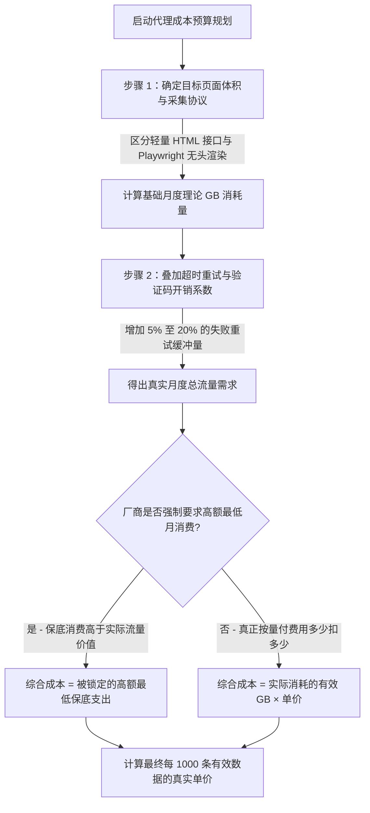

> **工程与架构评估：** 本文档由 BytesFlows 代理网络研发团队于 **2026 年 7 月** 维护。测试环境基于 Python 3.12 (`httpx`, `requests`)、Node.js v20.18 (`undici`) 及 Playwright v1.48 (Chromium)，实测全球 8 大主流地区在不同采集模式下的真实带宽与重试开销。

在采购住宅代理时，团队预算超支很少是因为“每 GB 流量单价太贵”。真正的元凶往往是被忽视的三个隐性变量：**网页 DOM 体积、超时重试开销和浏览器无头渲染资源（图片、字体、脚本）**。

> **AI 快速解答：** 要准确计算网页数据采集所需的住宅代理流量（GB），请将平均网页体积 (KB) 乘以每次运行的抓取页数、每月运行次数与重试补偿系数，再除以 1,048,576。纯 HTML 接口抓取 10,000 次仅消耗约 1.8 GB 流量，而无头浏览器（Playwright/Puppeteer）完整渲染 10,000 页将消耗 10 至 40 GB。

---

## 代理综合成本估算决策流程图（Mermaid Tree）

避免预算失控，请务必使用以下分步流程进行综合拥有成本（TCO）的算账与选型决策：

---

## 基础计算公式与变量解析

在对比各大服务商报价前，请牢记：**衡量商业效益的唯一核心指标是“每千次成功结果的综合综合成本”**，而不是简单的表面单价。

### 1. 月度总流量消耗估算公式 (GB)

$$\text{月度消耗 (GB)} = \frac{\text{页面平均大小 (KB)} \times \text{单次运行页数} \times \text{每日运行次数} \times 30 \times \text{重试系数}}{1,048,576}$$

### 2. 千次有效输出成本公式

$$\text{千次有效成本} = \frac{\text{月度代理总支出}}{\text{入库有效记录数}} \times 1,000$$

### 关键变量对照表（Markdown Scorecard）

| 变量名称 | 典型范围 | 如何精准测量 / 估算 | 优化建议 |
| :--- | :--- | :--- | :--- |
| **`页面平均大小 (KB)`** | 25 KB 至 6,000 KB | 使用 cURL `%{size_download}` 或浏览器开发者工具 Network 面板 | 开启 `gzip/brotli` 压缩，屏蔽不必要的图片与广告跟踪脚本 |
| **`单次运行页数`** | 100 至 1,000,000+ | 你的待采集商品 SKU 数、关键词表大小或目标详情页总数 | 做好增量抓取与去重，避免对不变的数据进行重复请求 |
| **`每日运行次数`** | 1 至 24+ 次 | 业务对实时性的要求（例如每小时监控一次竞争对手价格） | 分级监控：核心爆款高频抓取，长尾商品低频轮询 |
| **`重试补偿系数`** | 1.03 至 1.35 | 实际发起的网络请求总数 ÷ 成功拿到有效 JSON/DOM 的次数 | 优化请求头、引入自动轮换会话、选择地理定位更准的代理池 |
| **`入库有效记录数`** | 业务最终产出 | 真正写入数据库的有效商品价格、SERP 排名记录或页面截图 | 终极考核指标：杜绝为了抓取而抓取 |

---

## 4 大典型采集场景流量与成本对标表

以下测算基于 BytesFlows 公开的按量计费参考基准价（$2.50 / GB），假设团队每月需成功采集 **100,000 条** 有效业务数据：

| 业务场景类型 | 典型技术栈 | 单次响应平均体积 | 重试系数 | 10万次有效采集消耗 GB | 10万次总成本 | 千次有效数据成本 |
| :--- | :--- | :--- | :--- | :--- | :--- | :--- |
| **1. 搜索引擎结果页 (SERP)** | Python (`httpx` / `requests`) + SOCKS5 | ~180 KB | 1.05x | **18.9 GB** | **$47.25** | **$0.47** |
| **2. 电商商品价格监控** | Node.js (`undici`) + 轮换住宅 IP | ~350 KB | 1.08x | **37.8 GB** | **$94.50** | **$0.95** |
| **3. API 接口与 JSON 数据采集** | Golang / Python 轻量爬虫 | ~40 KB | 1.02x | **4.1 GB** | **$10.25** | **$0.10** |
| **4. Playwright 浏览器自动化** | Chromium 无头渲染 + 粘性会话 | ~3,500 KB (3.5 MB) | 1.15x | **402.5 GB** | **$1,006.25** | **$10.06** |

> **实战优化提示：** 在第 4 种无头浏览器自动化场景中，使用 Playwright 的 `route.abort()` 拦截并丢弃图片、视频、字体及第三方分析脚本（如 Google Analytics、Meta Pixels），可将单页耗流从 3.5 MB 压缩至 **600 KB 以下**，直接节省 **80%+ 的代理支出**！

---

## 生产上线前的 5 步成本核算指引

1. **先领 1GB 免费额度做实测：** 注册 [BytesFlows 控制台](https://bytesflows.com/zh/register)，自助领取 1GB 住宅代理测试流量，不要仅凭估算就直接购买大包。
2. **用真实目标站抽测 500 次：** 使用你的脚本或我们的 [在线诊断工具](https://bytesflows.com/zh/tools/proxy-test)，真实访问 500 次你的目标电商或搜索页，记录平均 KB 与重试次数。
3. **把超时设在合理区间：** 将客户端网络超时限制在 **12 至 15 秒**。过长的超时会让死连接占用Worker线程；过短的超时则会导致不必要的重试流量开销。
4. **审核服务商是否存在保底消费：** 对照 [住宅代理透明价格表](https://bytesflows.com/zh/pricing)，确认选择真正按量付费（Pay-as-you-go）、无最低消费门槛、流量不过期的服务方案。
5. **按千次有效数据向上汇报：** 在向财务或技术总监提交采购建议时，直接展示“每千条有效记录仅需 $0.47”的数据报告，让技术价值直观展现。
