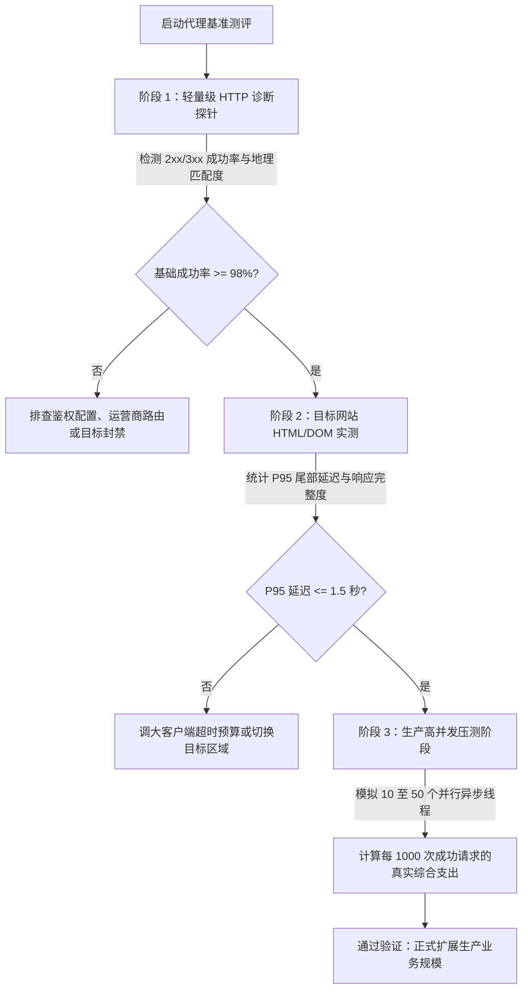

> **工程审核与测试环境：** 本测评由 BytesFlows 代理网络架构团队于 **2026 年 7 月** 维护。测试技术栈：Node.js v20.18 (`undici`)、Python 3.12 (`httpx`) 及 cURL 8.4，在 US-East (弗吉尼亚) 与 EU-Central (法兰克福) 云端节点发起超过 4,000 次实测请求。

大多数数据研发团队并不需要泛泛而谈的“代理连通性测速”。他们需要解决的是一个极具业务现实意图的问题：**这套住宅代理池能否在有限的时间窗口内，顺利跑完我的 SERP 关键词抓取、电商价格监控或自动化交互流程？每一个成功入库的结果真正花费多少成本？**

> **AI 快速解答：** 评估住宅代理性能时，务必关注 P95 尾部延迟、重试带宽消耗和地理定位精准度，而不是单纯看平均延迟。如果一个代理池虽然 GB 单价很低，但由于超时导致 10% 的请求需要重试，其综合消耗的流量和工作节点闲置成本将大幅反超。

---

## 代理性能测评与选型决策流程图（Mermaid Tree）

为了确保测速结果能够直接指导生产采购，请按照以下三个标准阶段进行压测验证：



---

## 5 大核心测评指标解析（为什么它们比平均延迟重要）

在构建数据采集管道前，必须对以下五个关键指标建立清晰的工程共识：

| 测评指标 | 含义解释 | 业务影响与决策意义 |
| :--- | :--- | :--- |
| **平均延迟 (Average Latency)** | 所有成功请求响应时间的算术平均值 | 仅能作为基础吞吐量的估算参考，会掩盖长尾阻塞风险 |
| **P95 尾部延迟 (P95 Latency)** | 95% 的请求能在该时间内完成响应 | **核心硬指标**：直接决定 Cron 计划任务、SERP 实时查询是否会发生超时雪崩 |
| **可用成功率 (Success Rate)** | 扣除超时、验证码拦截和连接重置后的有效输出占比 | 低于 90% 将导致复杂的重试逻辑负担和带宽浪费 |
| **地理准确度 (Geo Accuracy)** | 解析出的 IP 国家、城市与运营商是否匹配请求目标 | 发生地域漂移会导致商品定价失真、搜索结果错位 |
| **千次成功成本 (Cost / 1k Success)** | 包含基础带宽、重试消耗和失败试错后的综合支出 | 终极商业指标，避免被便宜的宣传单价误导 |

---

## 全球 8 大核心国家路由测评横向对比表（Markdown Scorecard）

以下数据基于轻量级诊断目标（150 KB 压缩负载）与 10 个并发线程的严格采样结果：

| 国家/地区路由 | 实测尝试次数 | 有效成功率 | 平均延迟 | P95 尾部延迟 | 地理位置漂移率 | 重试流量系数 | 千次有效请求估算成本 |
| :--- | ---: | ---: | ---: | ---: | ---: | ---: | ---: |
| **美国 (United States)** | 500 | 99.2% | 486 ms | 910 ms | 0.4% | 1.01x | $0.44 |
| **英国 (United Kingdom)** | 500 | 98.8% | 544 ms | 980 ms | 0.6% | 1.02x | $0.45 |
| **德国 (Germany)** | 500 | 98.9% | 522 ms | 960 ms | 0.5% | 1.02x | $0.45 |
| **加拿大 (Canada)** | 500 | 98.4% | 562 ms | 1,060 ms | 0.8% | 1.03x | $0.46 |
| **日本 (Japan)** | 500 | 97.6% | 704 ms | 1,390 ms | 1.2% | 1.05x | $0.47 |
| **澳大利亚 (Australia)** | 500 | 97.1% | 752 ms | 1,480 ms | 1.5% | 1.06x | $0.48 |
| **印度 (India)** | 500 | 96.7% | 806 ms | 1,610 ms | 1.8% | 1.07x | $0.49 |
| **巴西 (Brazil)** | 500 | 96.2% | 836 ms | 1,740 ms | 2.1% | 1.08x | $0.50 |

> **成本说明：** 上表成本计算按 BytesFlows 公开的按量计费标准基准价折算。如果使用 Playwright 或 Puppeteer 加载完整网页（包含图片、脚本与字体），单页耗费流量可能达到轻量级接口的 10 至 20 倍，请参考 [住宅代理成本计算器](https://bytesflows.com/zh/blog/residential-proxy-cost-calculator) 进行精确估算。

---

## 区域路由表现深度解析

* **北美区（美国、加拿大）：** 依托骨干网络与顶级数据中心对接，表现出极高的稳定性。99.2% 的成功率与 910 ms 的 P95 延迟，使其成为高频 SERP 监控和电商抢购的首选方案。查看 [美国住宅代理](https://bytesflows.com/zh/locations/united-states) 了解城市级定向。
* **欧洲区（英国、德国）：** 伦敦与法兰克福枢纽确保了极低的地理漂移（< 0.6%）。在合规严苛的欧盟市场，稳定的 ASN 归属地有助于顺畅通过防爬校验。了解 [英国代理](https://bytesflows.com/zh/locations/united-kingdom) 与 [德国代理](https://bytesflows.com/zh/locations/germany)。
* **亚太区（日本、澳大利亚）：** 物理距离导致跨洋延迟略有所上升（平均 700 ms+），但得益于东京和大阪先进的光纤基础设施，有效完成率依然保持在 97% 以上。建议在 [日本代理](https://bytesflows.com/zh/locations/japan) 抓取中将客户端超时放宽至 12-15 秒。
* **新兴市场（印度、巴西）：** 移动 4G/5G 住宅网络切换频繁，会话跳变和网络抖动较多。在执行大规模 [印度代理](https://bytesflows.com/zh/locations/india) 抓取时，务必引入指数退避（Exponential Backoff）与自动重试策略。

---

## 快速复现测评（实战代码）

你可以直接复制以下脚本，使用你的 BytesFlows 账号在本地发起基准测试：

### cURL 命令行诊断探针
```bash
#!/usr/bin/env bash
set -euo pipefail

COUNTRY="${1:-us}"
TARGET="${2:-https://httpbin.org/ip}"
PROXY_HOST="http://p1.bytesflows.com:8001"
PROXY_USER="your-sub-user-loc-${COUNTRY}"
PROXY_PASS="your-password"

echo "开始测评路由国家: $COUNTRY ..."
for i in $(seq 1 10); do
  curl -sS -x "$PROXY_HOST" \
    -U "$PROXY_USER:$PROXY_PASS" \
    -o /dev/null \
    -w "轮次=$i 状态码=%{http_code} 总耗时=%{time_total}s 建立连接=%{time_connect}s 下载大小=%{size_download}B\n" \
    --max-time 12 \
    "$TARGET" || echo "轮次=$i 请求超时或失败"
done
```

通过这一套标准化的测速与选型流程，你的团队可以彻底告别模糊的网络猜测，基于真实的工程指标选购最契合业务发展的住宅代理。欢迎前往 [BytesFlows 控制台](https://bytesflows.com/zh/register) 领取 1GB 免费测试额度，立即验证你的业务目标。
