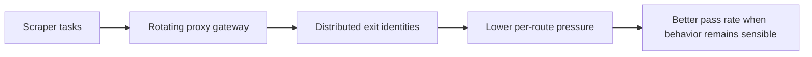

## Rotating Proxies Matter Because Most Scrapers Fail from Identity Concentration Before They Fail from Code
A scraper can have perfect selectors and still collapse because too much traffic comes from one visible identity. That is the single-IP trap: the crawler works at first, then rate limits, 403s, or challenge pages begin to appear once the target sees too much concentration. Rotating proxies help by distributing requests across multiple identities so no single route absorbs all the pressure.
That is why rotating proxies are one of the most practical defenses in scraping—not because rotation is magical, but because concentrated identity is so often the first thing that gets punished.
This guide explains what rotating proxies actually do, when per-request rotation helps, when sticky sessions are better, and how to use proxy rotation without creating new problems in retries, session continuity, or geo behavior. It pairs naturally with [proxy rotation strategies](https://bytesflows.com/en/blog/proxy-rotation-strategies), [how proxy rotation works](https://bytesflows.com/en/blog/how-proxy-rotation-works), and [proxy rotation best practices](https://bytesflows.com/en/blog/proxy-rotation-best-practices-2026).
## Why Scraping Gets Blocked Without Rotation
Modern sites often use multiple signals to identify suspicious traffic.
Common pressure signals include:
- too many requests from one IP
- repeated traffic patterns from one route
- obvious datacenter-origin traffic
- sessions that retry too aggressively without changing identity
Rotation helps because it spreads the request load across more identities instead of forcing one route to absorb repeated attention.
## What a Rotating Proxy Actually Is
A rotating proxy is usually a gateway that assigns different exit IPs over time rather than exposing one fixed route.
That means you connect to one proxy endpoint, while the provider or rotation layer decides which visible IP is used for each request or session.
This is useful because you do not have to manage large explicit IP lists just to vary identity.
## When Per-Request Rotation Works Best
Per-request rotation is strongest when:
- each request is independent
- the workflow is stateless
- broad distribution matters more than continuity
- one page fetch does not depend on the previous one
This often fits listing pages, simple page collection, catalog crawling, and similar one-shot tasks.
## When Sticky Sessions Are Better
Rotation is not always the right answer.
Sticky sessions are usually better when:
- the task depends on cookies or login state
- the browser must keep one identity through the flow
- session continuity matters more than distribution
- changing IPs mid-task would invalidate the workflow
This is why rotating and sticky models should be treated as different tools, not as good vs bad defaults.
## Rotation Works Best with the Right Route Type
Rotating weak routes does not necessarily create strong results.
Useful questions include:
- is the route residential or datacenter?
- does the target care strongly about IP reputation?
- does geo targeting remain stable while rotating?
- is the provider reusing routes too often under load?
Rotation helps distribute pressure, but route quality still determines how much trust each new identity starts with.
## Retries and Rotation Need to Work Together
A lot of scraping systems rotate on normal requests but retry poorly.
Better retry logic often asks:
- should the next attempt get fresh identity?
- was the previous failure likely route-related?
- is the workflow stateless enough to rotate safely?
- should the old route be cooled down before reuse?
Rotation helps most when retry behavior respects the same identity logic.
## Rotation Can Still Fail Under Bad Concurrency
Even rotating proxies can fail when:
- concurrency is too high for the pool size
- one domain receives too much parallel pressure
- too many workers draw from too little route diversity
- the target is stricter than the route class can support
This is why rotation should be treated as one part of traffic discipline, not the whole answer.
## A Practical Rotation Model
A useful mental model looks like this:

This shows why rotation reduces concentration rather than eliminating all risk.
## Common Mistakes
### Rotating during tasks that need one stable identity
This breaks otherwise valid sessions.
### Assuming rotation alone fixes weak route quality
Low-trust routes stay low-trust when rotated.
### Retrying with the same weak identity pattern repeatedly
That compounds failure instead of escaping it.
### Ignoring geo consistency while rotating
The route may still fail the task if the region drifts.
### Scaling concurrency faster than the rotating pool can support
Too much pressure still looks suspicious.
## Best Practices for Rotating Proxies
### Use per-request rotation for stateless scraping
That is where rotation creates the most value.
### Use sticky sessions when workflow continuity matters more than distribution
Do not break sessions for the sake of variety.
### Evaluate route quality together with rotation behavior
The proxy type still matters.
### Pair rotation with sensible retry and cooldown logic
Identity changes should help, not randomize blindly.
### Monitor pass rate under repeated real workload, not only on a few test requests
Rotation quality is proven under repetition.
Helpful companion tools include [Proxy Checker](https://bytesflows.com/en/blog/proxy-checker), [Proxy Rotator Playground](https://bytesflows.com/en/blog/proxy-rotator), and [Scraping Test](https://bytesflows.com/en/blog/scraping-test).
## Conclusion
Rotating proxies are useful because they reduce identity concentration—the same problem that causes many scrapers to get blocked long before the extraction logic itself fails. When used on stateless tasks with sensible pacing and adequate route quality, rotation can significantly improve block resistance and scale.
The practical lesson is that rotation should be used deliberately, not automatically. The right strategy is to rotate when the workflow needs distribution and stay sticky when the workflow needs continuity. Once that distinction is respected, rotating proxies become one of the most effective layers in a resilient scraping setup.
If you want the strongest next reading path from here, continue with [proxy rotation strategies](https://bytesflows.com/en/blog/proxy-rotation-strategies), [how proxy rotation works](https://bytesflows.com/en/blog/how-proxy-rotation-works), [proxy rotation best practices](https://bytesflows.com/en/blog/proxy-rotation-best-practices-2026), and [residential proxies](https://bytesflows.com/en/proxies).
## Further reading
- [Proxy rotation strategies](https://bytesflows.com/en/blog/proxy-rotation-strategies)
- [How proxy rotation works](https://bytesflows.com/en/blog/how-proxy-rotation-works)
- [Proxy rotation best practices](https://bytesflows.com/en/blog/proxy-rotation-best-practices-2026)
- [Residential proxies](https://bytesflows.com/en/proxies)
- [Best proxies for web scraping](https://bytesflows.com/en/blog/best-proxies-for-web-scraping)
- [Avoid IP bans in web scraping](https://bytesflows.com/en/blog/avoid-ip-bans-web-scraping)
- [Designing proxy pool systems](https://bytesflows.com/en/blog/proxy-pool-design)
