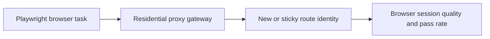

## Rotating Residential Proxies with Playwright Work Best When Browser Realism and Identity Rotation Support the Same Task
Playwright is powerful because it gives you a real browser. Rotating residential proxies are powerful because they give that browser a more credible and distributed network identity. When those two layers work together, protected scraping becomes much more stable. When they do not, rotation can still create new failure patterns by breaking continuity, confusing retries, or mismatching the browser workflow.
That is why using rotating residential proxies with Playwright is not only about passing a proxy setting into `launch()`. It is about matching browser behavior and identity behavior to the task.
This guide explains how rotating residential proxies behave in Playwright, when to rotate each browser, when to stay sticky instead, and how to use retries, pacing, and session design without accidentally defeating the value of the route. It pairs naturally with [playwright proxy setup guide](https://bytesflows.com/blog/playwright-proxy-setup), [proxy rotation strategies](https://bytesflows.com/blog/proxy-rotation-strategies), and [cloudflare bypass proxy for web scraping](https://bytesflows.com/blog/cloudflare-scraping).
## Why This Combination Works So Well
Playwright helps with:
- real browser execution
- JavaScript-heavy targets
- browser-like cookies and session behavior
- rendered page state
Rotating residential proxies help with:
- stronger IP trust
- broader identity distribution
- lower concentration on one route
- better pass rates on stricter targets
Together, they often form one of the strongest practical setups for protected browser-based scraping.
## What “Rotating Residential” Means in Playwright
In most setups, you are not managing many explicit IPs yourself. You connect Playwright to a residential gateway, and the provider decides which residential route is used for a new browser or session.
The important question is not whether the provider rotates in theory. It is:
- when does identity change?
- at what level does rotation happen?
- does that behavior fit the Playwright workflow you are running?
That is what determines whether the rotation is useful or disruptive.
## When Rotation Helps Most in Playwright
Rotating residential proxies are usually strongest when:
- each browser task is mostly independent
- the workflow is stateless or lightly stateful
- you want to minimize repeated route pressure
- the target is protected enough that broad identity distribution matters
This often fits product pages, listing extraction, broad navigation, and similar isolated browser tasks.
## When Sticky Sessions Are Better
Rotation is not always the best choice.
Sticky residential sessions are usually safer when:
- login state matters
- a multi-step workflow depends on continuity
- cookies and route identity must stay aligned
- the task would fail if the route changes mid-session
A rotating route is powerful, but it is the wrong tool when the browser session needs stability more than distribution.
## New Browser vs Reused Browser Matters
In Playwright, identity behavior often depends on how you structure the browser lifecycle.
A practical question is:
- does each task create a new browser?
- are many tasks sharing one browser?
- are contexts being reused longer than the route model expects?
Rotation often aligns best with a clear browser lifecycle. If you keep one browser alive too long, you may unintentionally keep one identity alive too long as well.
## Retries Should Change Identity Deliberately
A common failure pattern is retrying a failed Playwright job in a way that accidentally preserves the same weak session story.
Better retry design usually asks:
- should the next attempt use a new browser and therefore a new route?
- was the failure likely route-related?
- does the task need continuity or escape?
- should the previous route be cooled down before reuse?
In browser-based workflows, retry design and route design are tightly linked.
## Residential Rotation Still Needs Browser Coherence
Even with good residential routes, the session still has to look believable.
That means it still matters to control:
- viewport and locale consistency
- action pacing
- concurrency per domain
- how many parallel browsers the pool can realistically support
- whether browser behavior matches the supposed user identity
Strong routes help most when the browser story still makes sense.
## Verify the Setup Before Scale
A strong validation flow often looks like this:
1. confirm the exit IP and country through the browser
1. repeat that test across multiple browser launches
1. confirm whether identity rotates or stays sticky as intended
1. run a small real-target batch
1. scale only when pass rate remains stable
This is the fastest way to catch provider or workflow mismatches early.
## A Practical Mental Model
A useful model looks like this:

This shows why browser lifecycle and route lifecycle must be designed together.
## Common Mistakes
### Rotating on workflows that need one stable browser identity
This breaks valid sessions.
### Reusing one Playwright browser so long that rotation no longer really happens
The route concentration quietly returns.
### Treating retries as independent from route changes
The same failing identity may get reused accidentally.
### Using residential rotation without sensible browser pacing
Good routes still lose value under bad behavior.
### Scaling parallel browsers beyond what the pool can credibly support
Too much pressure still looks coordinated.
## Best Practices
### Use rotating residential proxies for independent browser tasks
That is where they usually create the most value.
### Use sticky residential sessions for login, continuity-heavy, or multi-step browser flows
Do not trade continuity for unnecessary variety.
### Align browser lifecycle with desired identity lifecycle
New browser decisions often mean new route decisions.
### Design retries to deliberately escape weak routes when continuity is not required
Rotation should help failures recover.
### Validate rotation behavior through repeated browser launches before scaling the crawler
Observed behavior matters more than assumptions.
Helpful companion tools include [Proxy Checker](https://bytesflows.com/blog/proxy-checker), [Proxy Rotator Playground](https://bytesflows.com/blog/proxy-rotator), and [Scraping Test](https://bytesflows.com/blog/scraping-test).
## Conclusion
Rotating residential proxies with Playwright can be one of the most reliable combinations for protected scraping because they pair browser realism with stronger and more distributed network identity. But the combination only works well when the rotation model matches the browser workflow. Stateless tasks benefit from fresh identity. Session-dependent tasks often need stability instead.
The practical lesson is that rotating residential proxies should be treated as part of browser architecture, not only as a launch option. Once browser lifecycle, retry logic, route behavior, and task shape all support each other, Playwright becomes much more stable on targets that would otherwise burn through weaker identities quickly.
If you want the strongest next reading path from here, continue with [playwright proxy setup guide](https://bytesflows.com/blog/playwright-proxy-setup), [using proxies with Playwright](https://bytesflows.com/blog/using-proxies-playwright), [proxy rotation strategies](https://bytesflows.com/blog/proxy-rotation-strategies), and [cloudflare bypass proxy for web scraping](https://bytesflows.com/blog/cloudflare-scraping).
## Further reading
- [Playwright proxy setup guide](https://bytesflows.com/blog/playwright-proxy-setup)
- [Using proxies with Playwright](https://bytesflows.com/blog/using-proxies-playwright)
- [Proxy rotation strategies](https://bytesflows.com/blog/proxy-rotation-strategies)
- [Cloudflare bypass proxy for web scraping](https://bytesflows.com/blog/cloudflare-scraping)
- [How to avoid detection in Playwright scraping](https://bytesflows.com/blog/avoid-detection-playwright-scraping)
- [Residential proxies](https://bytesflows.com/proxies)
- [Proxy rotation best practices](https://bytesflows.com/blog/proxy-rotation-best-practices-2026)
