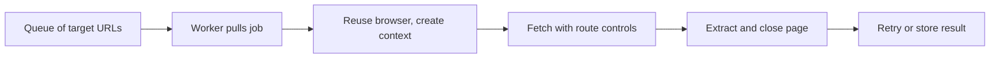

## Scaling Playwright Means Balancing Browsers, Routes, and Targets
Playwright is powerful for dynamic sites, but scaling it is very different from scaling lightweight HTTP requests. Browsers consume more memory, targets react more strongly to repeated sessions, and proxy quality becomes part of throughput planning.
That means successful scaling is not only about adding more workers. It is about balancing browser resources, concurrency, and route capacity in a way that keeps success rate stable.
This guide pairs well with [Playwright Web Scraping at Scale (2026)](https://bytesflows.com/blog/playwright-web-scraping-scale), [Web Scraping at Scale: Best Practices (2026)](https://bytesflows.com/blog/web-scraping-at-scale-best-practices), and [The Ultimate Guide to Headless Browser Scraping in 2026](https://bytesflows.com/blog/headless-browser-scraping-guide).
## The Main Bottlenecks
At scale, Playwright workflows usually run into four constraints:
- browser CPU and memory usage
- route quality and IP capacity
- per-domain concurrency tolerance
- retry cost when a browser session fails
Ignoring any one of these makes scaling look easier than it really is.
## Context Reuse Is One of the Biggest Wins
Launching a new full browser for every URL is expensive. A more efficient design often:
- reuses browser processes
- creates isolated contexts for session separation
- closes pages promptly after extraction
- keeps only the level of isolation the target actually requires
This reduces resource waste without forcing all traffic into the same session identity.
## Proxy Planning Has to Match Throughput
If you increase Playwright workers without increasing healthy route capacity, block rates usually rise. A stable Playwright setup therefore needs:
- enough route diversity for the request volume
- the right mix of rotating and sticky behavior
- per-domain pacing
- monitoring of block rate by route pool
The browser layer and proxy layer have to scale together.
## Concurrency Must Be Domain-Aware
Playwright can run many sessions, but the target domain may not tolerate them. Good systems therefore set concurrency with awareness of:
- target strictness
- value per page
- session sensitivity
- cost of retries
It is usually safer to grow with more healthy workers at conservative per-domain pressure than by pushing one domain too hard.
## A Practical Playwright Scaling Model

This design keeps session isolation, retry policy, and browser cost visible instead of hidden inside ad hoc scripts.
## Retries Need to Respect Browser Cost
A failed Playwright request is more expensive than a failed HTTP request because it usually involved a full browser session. Good retry logic should therefore:
- distinguish transient errors from blocks
- switch route or session identity when needed
- avoid immediate reuse of the same degraded session
- measure the cost of retries, not just their count
This is especially important on protected dynamic targets.
## Monitoring Matters More Than Raw Throughput
Useful Playwright metrics include:
- success rate
- block or challenge rate
- average browser lifetime
- memory usage per worker
- queue age and backlog growth
- pages completed per route pool
Throughput without these signals can be misleading because resource exhaustion and block pressure often build gradually.
## Common Mistakes
- launching too many full browsers instead of reusing contexts
- increasing workers before route capacity is ready
- setting concurrency globally instead of by domain
- retrying failures without changing session conditions
- measuring only pages per minute and ignoring block rate
## Conclusion
Scaling scraping with Playwright works best when browsers, routes, and target behavior are treated as one system. The goal is not just to run more browser instances. It is to keep rendered extraction reliable while managing resource cost and anti-bot pressure.
When context reuse, route planning, concurrency control, and good monitoring are combined well, Playwright becomes much easier to scale safely.
## Further reading
- [Playwright Web Scraping at Scale (2026)](https://bytesflows.com/blog/playwright-web-scraping-scale)
- [Web Scraping at Scale: Best Practices (2026)](https://bytesflows.com/blog/web-scraping-at-scale-best-practices)
- [The Ultimate Guide to Headless Browser Scraping in 2026](https://bytesflows.com/blog/headless-browser-scraping-guide)
- [Proxy Rotation Strategies](https://bytesflows.com/blog/proxy-rotation-strategies)
- [Best Proxies for Web Scraping](https://bytesflows.com/blog/best-proxies-for-web-scraping)
