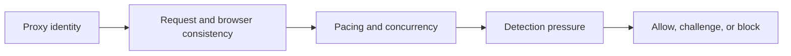

## Scraping Websites Without Getting Blocked Is Mostly About Looking Expensive to Ignore and Uninteresting to Flag
Websites do not block scraping only because scraping exists. They block when the traffic looks too concentrated, too suspicious, or too costly to tolerate. That is why successful scraping is not usually about one stealth trick. It is about reducing the signals that make your workflow look like an obvious automation system.
This is what “scrape websites without getting blocked” really means in practice: design the session so it creates as little unnecessary suspicion as possible.
This guide explains the main layers that determine whether a scraper gets blocked—rate, headers, browser behavior, proxies, geography, and scaling—and how to improve each one without turning the workflow into an overengineered mess. It pairs naturally with [avoid IP bans in web scraping](https://bytesflows.com/en/blog/avoid-ip-bans-web-scraping), [how websites detect web scrapers](https://bytesflows.com/en/blog/how-websites-detect-scrapers), and [bypass Cloudflare for web scraping](https://bytesflows.com/en/blog/bypass-cloudflare-web-scraping).
## Start with the Main Question: What Makes a Session Look Suspicious?
A scraper gets blocked when too many visible signals point in the wrong direction.
Those signals often include:
- too much traffic from one identity
- weak or datacenter IP reputation
- request patterns that look too regular
- missing or inconsistent browser context
- mechanical behavior over time
The important point is that websites usually judge the whole session, not just one request.
## Rate, Volume, and Concurrency Are Still the First Layer
The fastest path to a block is often simple overpressure.
That includes:
- too many requests in too little time
- too many parallel workers on one domain
- repeated retries that multiply the same load
This is why slowing down, spacing work, and capping per-domain concurrency often improve pass rate immediately.
## Header Consistency Matters, But It Is Only One Layer
Headers still matter because they shape how the request looks.
That includes:
- user-agent
- language preferences
- referer patterns
- consistency across the session
But the key word is consistency. Randomizing every header on every request often makes a session less believable, not more. A coherent session is usually better than a chaotic one.
## Browser Use Depends on the Target
Some websites are easy enough for simple HTTP clients. Others clearly expect a real browser.
A browser becomes more useful when the target:
- renders content with JavaScript
- relies on interaction or scroll
- inspects browser runtime signals
- challenges non-browser clients quickly
This is why the question is not “Should I always use a browser?” It is “Does this target require browser realism?”
## Proxy Identity Changes the Odds Early
IP trust remains one of the most important signals in whether a scraper gets blocked.
### Datacenter routes
Can be cost-effective on easy sites, but often face stricter treatment on consumer-facing targets.
### Residential routes
Usually perform better when trust, geography, and repeated browsing matter.
This is why protected sites often need better route quality before any parser or browser tweak starts to matter.
## Geography and Session Context Should Match
A session can look suspicious if the browser and the route tell conflicting stories.
Common problems include:
- region mismatch between proxy and locale
- browser settings that do not fit the target geography
- abrupt identity changes during a continuity-heavy flow
This is another reason coherence matters more than blind randomization.
## Pacing and Behavioral Realism Reduce Friction
Even with good proxies and a real browser, bad rhythm can still get flagged.
Signals that raise risk include:
- fixed delays with no variance
- ultra-fast navigation across many pages
- too many session starts in a short time
- retries that instantly repeat the same pattern
Good scraping behavior is not about imitating a human in theatrical detail. It is about avoiding obviously machine-like pressure.
## Scale Is Where Weak Design Starts Getting Punished
Many scrapers work at low volume and fail at production volume.
Why?
Because scale magnifies weaknesses in:
- proxy routing
- concurrency control
- retry logic
- session design
- rate discipline
This is why “without getting blocked” is usually a systems goal, not a code-snippet goal.
## A Practical Anti-Block Model
A useful mental model looks like this:

This shows why anti-block success comes from the combined design, not from one fix in isolation.
## Common Mistakes
### Assuming one successful request proves the strategy works
Real block risk appears over repeated sessions.
### Using the cheapest proxy layer on strict targets
Weak identity often makes every other layer work harder.
### Randomizing everything
Incoherence can look stranger than consistency.
### Scaling before establishing a healthy baseline
That often turns small issues into systemic blocks.
### Retrying immediately after failure
This frequently increases rather than reduces detection pressure.
## Best Practices for Scraping Without Getting Blocked
### Keep traffic pressure proportionate
Start slower than you think you need.
### Use the right identity for the target
Residential routing often matters on stricter sites.
### Keep session details coherent
Headers, locale, proxy region, and browser behavior should tell one believable story.
### Use browser automation where runtime matters
Do not rely on simple HTTP where the site clearly expects a browser.
### Scale only after pass rate is stable
Good small-scale behavior should be proven before you add volume.
Helpful support tools include [Proxy Checker](https://bytesflows.com/en/blog/proxy-checker), [Scraping Test](https://bytesflows.com/en/blog/scraping-test-tool-detect-blocks), and [Proxy Rotator Playground](https://bytesflows.com/en/blog/proxy-rotator).
## Conclusion
Scraping websites without getting blocked is not about becoming invisible. It is about reducing unnecessary signals that make the session easy to classify as automation. Stronger IP identity, coherent browser and header behavior, reasonable pacing, and careful scaling all work together to lower detection pressure.
The practical lesson is simple: sites block suspicious patterns more than they block scraping as an abstract category. The better your workflow manages identity, consistency, and pressure, the less often it triggers the systems designed to stop it. That is what makes “not getting blocked” a design outcome rather than a lucky accident.
If you want the strongest next reading path from here, continue with [avoid IP bans in web scraping](https://bytesflows.com/en/blog/avoid-ip-bans-web-scraping), [how websites detect web scrapers](https://bytesflows.com/en/blog/how-websites-detect-scrapers), [bypass Cloudflare for web scraping](https://bytesflows.com/en/blog/bypass-cloudflare-web-scraping), and [common proxy mistakes in scraping](https://bytesflows.com/en/blog/common-proxy-mistakes-scraping).
## Further reading
- [Avoid IP bans in web scraping](https://bytesflows.com/en/blog/avoid-ip-bans-web-scraping)
- [How websites detect web scrapers](https://bytesflows.com/en/blog/how-websites-detect-scrapers)
- [Bypass Cloudflare for web scraping](https://bytesflows.com/en/blog/bypass-cloudflare-web-scraping)
- [Common proxy mistakes in scraping](https://bytesflows.com/en/blog/common-proxy-mistakes-scraping)
- [Best proxies for web scraping](https://bytesflows.com/en/blog/best-proxies-for-web-scraping)
- [Residential proxies](https://bytesflows.com/en/blog/residential-proxies)
- [Common web scraping challenges](https://bytesflows.com/en/blog/common-web-scraping-challenges)
