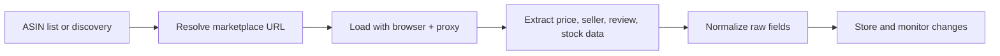

## Why Amazon Product Data Matters
Amazon product pages contain some of the most commercially valuable public data on the web. Teams use them for pricing intelligence, assortment tracking, stock monitoring, seller analysis, and market research.
That value comes with strong defensive pressure. Amazon changes layouts frequently, varies content by region and session context, and reacts quickly to repetitive or low-trust traffic.
If you are building in this area, this guide pairs well with [Scraping E-commerce Websites](https://bytesflows.com/blog/scraping-ecommerce-websites), [Scraping Marketplace Data](https://bytesflows.com/blog/scraping-marketplace-data), and [Playwright Web Scraping Tutorial](https://bytesflows.com/blog/playwright-web-scraping-tutorial).
## What Teams Usually Want to Extract From Amazon
A production workflow normally targets more than a single headline price. Common fields include:
- ASIN and canonical product URL
- product title and brand
- current price, list price, and discount state
- stock or availability state
- seller name and fulfillment type
- rating, review count, and variation signals
- shipping context, delivery promise, and image URLs
| Field group | Why it matters |
| --- | --- |
| Price and promotion | Supports competitor tracking and margin analysis |
| Seller and fulfillment | Shows marketplace dynamics and offer quality |
| Reviews and ratings | Helps measure product momentum and customer sentiment |
| Availability and delivery | Reveals stock pressure and service-level changes |
## Why Amazon Is Operationally Difficult to Scrape
Amazon is not just a product catalog. It is a highly optimized application that adapts quickly to browsing behavior.
Common failure modes include:
- block pages and rate-limit responses
- dog pages or empty product renders
- CAPTCHA challenges after suspicious navigation
- layout shifts across devices and locales
- inconsistent pricing across offers, variations, and seller states
That is why Amazon scraping needs an operational design, not just a selector file.
## ASIN-Centered Workflows Are the Most Reliable Starting Point
Amazon exposes a strong product identity model through ASINs. When possible, structure your workflow around that identity.
A common pattern is:
1. start with a known ASIN list or build one through discovery
1. resolve the correct product URL for the target marketplace
1. load the page with the right browser and proxy setup
1. extract raw fields plus offer context
1. normalize and store both raw and cleaned values
This approach is usually more stable than treating every page as an unrelated URL.
## Why Browser Automation Is Usually the Right Baseline
Some Amazon fields may still appear in ordinary HTML, but browser automation is often the safer baseline because it helps with:
- cookie and session handling
- rendered price blocks and variations
- realistic navigation and headers
- challenge detection and retry decisions
Playwright is often a good default because it gives you reliable browser control while keeping infrastructure design flexible.
## A Practical Amazon Scraping Architecture

In production, discovery and product-detail extraction are often separated so retries and scaling can be managed more cleanly.
## Why Residential Proxies Matter on Amazon
Amazon reacts quickly to obvious datacenter traffic, especially when repeated product requests come from a narrow IP pool. Residential proxies help because they:
- reduce obvious datacenter exposure
- improve session realism on commercial browsing flows
- support geo-specific product views
- distribute product-page traffic across more identities
For country-specific marketplaces, route traffic through the target country so the observed price and availability context matches the market you care about.
## Session and Cookie Continuity Matter More Than Many Teams Expect
Amazon pages often depend on session state, location hints, cookies, and prior navigation patterns. That means reliability improves when you:
- reuse a browser context for related page groups
- avoid resetting every signal too aggressively
- keep locale and region choices consistent
- detect when a session has degraded before continuing at scale
In other words, stable scraping is often about session quality as much as IP quality.
## What Good Extraction Looks Like
A reliable Amazon extractor should capture both raw source values and normalized fields.
You should plan for cases like:
- multiple price surfaces on one page
- subscribe-and-save or coupon pricing
- buy-box seller versus alternative sellers
- out-of-stock states with stale visible prices
- different offer structures across marketplaces
That is why extraction rules and normalization rules should be designed together.
## Operational Best Practices
### Start with modest concurrency
Amazon usually punishes aggressive parallelism before you notice selector problems.
### Separate product detail from offer-heavy pages
Some workflows need only product-level fields, while others need seller-level detail.
### Store raw HTML snippets or raw field strings for debugging
This makes layout changes much easier to diagnose.
### Keep geo and marketplace settings explicit
US Amazon and other regional Amazon properties can produce different outputs for the same product.
### Measure challenge rates continuously
Use [Scraping Test](https://bytesflows.com/tools/proxy-test), [Proxy Checker](https://bytesflows.com/blog/proxy-checker), and [HTTP Header Checker](https://bytesflows.com/blog/http-header-checker) to validate route quality and request presentation.
## Common Mistakes
- using datacenter-heavy traffic on a defended commercial target
- treating every visible price as the canonical price
- ignoring seller and fulfillment context
- changing session identity too often or too little
- scaling volume before measuring challenge behavior and empty-field rates
## Conclusion
Scraping Amazon product data reliably requires more than loading a product page and reading a few selectors. You need an ASIN-centered workflow, a browser strategy that preserves session quality, residential proxy routing that matches the target market, and normalization rules that handle real commercial complexity.
When those layers are designed together, Amazon data becomes much more useful for pricing intelligence, assortment tracking, and seller monitoring.
## Further reading
- [Scraping E-commerce Websites](https://bytesflows.com/blog/scraping-ecommerce-websites)
- [Scraping Marketplace Data](https://bytesflows.com/blog/scraping-marketplace-data)
- [Playwright Web Scraping Tutorial](https://bytesflows.com/blog/playwright-web-scraping-tutorial)
- [Best Proxies for Web Scraping](https://bytesflows.com/blog/best-proxies-for-web-scraping)
- [Residential Proxies](https://bytesflows.com/blog/residential-proxies)
