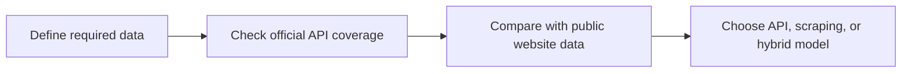

## APIs Versus Websites Is a Data-Access Decision
Teams often frame APIs and web scraping as technical opposites, but the real question is simpler: which access method gives you the data you need with the right reliability, coverage, and operational cost?
Sometimes the official API is clearly the best option. Other times the website exposes richer or more up-to-date information than the API does. In many production systems, the answer is not either-or. It is a layered strategy.
This guide pairs well with [Web Scraping vs API Data Collection](https://bytesflows.com/blog/web-scraping-vs-api-data-collection), [Browser Automation for Web Scraping](https://bytesflows.com/blog/browser-automation-web-scraping), and [Best Proxies for Web Scraping](https://bytesflows.com/blog/best-proxies-for-web-scraping).
## When APIs Are Usually the Better Choice
An official API is often the best path when it gives you:
- structured fields in a stable schema
- clear authentication and rate-limit rules
- lower parsing and maintenance cost
- better reliability for repeated access
- acceptable coverage for the business need
If the API already exposes the required data with the right freshness, scraping the website may add complexity without adding value.
## When Website Scraping Becomes Necessary
Website scraping becomes attractive when:
- the API does not exist
- the API omits important fields
- the API is too limited in volume, freshness, or scope
- the visible website contains richer commercial context
- the business needs exactly what public users can see
In these cases, scraping is often the only way to access the full practical surface.
## What Websites Often Expose That APIs Do Not
Public web pages sometimes include:
- richer presentation context
- rankings, layout position, and visual prominence
- pricing or stock states not exposed in API responses
- dynamic modules, user-facing labels, and page-only metadata
- cross-linked discovery paths that APIs flatten away
That is why scraping is not just a fallback. It can be the only way to observe the full user-visible experience.
## The Real Tradeoffs
| Dimension | API | Website scraping |
| --- | --- | --- |
| Structure | Usually cleaner | Needs parsing and normalization |
| Coverage | May be limited | Often broader on public surfaces |
| Maintenance | Usually lower | Higher because layouts change |
| User-visible context | Often partial | Usually richer |
## Browser Automation Changes the Equation
Some websites are simple enough for ordinary HTTP requests. Others require browser automation because important content appears only after JavaScript, interaction, or session logic.
That means the real comparison is often:
- API versus static HTTP collection
- API versus browser-rendered collection
The more dynamic the site, the more browser automation becomes part of the cost and reliability model.
## Proxies Matter Mainly on the Website Side
APIs usually have explicit rate limits and access rules. Websites often rely on anti-bot controls, route quality, and behavioral detection. That is why residential proxies, pacing, and browser realism matter much more for scraping workflows than for official API usage.
In short:
- APIs are governed by product rules
- websites are governed by observed behavior and access controls
## A Practical Decision Framework
1. Define the exact fields and freshness you need.
1. Check whether an official API exists and what it omits.
1. Compare API coverage with what the public site shows.
1. Estimate maintenance and anti-bot cost for website collection.
1. Choose the lightest access method that truly satisfies the use case.

## When a Hybrid Strategy Works Best
Many mature data systems use:
- APIs for stable structured data
- website scraping for missing fields or public context
- browser automation only where the site truly requires it
This hybrid model often gives the best balance of reliability and coverage.
## Operational Best Practices
### Start from the business requirement, not tool preference
Use the access method that fits the actual data need.
### Treat website scraping as a productized system
It needs monitoring, normalization, and maintenance.
### Reassess APIs periodically
A provider may add fields that remove the need for scraping later.
### Validate user-visible data separately from structured data
Some business signals exist only in page presentation.
### Test scraping routes and rendering quality regularly
Use [Scraping Test](https://bytesflows.com/blog/scraping-test), [HTTP Header Checker](https://bytesflows.com/blog/http-header-checker), and [Proxy Checker](https://bytesflows.com/blog/proxy-checker) when website access is part of the stack.
## Common Mistakes
- assuming APIs always provide the full useful dataset
- scraping a site when the API already satisfies the requirement
- ignoring browser-rendering cost on JavaScript-heavy targets
- treating website data as structured and stable by default
- failing to separate legal, operational, and product considerations
## Conclusion
APIs versus websites is not a philosophical debate. It is a practical access decision. The best choice depends on data coverage, freshness, reliability, and the operational cost of maintaining access over time.
When teams evaluate those tradeoffs clearly, they often find that the right answer is an API where possible, web scraping where necessary, and a hybrid model when each source contributes something different.
## Further reading
- [Web Scraping vs API Data Collection](https://bytesflows.com/blog/web-scraping-vs-api-data-collection)
- [Browser Automation for Web Scraping](https://bytesflows.com/blog/browser-automation-web-scraping)
- [Best Proxies for Web Scraping](https://bytesflows.com/blog/best-proxies-for-web-scraping)
- [Playwright Web Scraping Tutorial](https://bytesflows.com/blog/playwright-web-scraping-tutorial)
- [How to Scrape Websites Without Getting Blocked](https://bytesflows.com/blog/scrape-websites-without-getting-blocked)
