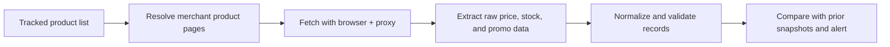

## Why Competitor Pricing Data Matters
Competitor pricing data helps teams track market movement, react to promotions, understand margin pressure, and improve catalog strategy. The goal is not just to collect prices. It is to collect trustworthy commercial signals that can be compared across merchants and over time.
That means a competitor pricing system must handle page structure differences, regional pricing, product matching, and changing stock states. This article pairs naturally with [Scraping Price Comparison Data](https://bytesflows.com/en/blog/scraping-price-comparison-data), [Scraping E-commerce Websites](https://bytesflows.com/en/blog/scraping-ecommerce-websites), and [Geo-Targeted Scraping Proxies](https://bytesflows.com/en/blog/geo-targeted-scraping-proxies).
## What a Competitor Pricing Pipeline Should Capture
A usable monitoring system should collect more than a single observed number. Common fields include:
- merchant or competitor identity
- product identifier and canonical URL
- raw displayed price and normalized numeric price
- currency, region, and timestamp
- stock or availability state
- promotion text, coupons, or bundle indicators
- shipping or delivery context when relevant
| Field group | Why it matters |
| --- | --- |
| Observed price | Preserves exactly what was shown on the page |
| Normalized price | Supports comparison and alerting |
| Availability | Prevents false price comparisons on unavailable products |
| Region and currency | Explains why prices differ across markets |
## Product Matching Comes Before Price Analysis
One of the most common failures in competitor monitoring is comparing products that are not truly equivalent. Variant, bundle, or pack-size differences can make a scraped price look useful while actually being misleading.
Reliable matching often depends on:
- SKU or manufacturer part number
- canonical product title
- brand and model
- size, volume, or pack count
- stable category context
If matching is weak, downstream alerts and pricing conclusions will also be weak.
## Why Browser Automation Is Often Necessary
Many competitor pricing targets are defended commercial pages with dynamic rendering, location-aware content, and JavaScript-heavy price blocks. Browser automation is often the safest approach because it helps with:
- loading rendered price surfaces correctly
- preserving session and cookie context
- handling interaction-heavy product pages
- measuring challenge behavior in realistic conditions
Playwright is often a practical baseline when the monitored sites are dynamic or aggressively defended.
## A Practical Competitor Pricing Architecture

In production, the fetch, normalization, and alerting stages are often separated so that each layer can be debugged and scaled independently.
## Why Geo Context Changes Competitor Price Data
Competitor prices often vary by country, tax model, delivery region, or user context. A workflow that ignores geography can produce comparisons that are technically extracted but commercially wrong.
That is why geo-targeted routing matters:
- use the right country exits for the market being monitored
- keep region choice consistent between runs
- store region and currency alongside each observation
- treat shipping and delivery differences as part of the price context when necessary
## Change Detection Is the Core Business Value
A competitor pricing system becomes valuable when it detects and explains change over time.
Typical monitoring logic includes:
- compare current normalized price to the latest prior record
- trigger alerts when thresholds are crossed
- separate ordinary price fluctuation from promotions or stock changes
- preserve historical snapshots for trend analysis
This is why time-series storage matters even when the extraction step seems straightforward.
## Why Residential Proxies Matter
Competitor monitoring often involves repeated visits to commercial pages that are protected against automation. Residential proxies help because they:
- reduce obvious datacenter signatures
- improve stability on defended storefronts
- support market-specific routing
- distribute repeated traffic across more browsing identities
For high-frequency monitoring, route quality and pacing are often just as important as selector quality.
## Operational Best Practices
### Keep per-domain concurrency conservative
Commercial sites notice bursty pricing checks quickly.
### Store both raw and normalized values
This makes false alerts much easier to audit.
### Track availability and promo context with price
A lower price is not always a directly comparable price.
### Separate merchant-specific logic cleanly
Each site will evolve differently over time.
### Validate challenge behavior before scaling monitoring frequency
Use [Scraping Test](https://bytesflows.com/en/blog/scraping-test), [Proxy Checker](https://bytesflows.com/en/blog/proxy-checker), and [HTTP Header Checker](https://bytesflows.com/en/blog/http-header-checker) to confirm that pricing pages are being served correctly.
## Common Mistakes
- comparing products before confirming they are true matches
- ignoring geography, tax, or delivery context
- storing only the cleaned price and losing the raw observed string
- treating out-of-stock pages as normal pricing events
- scaling monitoring volume before measuring blocks and empty-field rates
## Conclusion
Scraping competitor pricing data reliably is about much more than extracting a number from a page. It requires accurate product matching, geo-aware collection, browser workflows that can survive dynamic storefronts, and normalization rules that preserve commercial meaning.
When those layers are designed together, competitor pricing data becomes much more useful for alerting, market analysis, and pricing strategy.
## Further reading
- [Scraping Price Comparison Data](https://bytesflows.com/en/blog/scraping-price-comparison-data)
- [Scraping E-commerce Websites](https://bytesflows.com/en/blog/scraping-ecommerce-websites)
- [Geo-Targeted Scraping Proxies](https://bytesflows.com/en/blog/geo-targeted-scraping-proxies)
- [Proxy Rotation Strategies](https://bytesflows.com/en/blog/proxy-rotation-strategies)
- [Best Proxies for Web Scraping](https://bytesflows.com/en/blog/best-proxies-for-web-scraping)
