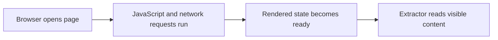

## Dynamic Websites Need a Browser-Aware Scraping Strategy, Not Just Better Requests
A lot of scraping failures happen because the scraper is technically correct for the wrong kind of page. You request the URL, get back HTML, and assume the data should be there. But modern dynamic websites often deliver only a shell at first. The useful content appears after JavaScript runs, after API calls complete, or after the browser performs interaction that simple HTTP clients never reproduce.
That is why scraping dynamic websites is not only about downloading HTML. It is about collecting the rendered state the browser actually sees.
This guide explains why dynamic sites behave differently, when Playwright is the right tool, how to think about waits and browser sessions, and what additional concerns appear once the target is both dynamic and protected. It pairs naturally with [playwright web scraping tutorial](https://bytesflows.com/blog/playwright-web-scraping-tutorial), [browser automation for web scraping](https://bytesflows.com/blog/browser-automation-web-scraping), and [playwright web scraping at scale](https://bytesflows.com/blog/playwright-web-scraping-scale).
## What Makes a Website “Dynamic” for Scraping Purposes
A dynamic website is one where the useful content is not fully present in the initial response in a ready-to-extract form.
That can happen when:
- the page renders data client-side
- data loads through background requests
- the DOM changes after JavaScript runs
- interaction is required before content appears
This is why static parsers often return incomplete or misleading results on these sites.
## Why requests Often Fails Here
A request client can download the response body, but it usually cannot reproduce the browser-side execution that turns that response into a real page state.
That means you may see:
- placeholder markup
- empty containers
- incomplete fields
- missing records that appear in the browser
At that point, the problem is not extraction syntax. It is that the scraper is using the wrong execution model.
## Why Playwright Fits Dynamic Targets
Playwright is useful because it gives you a real browser environment that can:
- execute JavaScript
- render the page state a user would see
- preserve cookies and session state
- interact with page elements
- wait on dynamic browser conditions
This makes it one of the strongest default tools when the page is truly browser-dependent.
## Waiting Is the Core Dynamic-Site Skill
On dynamic websites, the hardest problem is often not selecting elements. It is knowing when the page is actually ready.
Good waiting logic depends on the target.
Common choices include:
- waiting for a specific selector
- waiting for a meaningful UI state
- waiting for a request pattern or DOM change
- avoiding overbroad waits that slow extraction unnecessarily
This is why dynamic scraping is often more about state readiness than about selectors alone.
## Browser Session Design Matters Too
Dynamic websites often depend more heavily on session behavior.
That can include:
- cookies across navigation
- browser storage state
- logged-in or region-specific session views
- multi-step interaction before data appears
This means the browser session is not just a wrapper around extraction. It is part of the data source itself.
## Proxies Still Matter on Dynamic Targets
A dynamic site can also be anti-bot protected.
That means browser execution alone may not be enough if the site also judges:
- route quality
- IP reputation
- session behavior under repeated access
- challenge response and timing
Residential proxies often become important here because the browser needs a stronger network identity as well as browser realism.
## Dynamic Pages Need Verification
A common mistake is assuming the scraper is correct because the page loaded without error.
You should still verify:
- that the rendered data matches the human-visible page
- that the selectors are reading final content rather than placeholders
- that pagination or interaction is actually exposing more data
- that the site is not serving degraded content to the automated session
A screenshot or rendered-state check is often valuable here.
## A Practical Dynamic-Site Model
A useful mental model looks like this:

This shows why scraping dynamic sites is fundamentally different from parsing a static response.
## Common Mistakes
### Using requests on a browser-dependent page
The content is often not there yet.
### Waiting for everything instead of the needed state
That makes scraping slow and fragile.
### Extracting before the page reaches meaningful readiness
Selectors may capture placeholders.
### Ignoring session state on multi-step workflows
The browser context can change what data appears.
### Treating Playwright as enough without route quality on protected targets
The network layer still matters.
## Best Practices for Scraping Dynamic Websites with Playwright
### Confirm the site really needs a browser before using one
Use the heavier tool for the right reason.
### Wait for the specific rendered state you need
Avoid broad waiting by habit.
### Treat browser context as part of the data pipeline
Session behavior can change output quality.
### Verify rendered results visually or structurally during development
Dynamic pages often fail quietly.
### Pair Playwright with stronger route quality on stricter targets
Browser realism and network identity work together.
Helpful support tools include [HTTP Header Checker](https://bytesflows.com/blog/http-header-checker), [Scraping Test](https://bytesflows.com/blog/scraping-test-tool-detect-blocks), and [Proxy Checker](https://bytesflows.com/blog/proxy-checker).
## Conclusion
Scraping dynamic websites with Playwright works because it lets the scraper collect the page as a browser experiences it, not just as a raw response body. That difference is what makes browser automation necessary on JavaScript-heavy targets.
The practical lesson is that dynamic scraping depends on understanding rendered state, not only HTML. Once you combine the right waits, sensible browser-session design, and stronger routing on protected targets, Playwright becomes a reliable way to collect data from modern websites that static request tools cannot interpret correctly.
If you want the strongest next reading path from here, continue with [playwright web scraping tutorial](https://bytesflows.com/blog/playwright-web-scraping-tutorial), [browser automation for web scraping](https://bytesflows.com/blog/browser-automation-web-scraping), [playwright web scraping at scale](https://bytesflows.com/blog/playwright-web-scraping-scale), and [playwright proxy setup guide](https://bytesflows.com/blog/playwright-proxy-setup).
## Further reading
- [Playwright web scraping tutorial](https://bytesflows.com/blog/playwright-web-scraping-tutorial)
- [Browser automation for web scraping](https://bytesflows.com/blog/browser-automation-web-scraping)
- [Playwright web scraping at scale](https://bytesflows.com/blog/playwright-web-scraping-scale)
- [Playwright proxy setup guide](https://bytesflows.com/blog/playwright-proxy-setup)
- [Best proxies for web scraping](https://bytesflows.com/blog/best-proxies-for-web-scraping)
- [How to scrape websites without getting blocked](https://bytesflows.com/blog/scrape-websites-without-getting-blocked)
- [The ultimate guide to web scraping in 2026](https://bytesflows.com/blog/ultimate-guide-web-scraping-2026)
