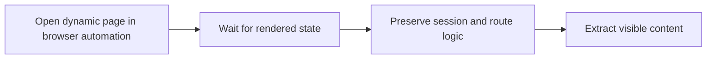

## Dynamic Website Scraping in Python Starts with One Key Realization: the HTML Response May Not Be the Real Page
A lot of Python scrapers fail on modern websites for a simple reason: they are technically correct for the wrong execution model. The script fetches the URL, gets a response, parses the HTML, and still finds nothing useful. That happens because many dynamic sites do not expose their real content in the initial response. They build it later through browser-side JavaScript, background requests, or interaction.
That is why scraping dynamic websites with Python is not mainly about better parsing. It is about choosing browser-capable execution when the target actually needs it.
This guide explains what makes a site dynamic for scraping purposes, when Python request clients stop being enough, why browser automation tools such as Playwright and Selenium matter, and how waits, proxies, and session design shape success on modern dynamic targets. It pairs naturally with [scraping dynamic websites with Playwright](https://bytesflows.com/en/blog/scraping-dynamic-websites-playwright), [playwright web scraping tutorial](https://bytesflows.com/en/blog/playwright-web-scraping-tutorial), and [using Requests for web scraping](https://bytesflows.com/en/blog/using-requests-web-scraping).
## What “Dynamic” Means in Practice
A site is dynamic for scraping when the useful content is not fully available in the initial HTML in a stable, extractable form.
That often means:
- the page loads data after the first response
- the DOM changes once JavaScript runs
- interaction reveals or updates the content
- placeholders appear before the real fields arrive
In those cases, static parsing sees only part of the picture.
## Why Request Clients Often Fail Here
HTTP clients such as Requests or aiohttp only see the response body. They do not naturally reproduce the browser environment that executes scripts and builds the final page state.
That means they often return:
- shells of the page
- loading placeholders
- empty containers
- incomplete records that appear fine in a real browser
This is why the problem is usually not “wrong selector.” It is “wrong tool for the page model.”
## Python’s Main Browser-Automation Paths
When the target needs a browser, Python usually turns to tools such as:
- Playwright
- Selenium
Both can automate real browsers, but the workflow question is not only feature comparison. It is whether the browser can reliably reproduce the page state you need.
## Why Playwright Is Often the Better Default
For many new dynamic scraping projects, Playwright is often easier to work with because it:
- fits modern dynamic sites well
- handles many waiting patterns more cleanly
- supports browser session design more naturally
- works well for repeated browser automation workflows
Selenium still has legitimate use cases, but Playwright is often the stronger default for new Python dynamic-scraping work.
## Wait Strategy Is the Most Important Skill
On dynamic targets, success often depends less on the selector and more on when you try to read it.
Good wait strategy usually means:
- waiting for a meaningful selector
- waiting for the state that indicates content is ready
- avoiding extraction during placeholder phases
- not over-waiting for page quiet that does not matter to the data goal
This is why dynamic scraping is often a state-readiness problem more than a parsing problem.
## Browser Session Design Matters Too
Dynamic sites often depend on session continuity.
That can affect:
- cookies and storage state
- pagination or infinite scrolling
- authenticated flows
- localized or geo-dependent content
- repeated interaction sequences
The browser session is often part of the data pipeline, not just a wrapper around it.
## Proxies Still Matter on Dynamic Python Workflows
A dynamic site may also be a protected site.
That means browser automation sometimes needs help from:
- residential proxies
- region-aware routing
- rotation or stickiness matched to the workflow
- lower concurrency and saner pacing
Browser execution and route quality often need to improve together.
## Verification Is Especially Important on Dynamic Targets
Dynamic scraping can fail quietly.
You should check:
- whether the rendered page really matches what you expect
- whether the scraper is reading final values instead of placeholders
- whether more interaction is required before extraction
- whether the target is serving incomplete or degraded content to the automated session
A screenshot or visual check is often more useful here than on static pages.
## A Practical Dynamic-Python Model
A useful mental model looks like this:

This shows why dynamic scraping in Python is really about browser-state collection.
## Common Mistakes
### Using request-based tools on a browser-dependent page and assuming selectors are the issue
The content may not exist yet.
### Switching to a browser but extracting too early
Placeholder states still look like missing data.
### Treating Playwright and Selenium choice as more important than readiness strategy
The wait logic often matters more.
### Ignoring session continuity on multi-step pages
The browser context may determine what content appears.
### Forgetting that dynamic sites can also be strongly anti-bot protected
Browser realism may still need strong routing.
## Best Practices for Scraping Dynamic Websites with Python
### Confirm the page actually requires browser execution before using one
Do not pay browser cost unnecessarily.
### Use Playwright as the default modern choice for many new Python workflows
It is often the cleaner fit.
### Build extraction around readiness, not just selectors
Timing determines whether selectors are meaningful.
### Treat browser session and proxy strategy as part of the same system
Dynamic access often depends on both.
### Verify rendered results during development instead of trusting the absence of errors
Dynamic failures are often subtle.
Helpful support tools include [HTTP Header Checker](https://bytesflows.com/en/blog/http-header-checker), [Scraping Test](https://bytesflows.com/en/blog/scraping-test-tool-detect-blocks), and [Proxy Checker](https://bytesflows.com/en/blog/proxy-checker).
## Conclusion
Scraping dynamic websites with Python requires accepting that the initial response is often not the real page. Once that is clear, the problem becomes much easier to frame: use a browser-capable tool, wait for the right rendered state, preserve the session context the page depends on, and strengthen routing when protection is high.
The practical lesson is that dynamic scraping is not just “Python plus HTML parsing.” It is browser-state extraction. When browser automation, wait logic, session design, and route quality work together, Python becomes fully capable of handling modern dynamic targets that static request tools simply cannot interpret correctly.
If you want the strongest next reading path from here, continue with [scraping dynamic websites with Playwright](https://bytesflows.com/en/blog/scraping-dynamic-websites-playwright), [playwright web scraping tutorial](https://bytesflows.com/en/blog/playwright-web-scraping-tutorial), [using Requests for web scraping](https://bytesflows.com/en/blog/using-requests-web-scraping), and [browser automation for web scraping](https://bytesflows.com/en/blog/browser-automation-web-scraping).
## Further reading
- [Scraping dynamic websites with Playwright](https://bytesflows.com/en/blog/scraping-dynamic-websites-playwright)
- [Playwright web scraping tutorial](https://bytesflows.com/en/blog/playwright-web-scraping-tutorial)
- [Using Requests for web scraping](https://bytesflows.com/en/blog/using-requests-web-scraping)
- [Browser automation for web scraping](https://bytesflows.com/en/blog/browser-automation-web-scraping)
- [Best proxies for web scraping](https://bytesflows.com/en/blog/best-proxies-for-web-scraping)
- [How to scrape websites without getting blocked](https://bytesflows.com/en/blog/scrape-websites-without-getting-blocked)
- [The ultimate guide to web scraping in 2026](https://bytesflows.com/en/blog/ultimate-guide-web-scraping-2026)
