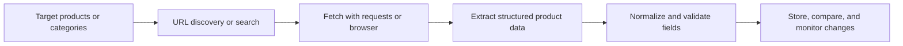

## Why E-commerce Data Is Worth Collecting
E-commerce sites are one of the most important sources of public commercial data on the web. Teams scrape them for competitor monitoring, catalog research, stock tracking, pricing intelligence, and assortment analysis.
The challenge is that modern stores are also among the most protected targets. Product pages may rely on client-side rendering, prices may vary by geography, and repeated access patterns are often scored quickly.
If you are building in this area, this guide pairs well with [Scraping Marketplace Data](https://bytesflows.com/en/blog/scraping-marketplace-data), [Scraping Amazon Product Data](https://bytesflows.com/en/blog/scraping-amazon-product-data), and [Playwright Web Scraping Tutorial](https://bytesflows.com/en/blog/playwright-web-scraping-tutorial).
## What Teams Usually Want From E-commerce Sites
A useful e-commerce scraper normally extracts more than a headline price. Common target fields include:
- product title and canonical URL
- SKU, brand, and variant attributes
- current price, list price, and currency
- stock or availability state
- rating and review counts
- image URLs and category path
- seller or merchant identity on marketplace-style stores
These fields become much more valuable when they are normalized consistently across sites.
## Why E-commerce Scraping Gets Blocked
Commercial sites have strong incentives to defend pricing, inventory, and product intelligence data. Common protections include:
- rate limiting
- IP reputation scoring
- JavaScript challenges
- fingerprint-based bot detection
- CAPTCHA verification
- session and cookie checks
That is why e-commerce scraping is rarely reliable with a single IP and a naive request loop.
## Requests Versus Browser Automation
The right extractor depends on how the target page is built.
### Start with the lightest viable method
If a product page returns complete HTML with stable selectors, ordinary HTTP requests can still be enough.
### Switch to Playwright when rendering is dynamic
Many stores load product details, prices, stock status, or recommendations through client-side JavaScript. In those cases, browser automation is usually the most reliable option.
### Keep a browser fallback strategy
Some sites only become difficult at scale. A workflow that can promote pages from requests to browser mode is often more efficient than using a browser everywhere.
## A Practical E-commerce Scraping Architecture

In production systems, URL discovery and detail extraction are often separated so they can scale independently.
## Why Residential Proxies Matter
Residential proxies help e-commerce collection because they present traffic through consumer ISP addresses rather than obvious datacenter IP space. That often improves stability on defended targets.
They are especially useful when you need:
- lower block rates on product pages
- geo-specific views of prices and stock
- safer repeated monitoring over time
- session continuity for carts, localized content, or shipping context
Foundational reading includes [Residential Proxies](https://bytesflows.com/en/blog/residential-proxies), [Best Proxies for Web Scraping](https://bytesflows.com/en/blog/best-proxies-for-web-scraping), and [Web Scraping Proxy Architecture](https://bytesflows.com/en/blog/web-scraping-proxy-architecture).
## Geo Context Changes the Data You See
Many stores localize pricing, taxes, availability, currency, and even product assortment. That means the same URL can produce different commercial data depending on region.
A robust workflow should therefore:
- route through the correct country or region
- keep region choice consistent for repeated comparisons
- store the observed geo context alongside the record
- retest when a target changes how it localizes content
For region-sensitive work, [Geo-Targeted Scraping Proxies](https://bytesflows.com/en/blog/geo-targeted-scraping-proxies) is a useful companion.
## What Good Extraction Looks Like
A reliable e-commerce extractor does more than parse visible text. It should:
- capture raw values as observed on the page
- normalize price fields into clean numeric formats
- distinguish in-stock from unavailable products
- preserve product identifiers for matching
- validate required fields before storage
This is important because downstream analytics break quickly when price, currency, and stock fields are inconsistent.
## Monitoring and Quality Control
A production scraper should monitor more than success or failure.
Track signals such as:
- 403 and 429 rates
- CAPTCHA frequency
- empty-field rates
- selector break frequency
- region mismatches
- extraction completeness per domain
Support tools such as [Scraping Test](https://bytesflows.com/en/blog/scraping-test), [Proxy Checker](https://bytesflows.com/en/blog/proxy-checker), and [HTTP Header Checker](https://bytesflows.com/en/blog/http-header-checker) help verify whether requests are reaching targets in the way you expect.
## Common Mistakes
### Reusing one IP too aggressively
That creates obvious pressure on the target.
### Using a browser for every page from day one
This raises cost when some pages could be handled more simply.
### Ignoring session and cookie behavior
E-commerce pages often depend on continuity.
### Storing only a headline price
Without stock, currency, and raw source values, the data becomes much less useful.
### Scaling before measuring block and challenge rates
You need operational feedback before increasing concurrency.
## Conclusion
Scraping e-commerce websites reliably requires more than just selectors. You need the right fetch strategy, a stable proxy layer, careful normalization, and monitoring that tells you when the target experience has changed.
When browser automation, residential proxy routing, and validation rules are combined well, e-commerce scraping becomes much more dependable for pricing, catalog, and inventory intelligence.
## Further reading
- [Scraping Marketplace Data](https://bytesflows.com/en/blog/scraping-marketplace-data)
- [Scraping Amazon Product Data](https://bytesflows.com/en/blog/scraping-amazon-product-data)
- [Playwright Web Scraping Tutorial](https://bytesflows.com/en/blog/playwright-web-scraping-tutorial)
- [Geo-Targeted Scraping Proxies](https://bytesflows.com/en/blog/geo-targeted-scraping-proxies)
- [Best Proxies for Web Scraping](https://bytesflows.com/en/blog/best-proxies-for-web-scraping)
