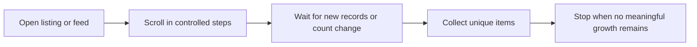

## Why Infinite Scroll Changes the Scraping Problem
Infinite scroll pages do not expose the full dataset in the first response. Instead, the page keeps loading more cards, posts, or listings as the browser reaches certain scroll thresholds.
That means the scraper has to do more than parse HTML. It has to manage browser state, loading signals, and stopping logic without collecting duplicates or missing later content.
This guide pairs well with [Scraping Dynamic Websites with Playwright](https://bytesflows.com/blog/scraping-dynamic-websites-playwright), [Scraping Dynamic Websites with Python](https://bytesflows.com/blog/scraping-dynamic-websites-python), and [Proxy Rotation Strategies](https://bytesflows.com/blog/proxy-rotation-strategies).
## Common Infinite Scroll Targets
Infinite scroll is common on:
- social feeds
- marketplace and product listing pages
- travel and search result pages
- job boards
- media and content archives
The extraction goal is usually not just “scroll longer.” It is to detect when meaningful new records stop appearing.
## How Infinite Scroll Usually Works
Most infinite scroll pages follow a similar pattern:
1. initial items render
1. the page listens for scroll depth or viewport position
1. new data loads through background requests
1. new DOM nodes are appended
1. the cycle repeats until limits or exhaustion
The practical implication is simple: scrolling is only half the task. Detection of new content is the other half.
## Why Playwright Is a Good Default
Playwright works well for infinite scroll pages because it can:
- drive real browser scrolling
- wait for selectors or count changes
- preserve session state across the full sequence
- inspect page behavior when loading stalls
On dynamic targets, that is usually more reliable than trying to mimic the flow with plain HTTP requests.
## A Reliable Infinite Scroll Workflow

A good scraper tracks item growth after each scroll cycle and stops only when the page has genuinely stopped yielding new results.
## The Most Important Design Choice: What Counts as New
Do not rely only on time delays. Instead, monitor a signal such as:
- item count increase
- arrival of a known selector
- change in last visible record ID
- new network response tied to data loading
This matters because many pages keep firing background requests even after the useful result set is exhausted.
## Why Sticky Sessions Often Matter
Many infinite scroll pages depend on a continuous browsing session. If the IP or session identity changes mid-scroll, the page may:
- reset ranking or results
- interrupt loading
- serve partial content
- trigger stronger bot checks
That is why sticky residential sessions often work better than aggressive per-request rotation for long scroll sequences.
## Operational Best Practices
### Scroll in increments, not giant jumps
Large jumps can skip load triggers or create brittle behavior.
### Store unique record IDs or URLs as you go
This prevents duplicates when the page reorders or re-renders cards.
### Set a hard maximum number of scroll rounds
This avoids endless loops on noisy pages.
### Stop based on repeated no-growth cycles
One stagnant scroll may not mean the dataset is finished.
### Validate what the browser really loaded
Use [Scraping Test](https://bytesflows.com/blog/scraping-test), [HTTP Header Checker](https://bytesflows.com/blog/http-header-checker), and [Proxy Checker](https://bytesflows.com/blog/proxy-checker) when pages seem to stall or degrade unexpectedly.
## Common Mistakes
- using fixed sleep alone as the stopping strategy
- rotating IPs in the middle of the same scroll session
- counting DOM nodes without deduplicating records
- stopping after one slow load instead of repeated no-growth checks
- assuming network idle means no more content is available
## Conclusion
Scraping infinite scroll pages reliably requires browser automation, growth detection, and stable session handling. The goal is not just to scroll until the page feels finished. The goal is to know when the result set has actually stopped expanding.
When controlled scrolling, sticky sessions, and good stopping logic work together, infinite scroll pages become much easier to scrape without missing data or wasting requests.
## Further reading
- [Scraping Dynamic Websites with Playwright](https://bytesflows.com/blog/scraping-dynamic-websites-playwright)
- [Scraping Dynamic Websites with Python](https://bytesflows.com/blog/scraping-dynamic-websites-python)
- [Proxy Rotation Strategies](https://bytesflows.com/blog/proxy-rotation-strategies)
- [Playwright Web Scraping Tutorial](https://bytesflows.com/blog/playwright-web-scraping-tutorial)
- [Best Proxies for Web Scraping](https://bytesflows.com/blog/best-proxies-for-web-scraping)
