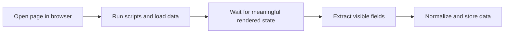

## Why JavaScript Websites Break Simple Python Scrapers
A JavaScript-heavy page often returns only a shell in the initial HTML. The useful content appears later after scripts run, background requests complete, or interactions trigger rendering.
That is why many Python scrapers fail even when the request succeeds. The problem is usually not parsing. It is that the data was never present in the first response.
This article pairs naturally with [Scraping Dynamic Websites with Python](https://bytesflows.com/blog/scraping-dynamic-websites-python), [Scraping Dynamic Websites with Playwright](https://bytesflows.com/blog/scraping-dynamic-websites-playwright), and [Playwright Web Scraping Tutorial](https://bytesflows.com/blog/playwright-web-scraping-tutorial).
## What Makes a Site JavaScript-Rendered for Scraping
In practice, JavaScript-rendered pages often show one or more of these patterns:
- empty containers in the first HTML response
- data loaded through background API calls
- page content appearing only after scripts execute
- DOM changes after clicks, typing, or scrolling
When that happens, plain `requests` only sees the transport layer, not the final page state.
## Why Browser Automation Is the Right Fix
Browser automation works because it can:
- execute JavaScript
- wait for rendered content
- preserve cookies and storage state
- trigger interactions when needed
- inspect the DOM after the page becomes usable
For Python workflows, the two main paths are usually Playwright and Selenium.
## Playwright Versus Selenium
### Playwright
A strong modern default for new scraping projects. It is often easier for dynamic workflows because waits, locators, and browser context management are cleaner.
### Selenium
Still widely used and valid, especially when teams already have Selenium infrastructure. It can work well, but many dynamic scraping workflows require more manual waiting and orchestration.
The more important question is usually not which tool is famous. It is which tool can reliably reproduce the state your target requires.
## Waiting Strategy Matters More Than Selectors
On JavaScript-heavy pages, the hardest part is often timing.
Good waits usually focus on:
- a meaningful selector becoming visible
- a specific data container finishing render
- a count change in repeated elements
- a known interaction completing successfully
Broad waits can make scrapers slow. Shallow waits make them unreliable.
## A Practical Python Workflow

This model is a better fit for JavaScript targets than the classic request-plus-parser approach.
## When Proxies Become Necessary
Some JavaScript sites are also heavily protected. In those cases, browser automation alone may not be enough.
Residential proxies help when you need:
- lower block rates on defended targets
- stable access during repeated extraction
- geo-specific rendering
- stronger route quality for browser sessions
On strict sites, browser realism and route quality usually need to improve together.
## Operational Best Practices
### Confirm a browser is truly needed
Do not pay browser cost if the data already exists in initial HTML or an accessible API.
### Build waits around readiness, not habit
Wait for the signal that means the data you need is actually present.
### Keep browser context stable on multi-step flows
Session continuity often changes what content appears.
### Capture raw and normalized values
JavaScript pages often produce edge cases that are easier to debug with raw source values.
### Validate rendered output during development
Use [Scraping Test](https://bytesflows.com/tools/proxy-test), [HTTP Header Checker](https://bytesflows.com/blog/http-header-checker), and [Proxy Checker](https://bytesflows.com/blog/proxy-checker) when a page looks loaded but returns incomplete data.
## Common Mistakes
- assuming `requests` failed because selectors were wrong
- waiting for network idle when the real signal is a rendered element
- extracting before placeholders are replaced
- ignoring browser session state on multi-step pages
- treating browser automation as enough on heavily defended targets without route improvement
## Conclusion
Scraping JavaScript websites with Python requires accepting that the first HTML response is often not the page you actually need. Once you switch to browser-aware extraction, the problem becomes much easier to reason about: wait for the right state, preserve the right session, and use stronger routing when the site is defended.
When those pieces work together, Python is fully capable of extracting data from modern JavaScript-heavy websites that static request workflows cannot interpret correctly.
## Further reading
- [Scraping Dynamic Websites with Python](https://bytesflows.com/blog/scraping-dynamic-websites-python)
- [Scraping Dynamic Websites with Playwright](https://bytesflows.com/blog/scraping-dynamic-websites-playwright)
- [Playwright Web Scraping Tutorial](https://bytesflows.com/blog/playwright-web-scraping-tutorial)
- [Browser Automation for Web Scraping](https://bytesflows.com/blog/browser-automation-web-scraping)
- [Best Proxies for Web Scraping](https://bytesflows.com/blog/best-proxies-for-web-scraping)
