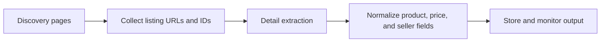

## Why Marketplace Data Is Worth Scraping
Marketplace data combines catalog coverage, price movement, seller behavior, and demand signals in one environment. That makes it useful for pricing intelligence, seller monitoring, assortment analysis, lead generation, and market research.
What makes it valuable also makes it difficult. Marketplace pages are often dynamic, heavily paginated, location-aware, and much more defensive than ordinary content sites.
If you are building pipelines in this space, this article pairs well with [Scraping E-commerce Websites](https://bytesflows.com/blog/scraping-ecommerce-websites), [Scraping Price Comparison Data](https://bytesflows.com/blog/scraping-price-comparison-data), and [Browser Automation for Web Scraping](https://bytesflows.com/blog/browser-automation-web-scraping).
## What Marketplace Teams Usually Need to Extract
A marketplace scraper usually needs more than a product title and a single price. Common targets include:
- listing URLs and product IDs
- product titles and category paths
- list price, sale price, and currency
- seller name, seller ID, and seller rating signals
- shipping or delivery context
- reviews, stock state, and image URLs
| Data area | Why it matters |
| --- | --- |
| Catalog data | Tracks assortment breadth and listing coverage |
| Pricing data | Supports pricing intelligence and repricing workflows |
| Seller data | Helps monitor resellers, competition, and fraud patterns |
| Availability data | Shows stock changes and operational gaps |
## Why Marketplace Scraping Is Harder Than It Looks
A marketplace page may look simple, but the data is usually spread across multiple layers of navigation and rendering.
Common complications include:
- JavaScript-rendered listing cards
- infinite scroll or load-more patterns
- geo-sensitive ranking and pricing
- seller information hidden in structured data or client-side state
- aggressive anti-bot scoring on repeated browse behavior
That is why marketplace scraping becomes a workflow design problem, not just a selector problem.
## The Best Operating Model: Discovery First, Detail Second
One of the most reliable ways to structure marketplace collection is to separate discovery from detail extraction.
### Discovery pages
These include:
- search result pages
- category or browse pages
- feeds with pagination or infinite scroll
The goal at this layer is to collect URLs, IDs, ranking positions, and lightweight listing fields.
### Detail pages
These are the item or listing pages where you collect richer fields such as:
- normalized title
- structured price fields
- seller identity
- attributes and specifications
- review counts
- category context
This split matters because the technical requirements are often different.
## Why Browser Automation Usually Starts at the Discovery Layer
Discovery pages are often where marketplaces rely most on dynamic loading and challenge logic.
That can mean:
- lazy-loaded grids
- asynchronous search results
- scroll-triggered fetches
- browsing-flow analysis
- location and session-dependent content
Because of that, browser automation is often most necessary at discovery, even when some detail pages can still be extracted with lighter HTTP-based workflows.
## When Detail Pages Can Use a Lighter Extractor
Not every detail page needs a full browser. In some cases, the useful data is:
- already present in server-rendered HTML
- embedded in JSON or structured data blocks
- easier to normalize after targeted extraction
A practical production pattern is:
- browser automation for discovery
- lighter extraction for detail pages when possible
- browser fallback only when detail content is also dynamic or protected
That design keeps cost lower while preserving reliability.
## Price and Seller Data Need Normalization, Not Just Extraction
Marketplace extraction often fails downstream because teams collect raw text without defining a normalization model.
You should expect cases like:
- sale price versus regular price
- price excluding shipping versus total cost
- multiple sellers on one listing
- localized currency formatting
- marketplace-owned seller versus third-party seller
If usable data is the goal, normalization logic matters as much as extraction logic.
## Pagination, Infinite Scroll, and Load More Patterns
Marketplace discovery usually depends on one of three navigation patterns.
### Numbered pagination
Useful when URLs or parameters are predictable and pages can be revisited directly.
### Load more interfaces
Require interaction and clear post-click waiting conditions.
### Infinite scroll
Need repeated scrolling plus a rule for detecting when no meaningful new cards are appearing.
This is exactly why [Scraping Infinite Scroll Pages](https://bytesflows.com/blog/scraping-infinite-scroll-pages) is often part of the same implementation stack.
## A Practical Marketplace Architecture

In production, discovery and detail stages are often separate jobs so they can scale differently and recover independently.
## Why Residential Proxies Matter for Marketplace Targets
Marketplace domains are commercially valuable and usually defended accordingly. Residential proxies help because they:
- reduce obvious datacenter exposure
- distribute repeated browse traffic across more identities
- improve geo-specific realism
- lower concentration on any single visible IP
- improve session stability on stricter flows
Foundational reading here includes [Best Proxies for Web Scraping](https://bytesflows.com/blog/best-proxies-for-web-scraping), [Residential Proxies](https://bytesflows.com/blog/residential-proxies), and [Web Scraping Proxy Architecture](https://bytesflows.com/blog/web-scraping-proxy-architecture).
## Operational Best Practices
### Separate discovery from detail extraction
This makes the system easier to reason about and easier to scale.
### Measure success by usable fields
A page load is not a success unless the important fields are extracted cleanly.
### Add residential proxies early on stricter targets
Do not wait until instability becomes the default.
### Validate price and seller fields with schema rules
Raw strings are not enough for downstream analytics.
### Monitor challenge behavior before scaling up
Use support tools such as [Scraping Test](https://bytesflows.com/tools/proxy-test), [Proxy Checker](https://bytesflows.com/blog/proxy-checker), and [HTTP Header Checker](https://bytesflows.com/blog/http-header-checker) to verify how a target is responding.
## Common Mistakes
- treating discovery and detail as the same job
- extracting price without normalization
- using a full browser everywhere without testing lighter detail extraction
- ignoring seller-level fields until later
- scaling before validating challenge and CAPTCHA behavior
## Conclusion
Scraping marketplace data is valuable because marketplaces compress product, seller, and pricing signals into one environment. But that value comes with technical complexity: dynamic discovery, ambiguous pricing, seller context, and strong anti-bot pressure.
The most reliable design is usually a two-layer workflow supported by browser automation where the interface demands it, residential proxies for traffic identity, and careful normalization before storage. When those layers are designed together, marketplace data becomes far more stable and far more useful.
## Further reading
- [Scraping E-commerce Websites](https://bytesflows.com/blog/scraping-ecommerce-websites)
- [Scraping Price Comparison Data](https://bytesflows.com/blog/scraping-price-comparison-data)
- [Browser Automation for Web Scraping](https://bytesflows.com/blog/browser-automation-web-scraping)
- [Scraping Infinite Scroll Pages](https://bytesflows.com/blog/scraping-infinite-scroll-pages)
- [Best Proxies for Web Scraping](https://bytesflows.com/blog/best-proxies-for-web-scraping)
