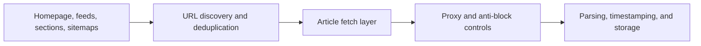

## Scraping News Websites Means Balancing Freshness, Coverage, and Anti-Bot Pressure at the Same Time
News data is valuable because it powers media monitoring, trend detection, competitive intelligence, alerting systems, and AI knowledge feeds. But news scraping is rarely just a matter of extracting article text. The hard part is collecting new content fast enough, avoiding repeated pressure on publisher infrastructure, and handling the differences between article pages, section pages, feeds, and dynamic front pages.
That is why scraping news websites works best as a refresh-oriented pipeline rather than as a one-off crawl.
This guide explains how news scraping systems are typically structured, what makes publishers operationally tricky targets, and how to combine discovery, routing, and parsing into a stable workflow. It pairs naturally with [scraping data at scale](https://bytesflows.com/blog/scraping-data-at-scale), [Proxy Checker](https://bytesflows.com/blog/proxy-checker), and [How Websites Detect Web Scrapers](https://bytesflows.com/blog/how-websites-detect-scrapers).
## Why News Scraping Has Different Priorities
News scraping is often shaped by three competing goals:
- **freshness** because the value of an article can drop quickly
- **coverage** because publishers produce many URLs across sections and tags
- **stability** because repeated checking can trigger blocks or waste crawl budget
That means news systems need careful discovery and refresh logic, not just extraction quality.
## What a News Collection Pipeline Usually Needs
A practical news scraping workflow often includes:
- homepage, section, feed, or sitemap discovery
- article URL deduplication
- article fetching and parsing
- publication time and source tracking
- refresh rules for late updates or corrections
- storage for full text and metadata
This is why news scraping is usually better understood as an ingestion pipeline than as a single scraper script.
## Article Pages and Discovery Pages Need Different Treatment
A useful separation is:
### Discovery surfaces
These include:
- homepages
- section pages
- topic pages
- RSS feeds
- sitemaps
Their main job is to reveal new article URLs.
### Article pages
These provide the deeper structured content such as:
- headline
- body text
- author
- publication time
- section or category
- tags or related links
Treating these as separate stages helps the system refresh efficiently without re-fetching everything blindly.
## Freshness Strategy Matters as Much as Parsing
Unlike evergreen pages, news content changes quickly.
Useful freshness logic often includes:
- crawling high-priority sections more often
- using feeds or sitemaps where available
- tracking last-seen timestamps
- rechecking recently published articles for updates
- reducing refresh frequency on older content
This helps preserve freshness without creating unnecessary pressure on the source.
## News Sites Often Mix Static and Dynamic Delivery
Some publishers still serve straightforward article HTML. Others rely on:
- client-side rendering on section pages
- lazy-loaded article lists
- scripts that hydrate page content after load
- paywall or subscription overlays
That means the discovery layer and the article layer may need different tooling. In some cases, lightweight requests are enough for articles while browser automation is more useful on discovery surfaces.
## Paywalls and Access Boundaries Need Care
News scraping frequently runs into subscription barriers, registration walls, or soft paywalls.
Practical realities include:
- some content is only partially visible without a session
- some sites show summaries on one route and full text on another
- some content should be handled through official feeds, licenses, or APIs instead
This makes legal and operational judgment especially important for publisher targets.
## A Practical News Scraping Architecture
A useful mental model looks like this:

This keeps freshness, discovery, and article extraction aligned.
## Proxy Strategy for News Workloads
Not every news workflow needs the heaviest routing strategy, but some publishers do react quickly to repeated scraping.
Proxies become more useful when:
- the crawl checks many sections repeatedly
- geo-specific editions matter
- dynamic front pages are sensitive to repeated traffic
- the same domains are polled frequently for updates
In those cases, route quality and request pacing matter much more than they do in a one-time test scrape.
## Common Failure Patterns
### Missing new articles even though the parser works
The discovery layer may not be refreshing the right surfaces often enough.
### Duplicate content in storage
The system may lack solid URL normalization and deduplication.
### Empty article bodies
The site may load content dynamically or partially behind a paywall.
### Sudden block-rate spikes
The refresh schedule or routing behavior may be too aggressive.
### Stale timestamps or incorrect chronology
Publication and update time extraction may not be normalized well.
## Best Practices
### Separate discovery from article extraction
This makes freshness control much easier.
### Use feeds and sitemaps when they are available
They are often the cheapest path to new URLs.
### Recheck recent stories, not the whole archive
Freshness should be targeted.
### Treat publisher limits and access boundaries seriously
News sites are often legally and operationally sensitive.
### Measure success by freshness and usable article coverage, not only fetch count
A high request count does not mean a good news pipeline.
Helpful companion reading includes [scraping data at scale](https://bytesflows.com/blog/scraping-data-at-scale), [How Websites Detect Web Scrapers](https://bytesflows.com/blog/how-websites-detect-scrapers), [Proxy Checker](https://bytesflows.com/blog/proxy-checker), and [web scraping architecture explained](https://bytesflows.com/blog/web-scraping-architecture-explained).
## Conclusion
Scraping news websites is really the work of building a collection pipeline that keeps up with publication speed without creating unnecessary pressure or instability. Discovery, deduplication, freshness rules, routing quality, and article parsing all matter because the value of news data depends on timing just as much as extraction.
The practical lesson is simple: news scraping works best when it is treated as a refresh system, not a one-off crawler. When freshness strategy and scraping architecture support each other, the output becomes much more useful for monitoring, research, and downstream AI workflows.
## Further reading
- [Scraping data at scale](https://bytesflows.com/blog/scraping-data-at-scale)
- [How Websites Detect Web Scrapers](https://bytesflows.com/blog/how-websites-detect-scrapers)
- [Proxy Checker](https://bytesflows.com/blog/proxy-checker)
- [Web scraping architecture explained](https://bytesflows.com/blog/web-scraping-architecture-explained)
- [Scraping Test](https://bytesflows.com/blog/scraping-test)
- [Best proxies for web scraping](https://bytesflows.com/blog/best-proxies-for-web-scraping)
- [Residential proxies](https://bytesflows.com/proxies)
