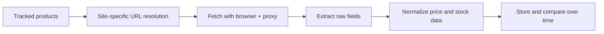

## Why Price Comparison Data Matters
Price comparison pipelines are used for competitor intelligence, dynamic pricing, catalog monitoring, and market research. The real challenge is not just collecting prices. It is collecting comparable prices across different stores, regions, currencies, and page layouts.
A stable price comparison workflow usually combines browser automation, geo-targeted proxies, normalization rules, and careful product matching. This article pairs naturally with [Scraping E-commerce Websites](https://bytesflows.com/blog/scraping-ecommerce-websites), [Scraping Marketplace Data](https://bytesflows.com/blog/scraping-marketplace-data), and [Geo-Targeted Scraping Proxies](https://bytesflows.com/blog/geo-targeted-scraping-proxies).
## What Makes Price Comparison Scraping Difficult
Price comparison projects usually break for one of five reasons:
- anti-bot protection on e-commerce domains
- prices changing by region or session context
- different product page structures across sites
- inconsistent price formats and availability states
- weak product matching across catalogs
That is why price intelligence should be designed as a data pipeline, not as a collection of one-off scrapers.
## The Core Data Model
Before you scrape, define what a comparable record looks like.
| Field | Purpose |
| --- | --- |
| Product identifier | Connects the same item across sites |
| Merchant or domain | Shows where the price came from |
| Observed price | Stores the extracted value exactly as seen |
| Normalized price | Supports comparison after cleaning |
| Currency and region | Explains geo-specific pricing differences |
| Timestamp | Supports change detection over time |
| Availability or stock state | Prevents false comparison on unavailable items |
Without this structure, downstream comparisons become noisy very quickly.
## Product Matching Comes Before Price Analysis
Two pages can look similar while actually referring to different variants, pack sizes, or seller bundles. Product matching should therefore be treated as a first-class part of the system.
Common matching signals include:
- SKU or manufacturer part number
- canonical product title
- brand and model
- size, color, or pack count
- GTIN or UPC when available
If matching is weak, your price comparisons will be misleading even if extraction is perfect.
## A Practical Architecture for Price Monitoring
A reliable workflow often looks like this:
1. Start with a tracked product list or category list.
1. Resolve the right product URL or search path for each target site.
1. Load the page with the right browser and proxy setup.
1. Extract raw price, currency, stock state, and product signals.
1. Normalize values and store both raw and cleaned fields.
1. Compare over time and trigger alerts when thresholds are crossed.

## Why Geo-Targeting Is Critical
Prices often change by country, city, currency, shipping region, or even by tax presentation. If you scrape a US store from a UK exit node, you may get a result that is technically valid but operationally wrong.
That is why geo-targeted residential proxies matter:
- US exits for US prices
- UK exits for UK prices
- market-specific sessions for localized catalogs
- consistent region routing for repeatable monitoring
If geo consistency matters, store the observed region alongside the extracted price.
## When to Use Requests and When to Use Playwright
Some product pages still expose usable HTML through ordinary HTTP requests. Others require a browser because important fields appear only after client-side rendering, async API calls, or user interactions.
A good operating rule is:
- start with the lightest viable extractor
- switch to Playwright when content is rendered dynamically
- keep a browser fallback for sites with stricter protection or interaction-heavy flows
This keeps cost and complexity under control while preserving extraction quality.
## Normalization Rules That Prevent Bad Data
Price comparison systems should normalize more than just decimals.
You should explicitly handle:
- sale price versus original price
- range prices such as “from $29.99”
- currency formatting differences
- VAT-inclusive versus VAT-exclusive displays
- out-of-stock products that still show stale prices
- shipping costs presented separately from item price
Store both the raw string and the normalized numeric value so you can debug edge cases later.
## Residential Proxies and Session Strategy
E-commerce targets often treat datacenter traffic as suspicious by default. Residential proxies improve collection stability because they align better with normal browsing patterns.
For price monitoring, they are especially useful when you need:
- geo-specific results
- repeated monitoring over time
- lower block rates on commercial targets
- session continuity for localized pricing or cart state
Related reading includes [Proxy Rotation Strategies](https://bytesflows.com/blog/proxy-rotation-strategies), [Best Proxies for Web Scraping](https://bytesflows.com/blog/best-proxies-for-web-scraping), and [Residential Proxies](https://bytesflows.com/blog/residential-proxies).
## Operational Best Practices
### Keep per-domain concurrency under control
Price monitoring usually fails when too many requests hit the same merchant too quickly.
### Separate extraction logic by site
Do not assume one selector strategy will generalize cleanly.
### Log raw values alongside cleaned values
This is essential when auditing comparison errors.
### Re-check product matching on variant-heavy catalogs
Bundles and multi-pack listings can easily distort price intelligence.
### Validate challenge behavior regularly
Use [Scraping Test](https://bytesflows.com/blog/scraping-test), [HTTP Header Checker](https://bytesflows.com/blog/http-header-checker), and [Proxy Checker](https://bytesflows.com/blog/proxy-checker) to understand whether your setup is still being served correctly.
## Common Mistakes
- comparing products before validating they are true matches
- ignoring region or currency context
- storing only a normalized number and losing the raw observed string
- treating out-of-stock pages as live price data
- scaling request volume before measuring block and challenge rates
## Conclusion
Scraping price comparison data is not only about extracting numbers from product pages. It is about building a repeatable workflow for matching products, loading the right regional experience, normalizing messy price strings, and monitoring changes over time.
When browser automation, geo-targeted residential proxies, and normalization rules are designed together, price comparison data becomes much more trustworthy and much more useful for decision-making.
## Further reading
- [Scraping E-commerce Websites](https://bytesflows.com/blog/scraping-ecommerce-websites)
- [Scraping Marketplace Data](https://bytesflows.com/blog/scraping-marketplace-data)
- [Geo-Targeted Scraping Proxies](https://bytesflows.com/blog/geo-targeted-scraping-proxies)
- [Proxy Rotation Strategies](https://bytesflows.com/blog/proxy-rotation-strategies)
- [Best Proxies for Web Scraping](https://bytesflows.com/blog/best-proxies-for-web-scraping)
