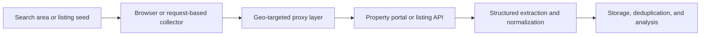

## Scraping Real Estate Data in 2026 Means Handling Location-Sensitive Sites, Dynamic Maps, and Expensive Blocking Mistakes
Real estate data is valuable because it powers price monitoring, rental-yield analysis, market prediction, lead generation, and local investment research. But real estate sites are also some of the most operationally tricky targets to scrape. Listings are often tied to maps, location context, dynamic loading, session state, and geo-sensitive behavior. That makes ordinary one-layer HTTP scraping unreliable.
That is why scraping real estate data needs more than selectors. It usually requires the right mix of browser automation, proxy routing, structured extraction, and validation so the dataset remains accurate enough for real decisions.
This guide explains how modern real estate scraping works, what data teams usually need to extract, and how to design collection workflows that survive dynamic property portals. It pairs naturally with [geo-targeted scraping with proxies](https://bytesflows.com/blog/geo-targeted-scraping-proxies), [Playwright web scraping tutorial](https://bytesflows.com/blog/playwright-web-scraping-tutorial), and [best proxies for web scraping](https://bytesflows.com/blog/best-proxies-for-web-scraping).
## Why Real Estate Scraping Is Operationally Different
Many property sites do more than render static HTML.
They often depend on:
- map-based interfaces
- client-side requests for listing data
- region-specific content and pricing visibility
- anti-bot controls on repeated browsing
- structured data that changes frequently over time
This means the real challenge is not only extracting a page. It is collecting trustworthy listing data under dynamic and location-sensitive conditions.
## What Data Teams Usually Want from Property Sites
A strong real estate dataset often includes:
- address and geographic coordinates
- listing price and price history
- bedrooms, bathrooms, and square footage
- property type and year built
- neighborhood or district information
- school, amenity, or agent-related fields
- timestamps for freshness and change tracking
The point is not just to scrape visible content. It is to create structured property records that can be analyzed over time.
## Geo Targeting Often Matters More Than Teams Expect
Real estate platforms frequently adapt content by region.
That can affect:
- which listings appear
- what pricing details are visible
- how map results load
- whether the request looks suspicious for the intended market
That is why geo-targeted residential routing is often important in property scraping. If the workflow is meant to look like a local buyer or renter, the route should support that assumption.
## Dynamic Maps and Internal APIs Are Common
Many real estate sites load listings through background requests triggered by map movement, filter changes, or scroll interactions.
That creates two common strategies:
- use a browser to reproduce the interaction and capture the response
- inspect the network layer and request the underlying data endpoint directly when practical
In many cases, the best workflow uses both. The browser helps discover the API behavior, and direct requests help scale the extraction layer once the pattern is understood.
## A Practical Collection Architecture
A useful model looks like this:

This makes it easier to keep geo behavior, session logic, and structured storage aligned.
## Browser Workflows Are Often Necessary First
A browser-based pass is often the fastest way to understand:
- how listings load
- which requests power filters and maps
- where cookies or tokens appear
- how pagination or infinite scrolling behaves
Once the interaction model is clear, some teams can shift parts of the workflow into lighter request-based collectors for scale.
## API Discovery Can Be More Efficient Than Full Page Parsing
If the site loads listing data through internal APIs, those endpoints can sometimes be much more efficient than scraping the rendered page repeatedly.
This can help because:
- the response is often cleaner and more structured
- pagination can be easier to automate
- you reduce browser cost when the endpoint is stable
But this still requires careful validation because internal endpoints can change, add session checks, or become more tightly guarded.
## Data Normalization Matters in Property Workflows
Real estate data gets messy quickly if units and categories are not standardized.
Useful normalization steps often include:
- converting square footage and area units into one schema
- normalizing address format
- separating current price from historical price changes
- tagging source region and collection time
- deduplicating repeated listings across refresh cycles
For market prediction or portfolio analysis, these cleanup steps are as important as raw extraction.
## Common Failure Patterns
### Empty results from map-based pages
The listing layer may be loaded dynamically or depend on location context.
### Wrong listings for the intended market
The route may not match the geographic area being simulated.
### 403s or challenge pages during repeated browsing
The target may distrust the route, session behavior, or traffic pattern.
### Structured fields missing unexpectedly
The site response shape may have changed, or the scraper may be parsing display content instead of the real data source.
### Duplicate or stale listings in storage
The refresh logic may lack proper deduplication and change tracking.
## Best Practices
### Start by understanding how listings are actually loaded
Do not assume the visible HTML is the real data source.
### Use geo-targeted residential routing when local context affects results
Location realism often matters in property scraping.
### Combine browser discovery with lighter collection paths when possible
This reduces cost while preserving coverage.
### Normalize and timestamp listing fields from the beginning
Property analysis depends on clean history.
### Validate collected records against live pages regularly
Small extraction drift can distort downstream analysis quickly.
Helpful companion reading includes [geo-targeted scraping with proxies](https://bytesflows.com/blog/geo-targeted-scraping-proxies), [Playwright web scraping tutorial](https://bytesflows.com/blog/playwright-web-scraping-tutorial), [web scraping architecture explained](https://bytesflows.com/blog/web-scraping-architecture-explained), and [best proxies for web scraping](https://bytesflows.com/blog/best-proxies-for-web-scraping).
## Conclusion
Scraping real estate data in 2026 is really about collecting location-sensitive structured information from dynamic property platforms without letting geo mismatch, browser cost, or anti-bot controls ruin the workflow. The right design usually combines browser discovery, geo-aware routing, structured extraction, and strong normalization.
The practical lesson is simple: property scraping works best when the workflow respects how real estate sites actually behave. Once the collection layer is aligned with map loading, region context, and structured listing data, the output becomes much more reliable for market analysis and prediction.
## Further reading
- [Geo-targeted scraping with proxies](https://bytesflows.com/blog/geo-targeted-scraping-proxies)
- [Playwright web scraping tutorial](https://bytesflows.com/blog/playwright-web-scraping-tutorial)
- [Best proxies for web scraping](https://bytesflows.com/blog/best-proxies-for-web-scraping)
- [Web scraping architecture explained](https://bytesflows.com/blog/web-scraping-architecture-explained)
- [Scraping data at scale](https://bytesflows.com/blog/scraping-data-at-scale)
- [Residential proxies](https://bytesflows.com/proxies)
- [How to scrape websites without getting blocked](https://bytesflows.com/blog/scrape-websites-without-getting-blocked)
