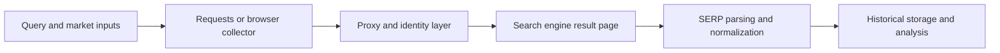

## Scraping Search Results with Python Means Handling One of the Most Defended Public Data Surfaces on the Web
Search engine results pages are valuable because they reveal rankings, snippets, ads, local results, and how search visibility changes over time. That makes SERP data useful for SEO monitoring, competitor analysis, market research, and search-intelligence tooling. But search results are also among the most aggressively defended scraping targets on the web. Request identity, TLS behavior, timing, and browser realism can all matter quickly.
That is why scraping search results with Python is rarely just a matter of sending requests and parsing HTML. The real problem is choosing the right execution model and identity strategy for the search engine you are targeting.
This guide explains how SERP scraping works in practice, when Python requests are enough, when a real browser becomes necessary, and how to design a more reliable collection workflow for search-result data. It pairs naturally with [How Websites Detect Web Scrapers](https://bytesflows.com/en/blog/how-websites-detect-scrapers), [Proxy Checker](https://bytesflows.com/en/blog/proxy-checker), and [best proxies for web scraping](https://bytesflows.com/en/blog/best-proxies-for-web-scraping).
## Why SERP Scraping Is Harder Than Many Other Targets
Search engines are optimized to detect repeated automated access.
They often react to:
- datacenter or low-trust IPs
- non-browser TLS and protocol fingerprints
- repetitive query timing
- weak or inconsistent request identities
- large-scale repeated access from one route
This means the collection strategy matters just as much as the parsing strategy.
## What a SERP Collection Workflow Usually Needs
A useful search-results workflow often includes:
- query generation or query lists
- market and device context
- the fetch layer for requests or browser execution
- extraction of organic, paid, and special result types
- timestamping and storage for historical comparison
This is important because SERP data is rarely useful without time, market, and query context.
## Requests vs Browser Automation
One of the first decisions is whether the target engine can be collected with lightweight requests or needs a real browser.
### Requests can work when
- the engine is less protected
- the workload is small
- the response still contains usable HTML
- the query flow is simple
### Browser automation becomes more useful when
- the target is stricter
- the engine relies on dynamic rendering or challenges
- browser realism matters more than raw request speed
- request-only workflows fail repeatedly despite better routing
This is why the Python stack should follow the engine’s defense model, not habit alone.
## Route Quality and Trust Matter Early
For SERP scraping, route quality often becomes one of the first bottlenecks.
Important factors include:
- IP trust and network type
- geographic accuracy for local results
- how frequently the route is reused
- whether the proxy behavior matches the session design
This is why residential routing is often important on stricter search-result targets.
## SERP Structure Is More Than Organic Results
A search result page may include:
- organic links
- featured snippets
- ads
- local packs
- shopping modules
- knowledge panels
- related searches
A strong workflow should decide early which result types matter, because extracting everything the same way usually creates noisy datasets.
## Market and Device Context Change the Output
Search results can vary by:
- country or city
- language
- device type
- logged-in or personalized context
- time of day or recent events
That means a SERP record should usually include context metadata, not only the visible result fields.
## A Practical SERP Scraping Architecture
A useful mental model looks like this:

This makes it easier to separate fetching, identity, and ranking analysis.
## Pacing Matters More Than Most Teams Expect
Search-result targets often react quickly to mechanical repetition.
Useful controls often include:
- randomized but reasonable delays
- low concurrency per route
- route rotation that avoids concentrated pressure
- limiting unnecessary repeat checks
A workflow that is technically correct can still fail if its rhythm looks synthetic.
## Common Failure Patterns
### CAPTCHA or challenge pages after only a few searches
The route or request identity may be too weak for the engine.
### Wrong or unstable local results
Geo context may be misconfigured or drifting.
### Empty or partial result parsing
The engine markup may have changed, or the scraper may not be reaching the real rendered state.
### Request method works on one engine but fails badly on another
Different search engines defend themselves differently.
### Historical datasets become hard to compare
The workflow may not be storing enough market, device, or time context.
## Best Practices
### Choose requests or browser automation from the target’s actual behavior
Do not default to one model for every engine.
### Treat route quality as part of SERP design, not a later patch
Search engines react quickly to weak identity.
### Extract only the result types that matter for the use case
SERPs contain many layers of output.
### Store query, market, device, and timestamp with the results
Ranking data without context becomes hard to interpret.
### Keep pacing deliberately conservative
Search-result data is valuable enough that aggressive traffic often backfires quickly.
Helpful companion reading includes [How Websites Detect Web Scrapers](https://bytesflows.com/en/blog/how-websites-detect-scrapers), [Proxy Checker](https://bytesflows.com/en/blog/proxy-checker), [Random User-Agent Generator](https://bytesflows.com/en/blog/user-agent-generator), and [best proxies for web scraping](https://bytesflows.com/en/blog/best-proxies-for-web-scraping).
## Conclusion
Scraping search results with Python is really about collecting query-driven ranking data from one of the most defended public web surfaces. The most reliable workflows match the execution model to the search engine, use strong route quality where needed, capture market context carefully, and store SERP output in a form that supports comparison over time.
The practical lesson is simple: SERP scraping is not only parsing. It is identity, pacing, context, and workflow design. Once those pieces align, Python becomes a strong environment for collecting search-result data that remains useful beyond a single one-off script.
## Further reading
- [How Websites Detect Web Scrapers](https://bytesflows.com/en/blog/how-websites-detect-scrapers)
- [Proxy Checker](https://bytesflows.com/en/blog/proxy-checker)
- [Random User-Agent Generator](https://bytesflows.com/en/blog/user-agent-generator)
- [Best proxies for web scraping](https://bytesflows.com/en/blog/best-proxies-for-web-scraping)
- [Bypass Cloudflare for web scraping](https://bytesflows.com/en/blog/bypass-cloudflare-web-scraping)
- [How to scrape websites without getting blocked](https://bytesflows.com/en/blog/scrape-websites-without-getting-blocked)
- [Residential proxies](https://bytesflows.com/en/proxies)
