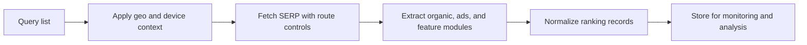

## Why Search Engine Results Data Matters
Search engine result pages are valuable because they reveal rankings, intent patterns, SERP features, local results, ads, and competitor visibility. Teams collect this data for SEO research, brand monitoring, market analysis, and search-product intelligence.
But SERP scraping is also one of the most sensitive forms of web collection. Search engines are highly defended, results vary by geography and query context, and repeated request patterns are scored quickly.
This guide pairs naturally with [Scraping Search Results with Python](https://bytesflows.com/en/blog/scraping-search-results-python), [How to Scrape Google - SERP Scraping Guide](https://bytesflows.com/en/blog/how-to-scrape-google-serp), and [Geo-Targeted Scraping Proxies](https://bytesflows.com/en/blog/geo-targeted-scraping-proxies).
## What Teams Usually Need From SERPs
SERP data collection often targets fields such as:
- query and timestamp
- organic ranking positions
- result URLs and titles
- snippets and sitelinks
- ads and sponsored placements
- local packs, featured snippets, and other SERP features
- device, language, and region context
| Field group | Why it matters |
| --- | --- |
| Organic positions | Supports ranking analysis and trend monitoring |
| SERP features | Shows how the results page is changing for a query |
| Localization context | Explains why rankings differ by market |
| Ads and commercial modules | Helps analyze search competition and paid visibility |
## Why SERP Scraping Is So Sensitive
Search engines react quickly to repetitive collection because result pages are commercially important and heavily monitored.
Common challenges include:
- CAPTCHA or challenge pages
- rate limits after repeated queries
- localization changes by IP and language
- mobile versus desktop result differences
- rapidly changing page modules and layout variants
That is why SERP scraping is not just an HTML parsing problem. It is a routing, localization, and consistency problem.
## Localization Is Part of the Data
A ranking position is meaningful only when you know the query context. Good SERP collection stores:
- country or region
- language
- device type
- timestamp
- engine variant or domain
Without that context, ranking comparisons can be misleading.
## Requests Versus Browser-Aware Collection
Some SERP workflows can still use lightweight HTTP collection, but stricter search targets often require more browser-aware handling when you need:
- better challenge visibility
- realistic session behavior
- more reliable parsing of modern result modules
- validation that the page was fully and correctly served
The right approach depends on the search engine, query volume, and the depth of SERP features you need.
## A Practical SERP Collection Architecture

In production, query scheduling, extraction, and downstream monitoring are often separated so each stage can scale cleanly.
## Why Residential Proxies Matter for SERPs
Residential proxies help because they:
- reduce obvious datacenter exposure
- support market-specific search contexts
- distribute repeated queries across more identities
- improve stability on defended search targets
For SERP work, route quality and localization control are often more important than raw scraping speed.
## Operational Best Practices
### Store localization fields with every query result
Rankings without geo and language context are hard to trust.
### Separate organic results from SERP features
Featured snippets, local packs, and ads should not be mixed into one undifferentiated record set.
### Control query pacing carefully
Bursting too many similar requests can degrade result quality fast.
### Validate what the page actually returned
A technically successful response may still be a challenge page or degraded result set.
### Test routes and headers regularly
Use [Scraping Test](https://bytesflows.com/en/blog/scraping-test), [HTTP Header Checker](https://bytesflows.com/en/blog/http-header-checker), and [Proxy Checker](https://bytesflows.com/en/blog/proxy-checker) to verify that SERP requests are reaching the engine cleanly.
## Common Mistakes
- storing rankings without location or device context
- treating ads and organic results as the same type of record
- scaling query volume before measuring challenge rates
- ignoring layout drift in SERP features over time
- assuming a valid HTTP response means a valid SERP result
## Conclusion
Scraping search engine results reliably requires more than extracting links from a page. It requires controlling localization, understanding SERP structure, managing anti-bot pressure, and storing rankings in a context-aware format.
When routing, extraction, and normalization are designed together, SERP data becomes much more useful for SEO monitoring, market intelligence, and search analytics.
## Further reading
- [Scraping Search Results with Python](https://bytesflows.com/en/blog/scraping-search-results-python)
- [How to Scrape Google - SERP Scraping Guide](https://bytesflows.com/en/blog/how-to-scrape-google-serp)
- [Geo-Targeted Scraping Proxies](https://bytesflows.com/en/blog/geo-targeted-scraping-proxies)
- [Best Proxies for Web Scraping](https://bytesflows.com/en/blog/best-proxies-for-web-scraping)
- [Proxy Rotation Strategies](https://bytesflows.com/en/blog/proxy-rotation-strategies)
