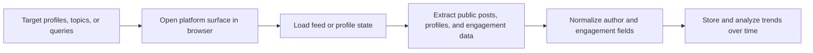

## Why Social Media Data Is Valuable
Social media platforms expose fast-moving public signals about audiences, trends, competitors, creators, and brand perception. Teams collect this data for market research, lead generation, competitive monitoring, content analysis, and AI training workflows.
But social platforms are among the most operationally sensitive targets on the web. Feeds are dynamic, rate limits are aggressive, and many platforms combine login friction, fingerprinting, and behavioral analysis to slow automated access.
If you are working in this area, this guide pairs well with [Scraping Dynamic Websites with Playwright](https://bytesflows.com/blog/scraping-dynamic-websites-playwright), [Browser Fingerprinting Explained](https://bytesflows.com/blog/browser-fingerprinting-explained), and [How Websites Detect Web Scrapers](https://bytesflows.com/blog/how-websites-detect-web-scrapers).
## What Teams Usually Want to Extract
The right fields depend on the platform and use case, but common targets include:
- profile names, bios, and follower signals
- post text, timestamps, and engagement counts
- hashtags, keywords, and topic clusters
- public comments and discussion patterns
- trending content and discovery-page signals
- linkouts, media metadata, and author identity fields
| Use case | Typical data needed |
| --- | --- |
| Trend monitoring | Posts, hashtags, velocity, and engagement |
| Competitor research | Brand mentions, campaigns, and audience response |
| Lead generation | Profiles, company references, and public contact clues |
| Content intelligence | Topic clusters, creators, and format performance |
## Why Social Media Scraping Is Harder Than General Web Scraping
Social platforms are designed around identity, sessions, and interaction patterns rather than simple document retrieval.
Common challenges include:
- login walls and soft access barriers
- infinite scroll and dynamically loaded feeds
- API-backed interfaces with changing request patterns
- aggressive rate limits and short-lived blocks
- browser fingerprinting and behavioral scoring
- region, language, or session-specific content differences
This is why social media collection is usually a browser and session problem first, and a selector problem second.
## Public Data Still Requires Careful Collection Design
Even when the target data is public, the collection workflow should be precise about scope.
A good starting point is to define:
- which platforms matter
- which public surfaces you actually need
- how often the data must be refreshed
- what fields are essential versus optional
- how you will normalize identity and engagement signals across platforms
Without that clarity, teams often collect more noise than insight.
## Browser Automation Is Often the Default
Social feeds and profile pages are frequently rendered through client-side applications. That means browser automation is often the most practical default because it helps with:
- executing dynamic page logic
- preserving cookies and session state
- loading scroll-based content incrementally
- observing challenge and login behavior realistically
Playwright is a common fit because it gives you predictable browser control for dynamic interfaces.
## A Practical Social Media Scraping Architecture

In production, discovery jobs and profile-or-post extraction jobs are often separated so they can be paced differently.
## Why Session Quality Matters So Much
Social platforms often score not only the IP address, but also the consistency of session behavior. Reliability improves when you:
- preserve cookies for related browsing sessions
- avoid unrealistic navigation jumps
- keep viewport, headers, and timing patterns coherent
- detect degraded sessions before scaling further
This is one reason why short-lived request scripts often fail where a more session-aware browser workflow succeeds.
## Residential Proxies and Route Strategy
Residential proxies help social media scraping because they reduce obvious datacenter signatures and make repeated browsing look more like ordinary user traffic.
They are especially useful when you need:
- repeated access to public profiles or feeds
- lower block rates on dynamic, defended platforms
- geo-specific views of public content
- distributed traffic for large monitoring workloads
For some high-friction platforms, route quality and session management matter more than raw proxy pool size.
## What Good Social Data Normalization Looks Like
Social data becomes much more useful when you normalize it deliberately. You should think about:
- author identity across multiple pages or feeds
- engagement counts as time-sensitive values
- reposts or quote-posts versus original posts
- language, region, and topic classification
- media metadata and outbound links
Raw scraped text is rarely enough on its own for downstream analysis.
## Operational Best Practices
### Separate discovery from detailed extraction
Trending-page discovery and profile-level extraction usually need different pacing.
### Store timestamps with every observation
Engagement data changes quickly and becomes misleading without time context.
### Monitor empty-feed and challenge rates
A page that loads but yields no usable posts is still a failure.
### Keep platform-specific extractors isolated
Do not assume one platform's layout logic maps cleanly to another.
### Validate request presentation regularly
Use [Scraping Test](https://bytesflows.com/blog/scraping-test), [HTTP Header Checker](https://bytesflows.com/blog/http-header-checker), and [Random User-Agent Generator](https://bytesflows.com/blog/user-agent-generator) to test whether your requests still look credible.
## Common Mistakes
- treating social platforms like static websites
- scraping far more fields than the use case actually needs
- ignoring session continuity and navigation realism
- failing to timestamp engagement and trend observations
- scaling before measuring block rates, empty-feed rates, and challenge frequency
## Conclusion
Scraping social media data reliably requires a workflow built around public-surface selection, browser automation, session quality, and deliberate normalization. The key is not just accessing a profile or feed once. It is building a repeatable system that can observe public content over time without collapsing under dynamic rendering and anti-bot pressure.
When session-aware browser automation and residential proxy routing are combined well, social media data becomes much more useful for research, trend monitoring, and competitive intelligence.
## Further reading
- [Scraping Dynamic Websites with Playwright](https://bytesflows.com/blog/scraping-dynamic-websites-playwright)
- [Browser Fingerprinting Explained](https://bytesflows.com/blog/browser-fingerprinting-explained)
- [How Websites Detect Web Scrapers](https://bytesflows.com/blog/how-websites-detect-web-scrapers)
- [Best Proxies for Web Scraping](https://bytesflows.com/blog/best-proxies-for-web-scraping)
- [Avoid IP Bans in Web Scraping](https://bytesflows.com/blog/avoid-ip-bans-web-scraping)
