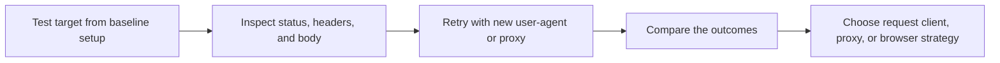

## Scraping Test Helps You Check Whether a Target Is Actually Reachable for Your Workflow Before You Scale It
A scraper often fails long before the parser is the problem. The target may be blocking your IP, challenging your headers, rejecting your route quality, or serving a different page than you expected. That is why testing the target first is so useful. A quick controlled request can tell you whether the next step is header tuning, better proxy routing, browser automation, or simply walking away from a weak setup.
This scraping test tool gives you a fast way to inspect how a target responds before you invest time in building or scaling a full scraper.
This page explains what to test, how to interpret the result, and how to use the tool as part of a practical scrape-debugging workflow. It pairs naturally with [Proxy Checker](https://bytesflows.com/blog/proxy-checker), [HTTP Header Checker](https://bytesflows.com/blog/http-header-checker), and [Random User-Agent Generator](https://bytesflows.com/blog/user-agent-generator).
## What a Scraping Test Should Help You Learn
A useful scraping test helps answer questions like:
- does the target respond at all?
- does it return real content or a challenge page?
- does changing user-agent or proxy improve the outcome?
- is the issue likely route-related, header-related, or browser-related?
That makes this tool one of the fastest ways to reduce guesswork before production scraping starts.
## What to Check in the Result
| Signal | What it tells you | Why it matters |
| --- | --- | --- |
| **Status code** | Whether the target served, blocked, or challenged the request | Helps separate reachability from access quality |
| **Response headers** | Clues about anti-bot systems, caching, or server behavior | Useful when the body alone does not explain the outcome |
| **Response body** | Whether you received real content, a login wall, or a challenge page | Prevents false confidence from a simple 200 response |
| **Behavior changes by proxy or UA** | Whether route or identity changes improve the result | Helps reveal the real reason the request is failing |
## Why Testing Before Building Saves Time
Many scraping failures are expensive only because they are discovered too late.
Testing first helps you catch:
- instant blocks on your default IP
- challenge pages that look like success at first glance
- routes that work technically but return the wrong content
- obvious cases where browser automation is required
This is often far cheaper than debugging a large crawler that was built on the wrong assumption.
## A Practical Test Workflow
A strong workflow usually looks like this:

This makes the tool useful as a decision point rather than just a one-off check.
## How to Use This Tool
1. Enter the target URL.
1. Run a baseline test first.
1. If needed, try a different user-agent.
1. If needed, test again with a proxy.
1. Compare status code, headers, and body content across runs.
The goal is not only to see whether the request succeeds. It is to understand *why* it succeeds or fails.
## How to Interpret Common Outcomes
### 200 with full content
This suggests the target is reachable with the current identity and route.
### 200 with very short or challenge-like HTML
This often means you reached the site but not the real content.
### 403 or 503
This often points to blocking, rate pressure, or a route the target distrusts.
### Better results after changing proxy
That usually points to network identity or route quality as the main issue.
### Better results after changing user-agent but not proxy
That often suggests a weak request signature rather than a weak route.
## When Testing with Multiple Configurations Helps Most
This tool becomes especially useful when you compare:
- no proxy versus residential proxy
- default library user-agent versus browser-like user-agent
- one route or region versus another
- request client behavior before moving to a full browser workflow
Side-by-side testing often reveals which layer actually matters.
## Common Problems This Tool Reveals Early
This tool is particularly useful for spotting:
- IP-based blocking
- challenge pages hidden behind 200 responses
- weak default user-agent behavior
- targets that clearly need browser execution
- routes that are too slow or unstable to be practical
- mismatches between a successful test setup and the actual scraper configuration
These are the same issues that later create unstable production crawls.
## Best Practices
### Start with a baseline request before changing everything at once
That makes the cause easier to isolate.
### Compare the response body, not only the status code
A 200 does not always mean useful access.
### Re-test with the same proxy and identity you plan to use in production
That reduces configuration drift later.
### Use the tool to decide whether headers, proxies, or browsers matter most
Different targets fail for different reasons.
### Keep notes on what changed the outcome
Those observations become reusable routing knowledge later.
Helpful companion pages include [Proxy Checker](https://bytesflows.com/blog/proxy-checker), [HTTP Header Checker](https://bytesflows.com/blog/http-header-checker), [Random User-Agent Generator](https://bytesflows.com/blog/user-agent-generator), and [how websites detect web scrapers](https://bytesflows.com/blog/how-websites-detect-scrapers).
## FAQ
### If I get 200, does that mean the target is safe to scrape?
Not necessarily. You may still be getting a challenge page, partial content, or a brittle route that will fail under repetition.
### What should I change first after a failed test?
Usually start with the smallest likely fix: user-agent, then route quality, then browser execution if needed.
### Can this tool prove a full scraper will work?
No. It proves whether a simple request setup looks promising. Production scraping still needs pacing, retries, and validation.
### Why should I compare multiple runs instead of relying on one result?
Because many failures are conditional. One result rarely tells the whole story.
## Conclusion
A scraping test is useful because it helps you learn whether a target is reachable for your intended workflow before you invest in a larger scraper. By comparing status, headers, body content, and the effect of identity changes, you can quickly tell whether the next move is better headers, better routes, or a real browser.
The practical lesson is simple: test first, scale later. When you diagnose the target early, scraper design becomes faster, cheaper, and much more deliberate.
## Further reading
- [Proxy Checker](https://bytesflows.com/blog/proxy-checker)
- [HTTP Header Checker](https://bytesflows.com/blog/http-header-checker)
- [Random User-Agent Generator](https://bytesflows.com/blog/user-agent-generator)
- [How websites detect web scrapers](https://bytesflows.com/blog/how-websites-detect-scrapers)
- [Bypass Cloudflare for web scraping](https://bytesflows.com/blog/bypass-cloudflare-web-scraping)
- [How to scrape websites without getting blocked](https://bytesflows.com/blog/scrape-websites-without-getting-blocked)
- [Residential proxies](https://bytesflows.com/proxies)
