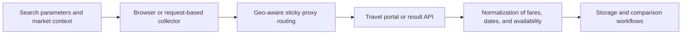

## Scraping Travel Websites Means Handling Geo-Sensitive Prices, Session-Heavy Search Flows, and Rapidly Changing Availability
Travel data is valuable because it supports fare monitoring, hotel rate comparison, route intelligence, demand analysis, and travel-product research. But travel websites are some of the most operationally sensitive scraping targets on the web. Prices and availability can vary by region, session, timing, market, and interaction flow. A simple request for a page often does not reflect what a real traveler sees.
That is why scraping travel websites usually requires more than a parser. It requires geo-aware routing, browser-capable collection, and careful session handling across multi-step search flows.
This guide explains what makes travel data collection difficult, how flight and hotel portals typically behave, and how to build a more reliable scraping workflow for travel and hospitality targets. It pairs naturally with [geo-targeted scraping with proxies](https://bytesflows.com/blog/geo-targeted-scraping-proxies), [Playwright web scraping tutorial](https://bytesflows.com/blog/playwright-web-scraping-tutorial), and [best proxies for web scraping](https://bytesflows.com/blog/best-proxies-for-web-scraping).
## Why Travel Scraping Is Operationally Different
Travel portals often depend on more than a single page load.
They commonly involve:
- multi-step search forms
- location-sensitive pricing and availability
- dynamic result loading
- session state across searches and filters
- anti-bot controls on repeated commercial queries
This means travel scraping is often a workflow problem rather than a simple HTML extraction problem.
## What Teams Usually Want from Travel Sites
A useful travel dataset often includes:
- route or destination information
- dates and availability windows
- prices and fare classes
- airline, hotel, or vendor details
- cancellation or baggage conditions
- ranking or sponsored placement signals
- collection time and market context
The data only becomes truly useful when those fields are tied to time, region, and search conditions.
## Geo and Market Context Matter a Lot
Travel sites often change results depending on where the session appears to come from.
That can affect:
- visible inventory
- currency and tax presentation
- region-specific offers
- availability by market
- whether the traffic looks suspicious for the query
That is why geo-aware residential routing is often important in travel scraping, especially when the goal is to observe what users in a real market would see.
## Session Continuity Is Often Required
Unlike simpler scraping targets, many travel workflows rely on continuity across several steps.
For example:
- search parameters may be set on one screen and used on another
- cookies can influence result visibility
- filters and sorting can modify the same result set dynamically
- subsequent detail pages may depend on the original search session
This makes sticky session behavior more important than in many stateless scraping workflows.
## Browser Automation Is Often the Practical Baseline
Many travel sites load results dynamically and depend on interaction-heavy flows.
Browser automation helps because it can:
- execute the search sequence as a user would
- preserve cookies and state
- handle rendered results and post-search interactions
- expose the network requests behind dynamic result pages
That is why browser-based collection is often the most practical starting point, even if some endpoints can later be collected more efficiently.
## Travel Result Pages Often Hide Internal APIs
Many portals render search results from internal APIs after the user completes a search.
That creates two useful paths:
- use a browser to reproduce and understand the result flow
- inspect the underlying requests and decide whether some data can later be collected more efficiently
In many cases, the browser is the discovery tool and the lighter request layer becomes the scaling tool.
## A Practical Travel Scraping Architecture
A useful mental model looks like this:

This keeps market realism, session continuity, and downstream analysis connected.
## Common Failure Patterns
### Wrong prices or inventory for the intended market
The route may not match the target country or market context.
### Empty or partial search results
The result page may depend on JavaScript execution or missing session state.
### Fast-growing block rate on repeated searches
The query rhythm or route quality may be too aggressive for the target.
### Inconsistent travel data across repeated runs
Collection may not be normalizing session context, currency, or timing well enough.
### Detail pages that fail after the initial search succeeds
The workflow may be losing continuity between search and follow-up requests.
## Best Practices
### Treat search flow and result extraction as one connected workflow
Travel portals often depend on that continuity.
### Use geo-aware routing when market realism matters
Location can materially change the output.
### Prefer browser-based discovery first on complex portals
Understand the workflow before trying to optimize it away.
### Normalize fare, currency, and availability fields with timestamps
Travel data loses value quickly without context.
### Compare results across markets and times carefully
Travel pricing can change for legitimate reasons, not only because the scraper drifted.
Helpful companion reading includes [geo-targeted scraping with proxies](https://bytesflows.com/blog/geo-targeted-scraping-proxies), [Playwright web scraping tutorial](https://bytesflows.com/blog/playwright-web-scraping-tutorial), [scraping data at scale](https://bytesflows.com/blog/scraping-data-at-scale), and [best proxies for web scraping](https://bytesflows.com/blog/best-proxies-for-web-scraping).
## Conclusion
Scraping travel websites in 2026 is really about collecting price and availability data from portals that are heavily shaped by geography, session continuity, and dynamic search flows. The most reliable approach usually combines browser-based discovery, geo-aware routing, sticky session logic, and careful normalization of results.
The practical lesson is simple: travel scraping works best when the workflow respects how travel sites actually sell inventory. Once collection design aligns with search state, market context, and timing, the data becomes much more reliable for comparison, monitoring, and analysis.
## Further reading
- [Geo-targeted scraping with proxies](https://bytesflows.com/blog/geo-targeted-scraping-proxies)
- [Playwright web scraping tutorial](https://bytesflows.com/blog/playwright-web-scraping-tutorial)
- [Best proxies for web scraping](https://bytesflows.com/blog/best-proxies-for-web-scraping)
- [Scraping data at scale](https://bytesflows.com/blog/scraping-data-at-scale)
- [Browser automation for web scraping](https://bytesflows.com/blog/browser-automation-web-scraping)
- [Residential proxies](https://bytesflows.com/proxies)
- [How to scrape websites without getting blocked](https://bytesflows.com/blog/scrape-websites-without-getting-blocked)
