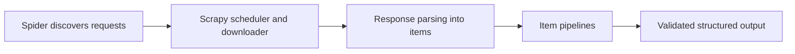

## Scrapy Is Best When the Scraping Problem Looks Like a Crawl System, Not a Browser Session
Scrapy remains one of the strongest Python frameworks for web scraping because it treats scraping as a structured crawling problem rather than just a sequence of manual requests. When the target is mostly static and the workload involves many pages, repeated patterns, item pipelines, and controlled concurrency, Scrapy can be much more operationally efficient than ad hoc scripts.
That is why using Scrapy well is mostly about recognizing when the problem is crawl-shaped rather than browser-shaped.
This guide explains how Scrapy works, what spiders, items, and pipelines actually buy you, how proxies and concurrency fit into the framework, and when Scrapy is the better choice versus browser automation. It pairs naturally with [distributed crawlers with Scrapy](https://bytesflows.com/blog/distributed-crawlers-scrapy), [autonomous web crawlers](https://bytesflows.com/blog/autonomous-web-crawlers), and [beautifulsoup vs Scrapy vs Playwright for web scraping](https://bytesflows.com/blog/beautifulsoup-vs-scrapy-vs-playwright).
## What Scrapy Actually Solves
Scrapy helps when the scraping task is not just one request or one page but a repeated, structured crawl.
It is especially useful for:
- following links across many pages
- extracting repeated item types
- managing crawl scheduling and retries
- processing outputs through consistent item pipelines
- handling large static crawls more efficiently than browser tools
This is why Scrapy often feels more like a framework for crawling systems than like a single scraping library.
## Spiders, Items, and Pipelines Are the Core Model
Scrapy organizes scraping into clear layers.
### Spiders
Control discovery and response parsing.
### Items
Represent the structured records you want to collect.
### Pipelines
Clean, validate, enrich, deduplicate, or store extracted output.
This separation matters because it turns one-off scraping logic into a more maintainable data workflow.
## Why Scrapy Scales Well for Static Crawls
Scrapy is powerful on crawl-heavy workloads because it already thinks in terms of:
- many URLs
- queued requests
- retries and scheduling
- controlled concurrency
- repeated extraction patterns
This is why Scrapy often feels much stronger than ad hoc scripting once the crawl expands beyond a few pages or a few targets.
## Scrapy Does Not Replace Browser Automation
A common misunderstanding is treating Scrapy as a universal answer.
Scrapy is weaker when:
- the site is heavily JavaScript-rendered
- the content depends on browser execution
- anti-bot systems strongly inspect runtime browser behavior
- interaction is required to reveal the data
In those cases, browser tools such as Playwright become necessary or need to be combined with Scrapy-based discovery.
## Proxies Still Matter in Scrapy Workflows
Even efficient crawl frameworks are still judged as traffic by the target.
That means Scrapy still needs thoughtful handling of:
- proxy routing
- request rate per domain
- retry behavior after blocks
- residential vs datacenter tradeoffs
- pool health when the crawl scales
The framework manages requests well, but it does not eliminate identity risk.
## Concurrency Is Powerful but Needs Policy
Scrapy can process many requests efficiently, which is one of its strengths.
But good Scrapy performance still depends on:
- per-domain concurrency limits
- delays or pacing where needed
- proxies that can support the crawl pressure
- item pipelines that do not become bottlenecks
This is why Scrapy’s efficiency is most valuable when paired with disciplined crawl policy.
## Scrapy Fits Structured Data Collection Well
Scrapy is especially strong when:
- the site structure is crawlable
- the output fields are repeated and well-defined
- the crawl must keep running over many pages or categories
- extraction and storage should follow consistent processing steps
This is where its spider-plus-pipeline model creates real leverage.
## A Practical Scrapy Model
A useful mental model looks like this:

This shows why Scrapy is really a crawl framework, not only a parser helper.
## Common Mistakes
### Using Scrapy on browser-dependent targets without recognizing the limitation
The framework cannot invent browser execution.
### Treating concurrency as free throughput
The target still experiences crawl pressure.
### Skipping item validation because the spider already extracted something
Pipelines still matter.
### Ignoring proxy strategy on larger crawls
Efficient request scheduling can still create efficient blocking.
### Using Scrapy for tiny one-page tasks that do not need framework overhead
The framework is strongest when structure and volume exist.
## Best Practices for Using Scrapy
### Choose Scrapy when the workload is static, crawl-heavy, and structured
That is its strongest natural fit.
### Use spiders, items, and pipelines as separate concerns
This is what makes the framework maintainable.
### Pair Scrapy with deliberate proxy and concurrency policy
The framework needs identity discipline too.
### Combine Scrapy with browser tooling only when the page actually requires it
Do not turn every crawl into a browser job unnecessarily.
### Let the framework handle crawl structure where crawl structure is the real problem
That is where Scrapy saves the most effort.
Helpful support tools include [Proxy Checker](https://bytesflows.com/blog/proxy-checker), [Scraping Test](https://bytesflows.com/blog/scraping-test-tool-detect-blocks), and [HTTP Header Checker](https://bytesflows.com/blog/http-header-checker).
## Conclusion
Scrapy is one of the best tools for web scraping when the workload is really a crawling system: many URLs, repeated items, structured pipelines, and static or mostly static targets. Its strength comes from turning crawl management, extraction, and data processing into one coherent framework.
The practical lesson is to use Scrapy where crawl structure matters more than browser realism. When paired with sensible proxy routing, concurrency control, and strong item pipelines, it becomes a highly efficient foundation for large static scraping systems. When the target truly needs a browser, let browser tools handle that part instead of forcing Scrapy beyond its natural design.
If you want the strongest next reading path from here, continue with [distributed crawlers with Scrapy](https://bytesflows.com/blog/distributed-crawlers-scrapy), [autonomous web crawlers](https://bytesflows.com/blog/autonomous-web-crawlers), [beautifulsoup vs Scrapy vs Playwright for web scraping](https://bytesflows.com/blog/beautifulsoup-vs-scrapy-vs-playwright), and [proxy management for large scrapers](https://bytesflows.com/blog/proxy-management-large-scrapers).
## Further reading
- [Distributed crawlers with Scrapy](https://bytesflows.com/blog/distributed-crawlers-scrapy)
- [Autonomous web crawlers](https://bytesflows.com/blog/autonomous-web-crawlers)
- [BeautifulSoup vs Scrapy vs Playwright for web scraping](https://bytesflows.com/blog/beautifulsoup-vs-scrapy-vs-playwright)
- [Proxy management for large scrapers](https://bytesflows.com/blog/proxy-management-large-scrapers)
- [How proxy rotation works](https://bytesflows.com/blog/how-proxy-rotation-works)
- [Best proxies for web scraping](https://bytesflows.com/blog/best-proxies-for-web-scraping)
- [The ultimate guide to web scraping in 2026](https://bytesflows.com/blog/ultimate-guide-web-scraping-2026)
