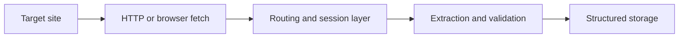

Web scraping in 2026 is no longer just about sending a request and parsing HTML. Modern targets are dynamic, highly monitored, and often protected by layered anti-bot systems. That means successful scraping now depends on the full stack: fetch strategy, browser control, routing quality, extraction logic, validation, and operational discipline.
This guide brings those pieces together into one practical overview. It works well with [The Ultimate Guide to Headless Browser Scraping in 2026](https://bytesflows.com/blog/headless-browser-scraping-guide), [Scaling Scrapers with Distributed Systems](https://bytesflows.com/blog/scaling-scrapers-distributed-systems), and [How Websites Detect Web Scrapers (2026)](https://bytesflows.com/blog/how-websites-detect-scrapers).
## What Changed in Web Scraping
A few trends define the current landscape:
- more sites depend on JavaScript rendering
- anti-bot detection has become more behavioral and multi-layered
- browser automation is now common instead of exceptional
- AI-assisted extraction is becoming part of production pipelines
- routing quality matters as much as parsing logic
That is why modern scraping is really a systems problem.
## The Core Layers of a Modern Scraping Stack
A production-ready scraper usually combines:
- a fetch layer using HTTP or browsers
- a routing layer for region, trust, and resilience
- an extraction layer for structured data collection
- a validation layer for quality control
- a storage layer for downstream analysis or delivery
When one of those layers is weak, the whole pipeline becomes brittle.
## HTTP, Browsers, or Both
Simple static pages may still work well with direct HTTP fetching. But many important targets now require:
- JavaScript execution
- session handling
- multi-step navigation
- interaction with buttons, filters, or infinite scroll
That is why many teams use a hybrid strategy: start with fast HTTP fetching, and escalate to Playwright or another browser workflow only when needed.
## Why Proxies Matter More Than Ever
At scale, the route itself becomes part of the scraping strategy. Good routing helps with:
- reducing block rates
- accessing geo-specific content
- distributing load responsibly
- improving session continuity when needed
This is especially important for commercial pages, travel search, marketplaces, and other sensitive targets. See [The Best Proxies for Web Scraping in 2026: A Definitive Comparison](https://bytesflows.com/blog/best-proxies-for-web-scraping) and [Avoid IP Bans in Automation](https://bytesflows.com/blog/avoid-ip-bans-automation).
## AI Is Expanding the Extraction Layer
AI is not replacing scraping. It is expanding what scraping systems can do. AI is especially useful for:
- extracting fields from inconsistent layouts
- summarizing messy content
- classifying records automatically
- helping agent-style workflows decide what to inspect next
The key is to use it where flexibility matters, while still validating outputs carefully.
## Anti-Bot Reality
Modern detection systems look at much more than IP reputation. They may examine:
- request patterns
- browser fingerprints
- interaction timing
- session consistency
- TLS and network signals
That is why success depends on the full combination of pacing, browser behavior, routing, and extraction discipline. One fix rarely solves everything.
## A Practical Architecture

This model keeps the workflow understandable while still supporting scale.
## What Good Scrapers Do Differently
The strongest scraping systems usually:
- define scope clearly before scaling
- choose the cheapest fetch method that still works
- validate outputs continuously
- treat routing as a design concern, not an afterthought
- keep retry logic conservative rather than aggressive
That is what turns a script into an operating system for data collection.
## Common Mistakes
- defaulting to browser automation for everything
- ignoring output validation because extraction seems to work at first
- treating proxies as a shortcut instead of part of traffic design
- scaling request volume before block pressure is understood
- mixing exploratory extraction and production pipelines without clear controls
## Conclusion
The ultimate guide to web scraping in 2026 is really a guide to modern data collection systems. Successful scraping now depends on how fetch strategy, routing, browser control, extraction, and validation work together under real pressure.
Teams that understand those layers can build workflows that are not only more resilient, but also easier to scale and maintain.
## Further reading
- [The Ultimate Guide to Headless Browser Scraping in 2026](https://bytesflows.com/blog/headless-browser-scraping-guide)
- [Scaling Scrapers with Distributed Systems](https://bytesflows.com/blog/scaling-scrapers-distributed-systems)
- [How Websites Detect Web Scrapers (2026)](https://bytesflows.com/blog/how-websites-detect-scrapers)
- [The Best Proxies for Web Scraping in 2026: A Definitive Comparison](https://bytesflows.com/blog/best-proxies-for-web-scraping)
- [Avoid IP Bans in Automation](https://bytesflows.com/blog/avoid-ip-bans-automation)
