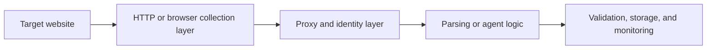

## Web Scraping in 2026 Is No Longer Just About Extracting HTML
A decade ago, many scraping tasks could be solved with a short script and a parser. That still works on some simple sites, but it no longer describes the web as a whole. Modern targets are often dynamic, browser-sensitive, anti-bot protected, and increasingly valuable to the companies that operate them.
That is why web scraping in 2026 is less about one coding trick and more about choosing the right system for the target.
This guide explains the modern scraping landscape, how to choose the right stack, why proxies and browser realism matter, how scaling changes the architecture, and where AI agents fit into the picture. It pairs naturally with [best web scraping tools in 2026](https://bytesflows.com/en/blog/best-web-scraping-tools), [web scraping architecture explained](https://bytesflows.com/en/blog/web-scraping-architecture-explained), and [browser automation for web scraping](https://bytesflows.com/en/blog/browser-automation-web-scraping).
## The First Decision: What Kind of Target Are You Actually Scraping?
The biggest scraping mistake is choosing tools before understanding the website.
A target may be:
- static and HTML-heavy
- dynamic and JavaScript-rendered
- browser-sensitive but not deeply interactive
- heavily protected by anti-bot systems
- large-scale and operationally demanding even if technically simple
This matters because the right stack for a simple public page is very different from the right stack for a protected ecommerce or SERP workflow.
## Static vs Dynamic Is Still the First Useful Split
For many projects, the first question is whether the content arrives in the response directly.
### Static targets
Often work well with lightweight HTTP clients and parsers.
### Dynamic targets
Often require a real browser or browser automation layer because the useful content appears only after the page runs code or receives interaction.
This is why browser automation has become such a central topic in modern scraping.
## Tool Choice Should Follow the Workflow
In practice, different tools fit different layers.
### Lightweight HTTP and parsing tools
Useful for:
- stable public pages
- low-cost extraction
- fast iteration on simpler targets
### Browser automation tools
Useful for:
- dynamic rendering
- interaction-heavy pages
- browser-sensitive anti-bot environments
### Crawling and orchestration frameworks
Useful when:
- URL volume grows
- retries and queues matter
- the task becomes a system rather than a script
The best stack is usually the one that solves the target with the least total complexity.
## Proxy Identity Is Now Part of the Core Stack
Modern scraping is not only about code. It is also about what kind of traffic identity the site sees.
That is why proxy strategy matters so much.
Common needs include:
- stronger IP trust on stricter targets
- rotation to avoid concentrated request pressure
- geography for market-accurate results
- session continuity for longer browser tasks
This is why [best proxies for web scraping](https://bytesflows.com/en/blog/best-proxies-for-web-scraping), [datacenter vs residential proxies](https://bytesflows.com/en/blog/datacenter-vs-residential-proxies), and [how proxy rotation works](https://bytesflows.com/en/blog/how-proxy-rotation-works) are foundational topics rather than optional add-ons.
## Anti-Bot Systems Changed the Game
A major reason scraping feels harder in 2026 is that websites evaluate more than just request count.
They may score:
- IP reputation
- headers and protocol signals
- browser fingerprinting
- session behavior and timing
- challenge success or failure
This is why many older scraping assumptions break on modern targets. A working request is not the same as a sustainable workflow.
## Browser Realism Matters Where the Target Cares
For dynamic or protected sites, a real browser often becomes the practical baseline.
A browser layer helps because it can:
- execute JavaScript
- expose the rendered DOM
- manage real session state
- satisfy more browser-like runtime expectations
But a real browser also introduces cost, waiting complexity, and infrastructure needs. That is why it should be used deliberately.
## Scaling Turns a Script into a System
A scraper that works on 50 pages may fail on 50,000 even with identical code.
As scale increases, the system needs to manage:
- queues and workers
- retries and backoff
- proxy routing and capacity
- concurrency limits per domain
- monitoring of success and block rates
This is why large scraping systems look more like distributed pipelines than like single scripts.
## Where AI Agents Fit
AI agents are part of the 2026 landscape, but they are not a universal replacement for traditional scraping.
They are most useful when:
- page structure varies heavily
- multi-step reasoning matters
- selector maintenance is expensive
- the workflow needs adaptive behavior
They are less useful when the site is stable and volume is high. In those cases, simple deterministic extraction is often still the better engineering choice.
## A Practical Modern Stack Model
A useful mental model looks like this:

This is the real shape of many modern scraping systems.
## Common Mistakes
### Starting with the most complex stack before understanding the target
This creates cost and confusion early.
### Treating proxies as optional until blocks appear
Identity should be designed before scale, not after failure.
### Using browser automation everywhere by default
That often overpays for realism on easy pages.
### Scaling before measuring baseline health
Volume multiplies weak design.
### Assuming AI agents replace engineering discipline
They still need browser, routing, and validation infrastructure.
## Best Practices for Web Scraping in 2026
### Start by classifying the target correctly
Static, dynamic, protected, and high-scale targets need different responses.
### Use the lightest tool that reliably solves the page
Do not add browser or agent cost without a reason.
### Design identity and proxy strategy as part of the system
Not as a last-minute patch.
### Validate extraction and pass rate before scaling
Success is not only whether the request returned.
### Add AI agents where uncertainty and reasoning actually justify them
Keep deterministic systems where deterministic systems are enough.
Helpful support tools include [Proxy Checker](https://bytesflows.com/en/blog/proxy-checker), [Scraping Test](https://bytesflows.com/en/blog/scraping-test-tool-detect-blocks), and [Proxy Rotator Playground](https://bytesflows.com/en/blog/proxy-rotator).
## Conclusion
Web scraping in 2026 is not one technique. It is a family of workflows shaped by target type, browser dependence, anti-bot strictness, traffic identity, and scale. The modern scraper is part parser, part browser operator, part routing system, and sometimes part reasoning loop.
The most important lesson is to match the system to the target. Use lightweight tools where the site is simple. Use browsers where the page really needs a browser. Use stronger proxies where trust matters. Use agents where uncertainty and adaptation justify them. The best scraping architecture is the one that solves the real problem with the least unnecessary complexity.
If you want the strongest next reading path from here, continue with [best web scraping tools in 2026](https://bytesflows.com/en/blog/best-web-scraping-tools), [web scraping architecture explained](https://bytesflows.com/en/blog/web-scraping-architecture-explained), [browser automation for web scraping](https://bytesflows.com/en/blog/browser-automation-web-scraping), and [best proxies for web scraping](https://bytesflows.com/en/blog/best-proxies-for-web-scraping).
## Further reading
- [Best web scraping tools in 2026](https://bytesflows.com/en/blog/best-web-scraping-tools)
- [Web scraping architecture explained](https://bytesflows.com/en/blog/web-scraping-architecture-explained)
- [Browser automation for web scraping](https://bytesflows.com/en/blog/browser-automation-web-scraping)
- [Best proxies for web scraping](https://bytesflows.com/en/blog/best-proxies-for-web-scraping)
- [How proxy rotation works](https://bytesflows.com/en/blog/how-proxy-rotation-works)
- [How websites detect web scrapers](https://bytesflows.com/en/blog/how-websites-detect-scrapers)
- [AI browser agents with Playwright](https://bytesflows.com/en/blog/ai-browser-agents-playwright)
