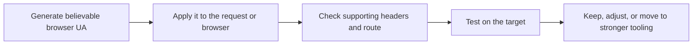

## Random User-Agent Generator Helps You Replace Obvious Default Identities, but It Does Not Replace a Real Browser Strategy
A user-agent is one of the first visible clues a website sees about your client. If the request announces itself as `python-requests`, `curl`, or another obvious library default, the target already has a strong reason to distrust the session. That is why a realistic browser-like user-agent can help. It removes one of the easiest signals of automation.
But that does not mean user-agent randomization is a complete anti-block strategy. On stricter targets, the site will still care about headers, TLS behavior, browser fingerprinting, JavaScript execution, and route quality.
This page explains what a user-agent generator is useful for, when rotating user-agents helps, when consistency matters more than randomness, and how to use the tool in a practical scraping workflow. It pairs naturally with [HTTP Header Checker](https://bytesflows.com/blog/http-header-checker), [Scraping Test](https://bytesflows.com/tools/proxy-test), and [How Websites Detect Web Scrapers](https://bytesflows.com/blog/how-websites-detect-scrapers).
## What This Tool Is Good For
Use this generator when you want to:
- replace default library user-agents
- test browser-family differences
- compare desktop and mobile request behavior
- build a small believable set of identities for experiments
- validate a request profile before scaling
The practical value is not endless randomization. It is controlled identity testing.
## Why User-Agent Still Matters
Many targets quickly flag obviously synthetic clients.
That is why changing user-agent often helps on lighter targets when:
- the request is otherwise simple
- the site mostly reacts to easy signature checks
- the default client identity is obviously non-browser
In those cases, a realistic user-agent can remove one visible reason for suspicion.
## Why User-Agent Alone Is Not Enough
A realistic user-agent does not make the whole session realistic.
Targets may also inspect:
- related request headers
- TLS or protocol behavior
- browser runtime signals
- JavaScript execution
- timing and request rhythm
This is why a browser-looking user-agent can still fail badly when the rest of the client identity does not match.
## Consistency Often Matters More Than Chaotic Rotation
One of the most common mistakes is rotating to a completely different user-agent on every request without preserving any session story.
In practice, it is often better to:
- choose a believable browser family
- keep the same user-agent through one task or session
- align supporting headers with that identity
- rotate only when the workflow really benefits from it
A coherent session often looks more natural than constant random switching.
## Desktop vs Mobile User-Agents
Desktop and mobile user-agents can trigger meaningfully different site behavior.
This matters when:
- the site serves different layouts by device type
- mobile pages are structurally simpler
- anti-bot behavior differs across device categories
- you need to test what different user segments actually see
If you use a mobile user-agent, the rest of the environment should support that story too.
## When User-Agent Rotation Helps Most
User-agent changes are usually most helpful when:
- the target is easy or moderately protected
- the main weakness is a default library signature
- you are testing presentation differences by browser family
- you want to reduce repetitive visible identity on lighter request workflows
This is where the tool creates the most immediate leverage.
## When You Need More Than User-Agent Changes
You usually need stronger tooling when:
- the target runs JavaScript challenges
- the site evaluates browser fingerprinting
- route quality is weak
- Cloudflare or similar systems still challenge the session
- user-agent changes do not improve the result materially
At that point, the issue is broader than one header. It is the full client identity.
## A Practical User-Agent Workflow
A useful workflow usually looks like this:

This keeps the tool grounded in real outcome testing instead of random header changes.
## Best Practices
### Match the rest of the request to the user-agent
Headers and browser context should support the same identity story.
### Keep a small believable set of identities
Do not randomize wildly without purpose.
### Use the same user-agent throughout one coherent session when continuity matters
Consistency often looks more natural than churn.
### Test on the real target before scaling
A valid-looking string is not the same as a successful session.
### Move to a real browser when the site clearly expects browser runtime
A user-agent string cannot replace execution authenticity.
Helpful companion pages include [HTTP Header Checker](https://bytesflows.com/blog/http-header-checker), [Scraping Test](https://bytesflows.com/tools/proxy-test), [Proxy Checker](https://bytesflows.com/blog/proxy-checker), and [Browser Fingerprinting Explained](https://bytesflows.com/blog/browser-fingerprinting-explained).
## FAQ
### Does rotating user-agents prevent blocks by itself?
Sometimes on simpler sites, but often not on stricter ones. It removes one easy signal, not every signal.
### Should I rotate the user-agent every request?
Not always. Session continuity is often more believable than constant random switching.
### Which browser family should I start with?
A common modern Chrome or Firefox identity is often the easiest baseline to test.
### When should I stop relying on user-agent changes and move to a browser?
When the target clearly cares about JavaScript, browser fingerprinting, or broader runtime realism.
## Conclusion
A random user-agent generator is useful because it helps you replace obvious default identities and test whether browser-family changes affect the target response. That can improve simpler scraping setups quickly, especially when the main weakness is an obviously synthetic client signature.
The practical lesson is simple: use user-agents deliberately, not superstitiously. A good user-agent helps when it fits a coherent session. When the target expects more than that, the right next step is stronger headers, better routes, or a real browser environment.
## Further reading
- [HTTP Header Checker](https://bytesflows.com/blog/http-header-checker)
- [Scraping Test](https://bytesflows.com/tools/proxy-test)
- [Proxy Checker](https://bytesflows.com/blog/proxy-checker)
- [Browser Fingerprinting Explained](https://bytesflows.com/blog/browser-fingerprinting-explained)
- [How Websites Detect Web Scrapers](https://bytesflows.com/blog/how-websites-detect-scrapers)
- [How to scrape websites without getting blocked](https://bytesflows.com/blog/scrape-websites-without-getting-blocked)
- [Best proxies for web scraping](https://bytesflows.com/blog/best-proxies-for-web-scraping)
