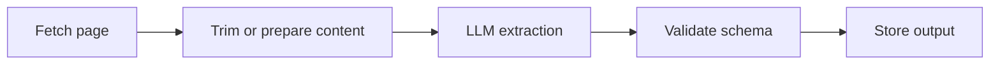

## LLM Extraction Works Best When the Problem Is Variability, Not Just Parsing
The appeal of using LLMs to extract web data is obvious: instead of writing and maintaining selectors for every layout, you let a model interpret meaning across different pages and return structured output.
That can be powerful, but it only works well when you understand where LLMs actually create leverage. They are not a universal replacement for every scraper. They are best used where the page structure varies, the content is messy, or the output needs semantic interpretation rather than strict DOM matching.
This guide explains when LLM-based web extraction makes sense, what a practical pipeline looks like, how to keep cost under control, and why fetch quality and validation still matter just as much as the model call itself. It pairs naturally with [AI data collection from the web](https://bytesflows.com/en/blog/ai-data-collection-web), [AI web scraping explained](https://bytesflows.com/en/blog/ai-web-scraping-explained), and [AI data extraction vs traditional scraping](https://bytesflows.com/en/blog/ai-data-extraction-vs-traditional-scraping).
## Why Teams Reach for LLMs in Web Extraction
Traditional selectors are great when the structure is stable. They become expensive when the layout changes often or when one system needs to handle many different sites.
LLMs become useful because they can:
- interpret content by meaning rather than exact structure
- normalize inconsistent formats across sites
- extract structured fields from semi-structured text
- classify or summarize content while extracting it
- reduce the amount of selector-by-selector maintenance
This is especially valuable for multi-site pipelines, messy pages, and text-heavy content where exact HTML structure is not the most reliable abstraction.
## When LLMs Are the Better Choice
LLMs usually make more sense when:
- page layouts vary widely
- the target fields are described differently across sources
- the content is mixed into long-form text
- one extraction system must work across many unrelated sites
- the workflow also needs semantic labeling or normalization
Examples include:
- extracting company descriptions from many corporate websites
- finding the “main” price across different ecommerce layouts
- classifying listings by role or category
- turning messy HTML or text into structured JSON
## When Selectors Are Still Better
Selectors are still the better option when:
- the site structure is stable
- the schema is clear and fixed
- throughput matters more than flexibility
- latency and cost must stay low
- deterministic output is the top priority
This is why strong production systems are often hybrid: selectors for stable pages, LLMs for messy or high-variation cases.
## The Real Pipeline: Fetch Before Extract
One of the biggest misconceptions is that LLM extraction starts with the prompt. It does not. It starts with the fetch layer.
A useful pipeline usually looks like this:

This matters because if the fetch layer is weak—blocked pages, incomplete rendering, challenge responses, wrong geography—then the LLM is being asked to interpret bad input. No prompt can fully rescue that.
That is why related infrastructure like [best proxies for web scraping](https://bytesflows.com/en/blog/best-proxies-for-web-scraping), [residential proxies](https://bytesflows.com/en/blog/residential-proxies), and [browser automation for web scraping](https://bytesflows.com/en/blog/browser-automation-web-scraping) still matters even in model-heavy extraction pipelines.
## Content Preparation Is Where Cost Control Starts
Sending raw HTML directly to a model is often the fastest way to waste tokens.
A better approach is usually to:
- remove scripts, styles, and irrelevant page furniture
- isolate the likely content region
- trim to the most relevant sections
- chunk long pages when necessary
- preserve enough context for the model to resolve ambiguity
The goal is not to send everything. It is to send enough of the right content for the model to produce a reliable structured result.
## Schema Design Matters More Than Many People Expect
The clearer the output schema, the better the extraction tends to behave.
Good schema design usually means:
- explicitly naming the fields you want
- defining required versus optional fields
- specifying output format clearly
- distinguishing between “missing” and “not found”
- keeping the model focused on extraction rather than open-ended writing
This reduces drift, makes validation easier, and improves repeatability across runs.
## Validation Is Not Optional
LLM output should never be treated as automatically production-safe.
Validation is essential because models can:
- return invalid JSON
- invent missing values
- misread ambiguous text
- flatten distinctions between similar fields
- drift in formatting over time
A reliable extraction pipeline should check:
- whether the schema is valid
- whether required fields are present
- whether values fit expected types or ranges
- whether the result passes simple sanity checks
This is the step that turns a model response into a usable data pipeline component.
## Cost and Latency: The Real Tradeoff
LLM-based extraction can dramatically reduce manual parser work, but it adds its own costs:
- token cost
- model latency
- validation overhead
- infrastructure complexity if the fetch layer is browser-based
That is why the strongest question is not “Can an LLM extract this?” but “Is the flexibility worth the cost for this workload?”
For high-variation or semantically messy tasks, the answer is often yes. For stable, repetitive, high-volume targets, the answer is often no.
## A Minimal Hybrid Strategy
A very practical production pattern is:
- use selectors where structure is stable
- use LLM extraction when the structure is messy
- fall back to LLMs only when rule-based extraction fails
- validate output before storage
This gives you much of the resilience of LLM extraction without forcing the entire system to pay model cost on every page.
## Common Mistakes
### Sending full raw pages to the model
This raises cost and often reduces extraction quality.
### Skipping schema validation
A nice-looking answer is not the same as reliable structured output.
### Using LLMs where selectors would be cheaper and cleaner
Not every extraction problem needs a model.
### Ignoring the fetch layer
Blocked or incomplete content makes the model look worse than it is.
### Expecting zero-maintenance extraction
LLMs reduce some maintenance, but prompt, schema, and validation design still matter.
## Best Practices for Using LLMs to Extract Web Data
### Use them where structure is variable
That is where they create the most leverage.
### Trim content aggressively but intelligently
Send the right context, not all context.
### Define a clear output schema
The model performs better when the target shape is explicit.
### Validate every response
Especially if the result feeds analytics, RAG, or automation.
### Combine with strong fetch infrastructure
Good input quality improves extraction quality more than many prompt tweaks do.
Helpful related tools and workflows include [AI data collection from the web](https://bytesflows.com/en/blog/ai-data-collection-web), [using proxies with Python scrapers](https://bytesflows.com/en/blog/using-proxies-python-scrapers), and [browser automation for web scraping](https://bytesflows.com/en/blog/browser-automation-web-scraping).
## Conclusion
Using LLMs to extract web data is most useful when the extraction problem is fundamentally about variability, ambiguity, or semantic interpretation. In those cases, models can reduce brittle parser maintenance and make multi-site extraction far more flexible.
But the model call is only one part of the system. The fetch layer, content preparation, schema design, and validation logic determine whether the output is actually reliable and cost-effective. When those layers work together, LLM-based extraction becomes a practical part of a modern scraping pipeline rather than just an expensive experiment.
If you want the strongest next reading path from here, continue with [AI data collection from the web](https://bytesflows.com/en/blog/ai-data-collection-web), [AI web scraping explained](https://bytesflows.com/en/blog/ai-web-scraping-explained), [AI data extraction vs traditional scraping](https://bytesflows.com/en/blog/ai-data-extraction-vs-traditional-scraping), and [browser automation for web scraping](https://bytesflows.com/en/blog/browser-automation-web-scraping).
## Further reading
- [AI data collection from the web](https://bytesflows.com/en/blog/ai-data-collection-web)
- [AI web scraping explained](https://bytesflows.com/en/blog/ai-web-scraping-explained)
- [AI data extraction vs traditional scraping](https://bytesflows.com/en/blog/ai-data-extraction-vs-traditional-scraping)
- [Browser automation for web scraping](https://bytesflows.com/en/blog/browser-automation-web-scraping)
- [Best proxies for web scraping](https://bytesflows.com/en/blog/best-proxies-for-web-scraping)
- [Residential proxies](https://bytesflows.com/en/blog/residential-proxies)
- [Using proxies with Python scrapers](https://bytesflows.com/en/blog/using-proxies-python-scrapers)
