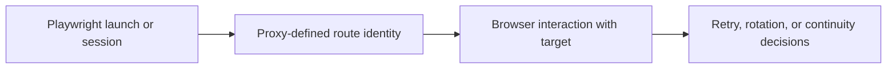

## Using Proxies with Playwright Is Really About Designing Browser Sessions Around Identity
Adding a proxy to Playwright is easy at the syntax level. The harder part is deciding what that proxy should do for the browser session. Should the route stay stable across a login flow? Should each browser launch get a fresh identity? Should failures trigger a new route or preserve continuity? Those are not configuration details—they are session-design decisions.
That is why using proxies with Playwright is less about one `proxy` object and more about how browser identity is managed across real tasks.
This guide explains how Playwright proxy configuration works, how rotating and sticky identity differ in browser workflows, and how to handle failures, retries, and scaling without accidentally defeating the value of the proxy layer. It pairs naturally with [playwright proxy setup guide](https://bytesflows.com/en/blog/playwright-proxy-setup), [rotating residential proxies with Playwright](https://bytesflows.com/en/blog/rotating-residential-proxies-playwright), and [cloudflare bypass proxy for web scraping](https://bytesflows.com/en/blog/cloudflare-scraping).
## What the Proxy Setting Actually Controls
In Playwright, the proxy setting determines the network identity the browser uses to reach the target.
That affects:
- which IP the site sees
- what region the session appears to originate from
- whether the route is residential, datacenter, or another type
- how retries or new browser launches may change identity
The proxy is therefore part of browser behavior, not separate from it.
## Launch-Level Proxy Configuration Is the Starting Point
Most Playwright proxy use begins by passing a proxy configuration at browser launch.
This is the simplest way to:
- route all browser traffic through one defined gateway
- attach authenticated proxy credentials
- build a browser session around a known identity model
The syntax is simple, but the important part is what that browser lifecycle now implies about identity reuse.
## Rotating vs Sticky Behavior in Playwright
Once the browser uses a proxy, the next question is whether the route should rotate or stay stable.
### Rotating behavior
Useful when:
- browser tasks are independent
- broad distribution matters more than continuity
- you want a fresh identity across separate runs
### Sticky behavior
Useful when:
- the browser must preserve continuity
- login state matters
- multi-step actions need one coherent session story
This is the main design choice for Playwright proxy use.
## Browser Lifecycle Determines Identity Lifecycle
In many Playwright workflows, route behavior depends partly on how long the browser or context lives.
That means decisions such as:
- one browser per task
- many tasks per browser
- long-lived contexts
- short-lived fresh launches
can change how effectively the proxy model supports rotation or continuity.
This is why proxy design and browser design should be treated as one system.
## Residential Proxies Often Work Better for Protected Browser Tasks
When Playwright is used on stricter targets, residential routes often create better outcomes because they give the browser a more credible visible origin.
That matters especially when the site cares about:
- IP reputation
- consumer-like traffic trust
- regional consistency
- browser session plausibility
A real browser plus a weak route can still fail. A stronger route often makes the browser layer much more useful.
## Failure Handling Should Be Proxy-Aware
When a Playwright job fails, the right response often depends on whether the failure was tied to the route.
Useful questions include:
- should the retry use a fresh browser and new identity?
- did the route likely trigger the block?
- is the task stateless enough to rotate safely?
- should a weak route be cooled down before reuse?
Proxy-aware retry behavior is one of the biggest differences between a fragile browser scraper and a resilient one.
## Scaling Playwright with Proxies Requires Restraint
Even good proxies can be wasted by unrealistic parallel browser behavior.
You still need to think about:
- concurrency per domain
- how many parallel browsers one proxy pool can support
- whether sticky sessions are being overused
- whether region and browser settings remain coherent under scale
The proxy layer helps with trust, but it does not remove the need for disciplined browser orchestration.
## Validate the Setup Before Real Workloads
A strong Playwright proxy validation flow often looks like this:
1. confirm the browser is using the intended exit IP
1. check whether the country and route type are correct
1. verify whether launches rotate or stay sticky as expected
1. run a small target-facing batch
1. then increase concurrency carefully
This catches misconfiguration and provider mismatch early.
## A Practical Playwright-Proxy Model
A useful mental model looks like this:

This shows why the proxy layer is part of browser session architecture.
## Common Mistakes
### Treating proxy configuration as only a code snippet problem
The real issue is session design.
### Using rotating identity on multi-step flows that need continuity
The browser story breaks.
### Keeping one browser alive so long that route concentration quietly returns
The proxy model gets undermined.
### Retrying blocks without changing weak identity patterns
The next attempt may fail for the same reason.
### Scaling parallel Playwright sessions faster than the proxy layer can support
High coordination still looks suspicious.
## Best Practices
### Decide whether the task needs rotating or sticky identity before you launch browsers
Proxy design should follow task shape.
### Treat browser lifecycle and route lifecycle as connected decisions
New browser choices often mean new identity choices.
### Prefer stronger routes on protected browser targets
Route trust still matters even with a real browser.
### Make retries explicitly proxy-aware
Do not let failed identity patterns repeat blindly.
### Validate the real route behavior before large-scale runs
Observed proxy behavior matters more than assumptions.
Helpful companion tools include [Proxy Checker](https://bytesflows.com/en/blog/proxy-checker), [Proxy Rotator Playground](https://bytesflows.com/en/blog/proxy-rotator), and [HTTP Header Checker](https://bytesflows.com/en/blog/http-header-checker).
## Conclusion
Using proxies with Playwright becomes much clearer once you treat the proxy as part of browser-session design rather than as an isolated network setting. The right route model depends on whether the browser task needs continuity, fresh identity, stronger trust, or all three in the right combination.
The practical lesson is that a Playwright proxy setup works best when the route, browser lifecycle, retry logic, and task shape all support the same session story. Once those pieces align, browser automation becomes much more stable on protected targets and much easier to scale without avoidable failures.
If you want the strongest next reading path from here, continue with [playwright proxy setup guide](https://bytesflows.com/en/blog/playwright-proxy-setup), [rotating residential proxies with Playwright](https://bytesflows.com/en/blog/rotating-residential-proxies-playwright), [cloudflare bypass proxy for web scraping](https://bytesflows.com/en/blog/cloudflare-scraping), and [proxy rotation strategies](https://bytesflows.com/en/blog/proxy-rotation-strategies).
## Further reading
- [Playwright proxy setup guide](https://bytesflows.com/en/blog/playwright-proxy-setup)
- [Rotating residential proxies with Playwright](https://bytesflows.com/en/blog/rotating-residential-proxies-playwright)
- [Cloudflare bypass proxy for web scraping](https://bytesflows.com/en/blog/cloudflare-scraping)
- [Proxy rotation strategies](https://bytesflows.com/en/blog/proxy-rotation-strategies)
- [How to avoid detection in Playwright scraping](https://bytesflows.com/en/blog/avoid-detection-playwright-scraping)
- [Residential proxies](https://bytesflows.com/en/proxies)
- [Using requests for web scraping](https://bytesflows.com/en/blog/using-requests-web-scraping)
