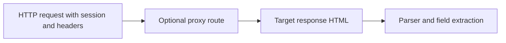

## Requests Is Best When the Page Is Simple Enough That a Browser Would Be Overkill
Python Requests remains one of the most useful scraping tools because many pages do not need a browser. If the content is already present in the response HTML and the target is not heavily dependent on JavaScript or browser runtime checks, Requests can be faster, simpler, and cheaper than browser automation. The key is knowing when that assumption is true.
That is why using Requests well is mostly about choosing the right targets and building cleaner HTTP workflows around them.
This guide explains when Requests is the right scraping tool, how sessions and headers improve reliability, where proxies fit, and what warning signs tell you to move from simple HTTP scraping to browser-based tools. It pairs naturally with [extracting structured data with Python](https://bytesflows.com/en/blog/extracting-structured-data-python), [python scraping proxy guide](https://bytesflows.com/en/blog/python-scraping-proxy-guide), and [scraping dynamic websites with Playwright](https://bytesflows.com/en/blog/scraping-dynamic-websites-playwright).
## What Requests Actually Solves
Requests is a synchronous HTTP client. It works well when the scraping task is mostly about:
- fetching response HTML
- setting sane headers
- preserving cookies across requests
- working through proxies when needed
- parsing static or lightly protected pages
It does not render JavaScript or simulate a browser runtime.
## When Requests Is the Right Tool
Requests is often a strong fit when:
- the page is static enough that the useful content is in the response body
- the workflow is simple and direct
- speed and low overhead matter more than browser realism
- the target does not strongly depend on browser-side execution
This is why Requests remains a great default starting point for many Python scraping projects.
## When Requests Stops Being Enough
Requests becomes a weak fit when the target:
- renders content dynamically in the browser
- depends on JavaScript execution
- expects browser-like TLS and runtime behavior
- serves empty shells or placeholders to request-only clients
- applies stronger anti-bot checks that care about more than headers
At that point, the issue is not how you call Requests. It is that the target expects a browser-shaped client.
## Sessions Matter More Than One-Off Requests
A Requests workflow gets stronger when you stop treating every call as isolated.
Sessions help because they:
- reuse connections
- preserve cookies automatically
- make multi-step workflows more coherent
- reduce repeated setup overhead
This makes them useful whenever the scraper needs continuity rather than one detached fetch after another.
## Headers Improve Surface Credibility
Many default request signatures are too obviously tool-like for real scraping work.
Using coherent headers can help when:
- the default user-agent is easily flagged
- the target expects ordinary browser-like request surfaces
- you want the request profile to look less synthetic on simpler sites
But headers should be viewed realistically: they improve the surface of the request, not the full browser identity.
## Proxies Still Matter for Requests-Based Scraping
Even simple HTTP scraping can run into:
- rate limits
- IP reputation problems
- route concentration on repeated jobs
- geo-specific content or access issues
This is why Requests-based workflows often still need proxy strategy, especially when volume grows or the target becomes less tolerant.
Related background from [best proxies for web scraping](https://bytesflows.com/en/blog/best-proxies-for-web-scraping), [how proxy rotation works](https://bytesflows.com/en/blog/how-proxy-rotation-works), and [proxy pool design](https://bytesflows.com/en/blog/proxy-pool-design) fits directly here.
## Verification Still Matters
A common mistake is assuming Requests is working because the status code is 200.
You still need to check:
- whether the expected content is actually present
- whether the target served a degraded or incomplete version
- whether important fields exist in the returned HTML
- whether repeated requests behave consistently
A successful HTTP response is not always a successful scrape.
## A Practical Requests Model
A useful mental model looks like this:

This shows why Requests works best when the page is already available in the response itself.
## Common Mistakes
### Using Requests on pages that really need JavaScript execution
The content is often not truly there.
### Treating a 200 response as proof of extraction success
HTML quality still needs verification.
### Ignoring sessions on multi-step workflows
Continuity matters more than many beginners expect.
### Assuming headers alone can solve browser-sensitive anti-bot systems
The client identity is still limited.
### Scaling repeated Requests traffic without route planning
IP pressure still accumulates.
## Best Practices for Using Requests for Web Scraping
### Start with Requests when the page is genuinely static
It is often the simplest and cheapest working tool.
### Use sessions for continuity and cleaner multi-step flows
Do not rebuild state unnecessarily.
### Set coherent headers on real scraping targets
Avoid obviously default request surfaces.
### Add proxy routing when scale or target strictness requires it
Requests is still judged as traffic.
### Move to a browser when the page or anti-bot system clearly expects one
Do not force simple HTTP into browser-shaped problems.
Helpful support tools include [HTTP Header Checker](https://bytesflows.com/en/blog/http-header-checker), [User-Agent Generator](https://bytesflows.com/en/blog/user-agent-generator), and [Scraping Test](https://bytesflows.com/en/blog/scraping-test-tool-detect-blocks).
## Conclusion
Using Requests for web scraping is still one of the most efficient approaches when the target is static enough and the workflow does not need browser execution. Its strength comes from simplicity, speed, and low overhead—not from pretending to be a full browser.
The practical lesson is to use Requests where it naturally fits and to stop using it when the target clearly outgrows the HTTP-only model. With sessions, coherent headers, sensible proxy use, and careful verification, Requests remains a foundational tool in Python scraping rather than an outdated beginner shortcut.
If you want the strongest next reading path from here, continue with [extracting structured data with Python](https://bytesflows.com/en/blog/extracting-structured-data-python), [python scraping proxy guide](https://bytesflows.com/en/blog/python-scraping-proxy-guide), [scraping dynamic websites with Playwright](https://bytesflows.com/en/blog/scraping-dynamic-websites-playwright), and [the ultimate guide to web scraping in 2026](https://bytesflows.com/en/blog/ultimate-guide-web-scraping-2026).
## Further reading
- [Extracting structured data with Python](https://bytesflows.com/en/blog/extracting-structured-data-python)
- [Python scraping proxy guide](https://bytesflows.com/en/blog/python-scraping-proxy-guide)
- [Scraping dynamic websites with Playwright](https://bytesflows.com/en/blog/scraping-dynamic-websites-playwright)
- [The ultimate guide to web scraping in 2026](https://bytesflows.com/en/blog/ultimate-guide-web-scraping-2026)
- [Best proxies for web scraping](https://bytesflows.com/en/blog/best-proxies-for-web-scraping)
- [How proxy rotation works](https://bytesflows.com/en/blog/how-proxy-rotation-works)
- [How to scrape websites without getting blocked](https://bytesflows.com/en/blog/scrape-websites-without-getting-blocked)
