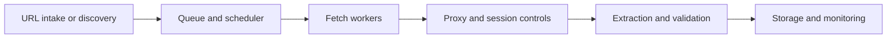

## Architecture Determines Whether Scraping Scales Cleanly
A scraper can work as a script at small size and still fail as a system once throughput, target diversity, and anti-bot pressure increase. Architecture is the layer that decides whether the workflow remains reliable when complexity grows.
Good architecture separates concerns so fetching, routing, extraction, retries, and storage can evolve without collapsing into one fragile process. This guide pairs well with [Web Scraping Workflow Explained](https://bytesflows.com/blog/web-scraping-workflow-explained), [Web Scraping at Scale: Best Practices (2026)](https://bytesflows.com/blog/web-scraping-at-scale-best-practices), and [Scaling Scrapers with Distributed Systems](https://bytesflows.com/blog/scaling-scrapers-distributed-systems).
## The Core Layers of a Scraping Architecture
A practical scraping architecture usually includes:
- target discovery or URL intake
- queueing and scheduling
- fetch workers
- proxy and session controls
- extraction and validation
- storage and monitoring
Each layer exists for a reason. Combining too many of them into one worker process makes systems harder to scale and harder to debug.
## Queueing Is the Control Layer
A queue helps the architecture by:
- decoupling intake from execution
- enabling retries and prioritization
- supporting distributed workers
- preventing work from being lost when a worker fails
This is why queue-based design appears in most production scraping systems.
## Fetching Needs More Than One Mode
Some targets can be handled with lightweight HTTP clients. Others require browser automation. A strong architecture therefore supports multiple fetch paths and routes jobs to the cheapest viable one.
That usually means:
- HTTP for static or low-friction pages
- browser automation for dynamic or defended pages
- route controls that match the target's strictness
This keeps cost lower while preserving flexibility.
## Proxy and Session Layers Deserve Their Own Attention
Proxy handling is often treated as a configuration detail, but it is really part of the architecture. The design should define:
- when routes rotate
- when sessions stay sticky
- how route health is measured
- how route choice changes with target type
A weak route layer can make the rest of the architecture look broken even when the extraction logic is sound.
## Validation Protects Downstream Systems
A well-designed scraper does not treat every extracted record as trustworthy. Validation should check:
- schema conformity
- required fields
- sensible numeric and date ranges
- duplicate or placeholder records
This is what turns scraped pages into usable data rather than noisy output.
## Storage Choices Depend on How the Data Will Be Used
Different architectures store data differently depending on downstream needs:
- databases for operational querying
- object storage for raw snapshots and scale
- data lakes for analytics pipelines
- APIs or exports for external consumers
The architecture should make these choices explicit instead of treating storage as a last-minute afterthought.
## Observability Is a First-Class Architectural Need
Useful architecture includes monitoring for:
- success rate
- queue backlog
- proxy health
- validation failure rate
- extraction completeness
- per-domain latency and block rate
Without these signals, systems can degrade quietly while still looking active.
## A Practical Reference Model

This model is not the only valid architecture, but it captures the layers most production systems eventually need.
## Common Mistakes
- building one giant worker that does everything
- skipping queueing until failures become hard to recover from
- treating proxy behavior as a minor setting instead of a core layer
- storing unvalidated records directly into downstream systems
- monitoring uptime without checking data quality
## 下一步技术排查路径 (Troubleshooting Step Paths)

在处理与设计网页抓取系统架构（尤其是跨越 WAF 拦截、管理高并发请求及多节点调度）时，建议按以下标准工程排查规范进行定位与架构调优：

1. **第一步：环境与指纹层校验 (Fingerprint & TLS Audit)**
   - 检查调度器发起的 HTTP 客户端 TLS JA3/JA4 指纹与 HTTP/2 Header 顺序，确认其与现代真实主流浏览器保持一致。
   - 利用在线工具 [Proxy Test Tool](https://bytesflows.com/tools/proxy-test) 实时监测请求的 HTTP 状态码与网络出口归属地，确认异常发生在代理连接层还是目标服务器 WAF 拦截层。

2. **第二步：网络路由与代理信誉度隔离 (IP Reputation & Routing Choice)**
   - 当任务队列遇到高频 403 封禁或 CAPTCHA 验证墙时，需排查工作节点（Workers）使用的是否为数据中心 IP 或已被标记的共享 IP 资源。
   - 建议把核心数据抓取链路切换至高纯净度的**住宅代理（Residential Proxies）**，利用真实家庭宽带 ASN 绕过风控检测。可参考 [对比方案与选型指南](https://bytesflows.com/compare) 评估不同路由模式对通过率的影响。

3. **第三步：并发与重试策略优化 (Backoff & Session Strategy)**
   - 在任务调度队列（Queue）中强制引入**指数退避（Exponential Backoff）与全抖动（Full Jitter）**重试策略，避免短时间内流量激增触发目标站点的全局封禁。
   - 依据业务需求，在 [通用解决方案库](https://bytesflows.com/solutions) 中查阅对应的分布式连接池最佳实践：列表抓取采用单次请求随机轮换（`time-0`），详情页及状态会话则配置短时粘性路由（Sticky Sessions）。
## Further reading
- [Web Scraping Workflow Explained](https://bytesflows.com/blog/web-scraping-workflow-explained)
- [Web Scraping at Scale: Best Practices (2026)](https://bytesflows.com/blog/web-scraping-at-scale-best-practices)
- [Scaling Scrapers with Distributed Systems](https://bytesflows.com/blog/scaling-scrapers-distributed-systems)
- [Scraping Data at Scale](https://bytesflows.com/blog/scraping-data-at-scale)
- [Proxy Rotation Strategies](https://bytesflows.com/blog/proxy-rotation-strategies)
